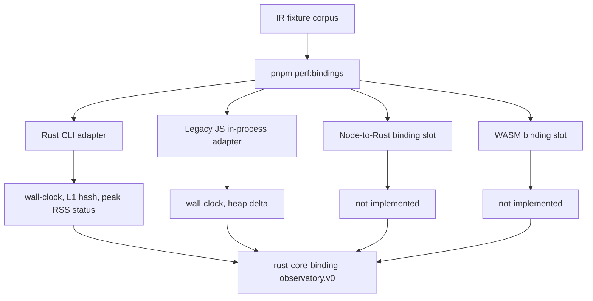

# Rust core binding observatory

## Why now

v0.0.6 made the Rust compiler truth harder to drift: Rust L1 fixtures,
JS/Rust parity projections, parser acceptance evidence, module-boundary
fixtures, and the first Rust CLI wall-clock baseline became repo-visible.

The next weak claim is not "can Rust lower this schema?" It is:

> How should the legacy Node toolchain call the Rust compiler core without
> guessing about latency, memory, packaging, fallback, or rollback?

This packet turned that question into migration evidence. Wesley then chose the
cleaner path: delete the legacy Node compiler surface instead of embedding the
Rust compiler through a Node binding.

## Hill

Wesley can compare Rust CLI lowering, legacy JS in-process lowering, future
Node-to-Rust binding lowering, future WASM binding lowering, and memory posture
through one fixture-backed report contract.

The first implementation does **not** ship a Node native binding or a WASM
binding. It records executable evidence for the paths that exist today and
reserves explicit `not-implemented` evidence slots for the binding paths that
still need implementation.

## Ten-Slice Scope

1. Pull the binding baseline backlog item into this active packet.
2. Define the `rust-core-binding-observatory.v0` report contract.
3. Preserve the existing Rust CLI wall-clock baseline as the first named
   adapter.
4. Add an in-process legacy JS adapter with wall-clock and heap-delta samples.
5. Add an explicit Rust CLI peak RSS evidence slot with a platform caveat.
6. Add a Node-to-Rust binding evidence slot that currently reports
   `not-implemented`.
7. Add a WASM binding evidence slot that currently reports `not-implemented`.
8. Keep the explicit IR fixture corpus and add observatory tests.
9. Record the Node binding strategy decision matrix.
10. Update BEARING, CHANGELOG, script docs, and verification surfaces.

## Report Contract

The retired observatory report was emitted by:

```bash
pnpm perf:bindings -- --json
```

It may also be emitted through:

```bash
pnpm perf:ir -- --observatory --json
```

Those commands are historical surfaces from before legacy Node retirement.
Current Rust-native lowering evidence is emitted by:

```bash
cargo xtask bench-ir --output out/rust-ir-performance-baseline.json
```

The v0 contract records:

- `tool: "rust-core-binding-observatory.v0"`
- Git head
- fixture corpus
- warmup and iteration counts
- named adapter metadata
- per-fixture Rust CLI duration, output hash, and memory posture
- per-fixture legacy JS duration and heap delta samples
- explicit `not-implemented` slots for Node binding and WASM binding
- cutover criteria that remain `not-evaluated`



## Adapter Semantics

| Adapter                | Current status    | What it measures                                                             | What it does not claim                                          |
| ---------------------- | ----------------- | ---------------------------------------------------------------------------- | --------------------------------------------------------------- |
| `rust-cli`             | `captured`        | Native CLI child-process wall-clock lowering and Rust L1 output identity.    | In-process binding overhead or peak RSS.                        |
| `legacy-js-in-process` | `captured`        | In-process `GraphQLAdapter.parseSDL` wall-clock and Node heap-delta samples. | Rust parity, Node-to-Rust overhead, or WASM overhead.           |
| `node-rust-binding`    | `not-implemented` | Reserved slot for future N-API/native-addon or equivalent binding evidence.  | No package, API, or binding choice is shipped by this packet.   |
| `wasm-binding`         | `not-implemented` | Reserved slot for future portable WASM binding evidence.                     | No WASM lowering package or host ABI is shipped by this packet. |

## Cutover Rule

No Node cutover is allowed from this packet alone.

A future non-Rust host binding decision must combine:

- correctness parity over named projections
- Rust CLI latency baseline
- legacy JS latency and memory baseline
- Node binding overhead measurement
- WASM binding overhead measurement
- peak RSS strategy
- normal CLI regression risk review

## Non-Claims

- This packet does not choose N-API.
- This packet does not choose WASM as the hot path.
- This packet did not retire legacy JS lowering by itself; that happened in the
  later Node retirement campaign.
- This packet does not claim browser or edge host readiness.
- This packet does not use Echo, jedit, Continuum, or PostgreSQL workloads as
  generic Wesley proof.

## Playback Questions

1. Does `pnpm perf:bindings -- --json` emit a report with named adapter
   statuses?
2. Does the report preserve the same explicit fixture corpus as the then-current
   performance command?
3. Does Rust CLI evidence remain separate from Node binding overhead?
4. Does legacy JS evidence include heap-delta samples without claiming peak RSS?
5. Are Node binding and WASM binding marked as `not-implemented` rather than
   silently absent?
6. Does Markdown output show adapter status and per-fixture comparison columns?

## Repo Evidence

- [EVIDENCE_rust-core-binding-and-memory-baselines.md](./EVIDENCE_rust-core-binding-and-memory-baselines.md)
- [RUNTIME_node-rust-core-binding-strategy.md](./RUNTIME_node-rust-core-binding-strategy.md)
- [Rust core performance baseline](../0013-rust-ir-parity-sentinel/EVIDENCE_rust-core-performance-baseline.md)
- Historical script: `scripts/measure-ir-performance.mjs` was deleted during
  legacy Node retirement.
- Historical test: `test/ir-performance-baseline.bats` was deleted during
  legacy Node retirement.
