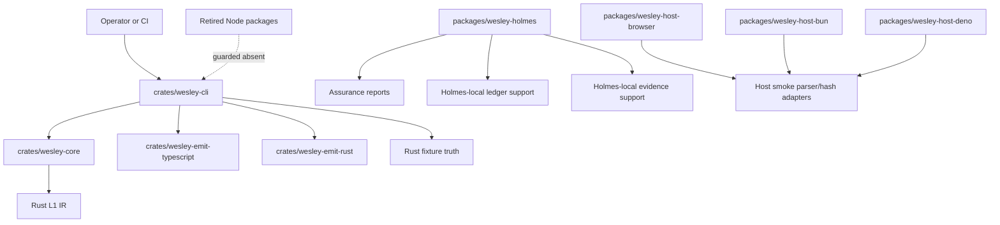
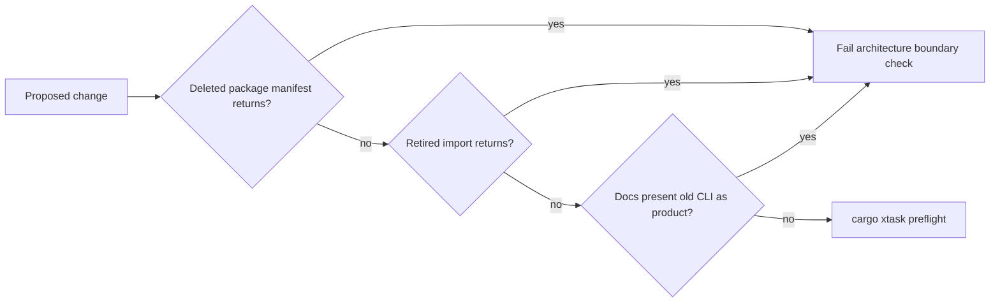

# Legacy Node Retirement Final Closeout

<!-- docs-truth: status=experimental owner=@flyingrobots -->

This closeout records the final disposition of Wesley's legacy Node retirement
campaign. It is the terminal packet for the 96-slice plan tracked in
[`docs/BEARING.md`](../../BEARING.md).

## Result

The campaign is closed at **96 / 96 slices**.

The deleted compiler-authority packages are:

- `packages/wesley-core/`
- `packages/wesley-cli/`
- `packages/wesley-host-node/`
- `packages/wesley-runtime-node/`

The retained JavaScript packages are no longer compiler authority:

- `packages/wesley-holmes/` is self-contained assurance tooling.
- `packages/wesley-host-browser/` is an external browser host smoke experiment.
- `packages/wesley-host-bun/` is an external Bun host smoke experiment.
- `packages/wesley-host-deno/` is an external Deno host smoke experiment.

## Final Topology

## Why The Last Deletion Was Safe

The final four packages had stayed alive because they still provided three
kinds of behavior:

- Shared assurance helpers for Holmes.
- Smoke-level parser/hash behavior for browser, Bun, and Deno hosts.
- Historical parity, performance, and Node CLI workflows.

Those are no longer blockers:

- Holmes now owns local copies of the evidence quality, generated artifact,
  module capability, and runtime ledger helpers it actually uses.
- Browser, Bun, and Deno hosts parse their own smoke SDL and hash the resulting
  IR without routing through the old `GenerationPipeline`.
- Parity and performance scripts that imported the JS lowerer were removed as
  historical migration tooling, not retained as release gates.
- CI workflows that existed only to exercise deleted packages were removed.
- Architecture boundary checks now fail if deleted package manifests return.

## Migrated

| Old Surface                            | New Owner                                                    |
| -------------------------------------- | ------------------------------------------------------------ |
| Useful compiler parsing/lowering truth | Rust crates and Rust fixture tests                           |
| Generic TypeScript output              | `crates/wesley-emit-typescript`                              |
| Generic Rust output                    | `crates/wesley-emit-rust`                                    |
| Native product command body            | `crates/wesley-cli`                                          |
| Holmes evidence quality helpers        | `packages/wesley-holmes/src/support/evidence-quality.mjs`    |
| Holmes generated artifact paths        | `packages/wesley-holmes/src/support/artifacts.mjs`           |
| Holmes module capability discovery     | `packages/wesley-holmes/src/support/module-capabilities.mjs` |
| Holmes runtime run ledger inspection   | `packages/wesley-holmes/src/support/runtime-ledger.mjs`      |

## Extracted

| Surface                                   | Extraction Boundary                                      |
| ----------------------------------------- | -------------------------------------------------------- |
| Holmes/Watson/Moriarty commands           | `@wesley/holmes`, explicitly outside compiler authority  |
| Runtime run inspection needed by Moriarty | Holmes-local ledger support                              |
| Counterfactual provider loading           | Holmes-local module capability support                   |
| Browser/Bun/Deno host smoke behavior      | Host experiment packages with local parser/hash adapters |

## Deleted

| Surface                               | Reason                                                          |
| ------------------------------------- | --------------------------------------------------------------- |
| `packages/wesley-core/`               | Rust core owns retained compiler facts.                         |
| `packages/wesley-cli/`                | Rust CLI owns the product front door.                           |
| `packages/wesley-host-node/`          | No retained product/test path uses the Node executable wrapper. |
| `packages/wesley-runtime-node/`       | Holmes owns retained ledger/module support locally.             |
| JS/Rust parity scripts                | Historical migration evidence, no longer release gates.         |
| Legacy CLI and core package workflows | They exercised deleted packages.                                |
| Root `pnpm wesley` script             | It pointed at the deleted Node wrapper.                         |

## Deferred

| Topic                                 | Reason                                                                     |
| ------------------------------------- | -------------------------------------------------------------------------- |
| Full Holmes Rust rewrite              | Design belongs to packet `0018`; this closeout only unblocks deletion.     |
| Native N-API or WASM compiler binding | Requires fresh observatory evidence and a real consumer.                   |
| Rich Zod output                       | Reintroduce only through an owning external module if a consumer needs it. |
| Product/database target semantics     | Belong in owning repos such as `wesley-postgres`, not base Wesley.         |

## Rejected

| Proposal                                              | Decision                                           |
| ----------------------------------------------------- | -------------------------------------------------- |
| Preserve umbrella `generate` as a core noun           | Rejected; native commands should be explicit.      |
| Keep legacy `models` behavior in generic Wesley       | Rejected; model classes are product-shaped output. |
| Keep Node certificate commands in compiler front door | Rejected; certificate evidence is assurance work.  |
| Keep JS lowerer parity as a release oracle            | Rejected; Rust fixture truth is authoritative.     |
| Keep the Node host package as a convenience wrapper   | Rejected; it recreates the old product entrypoint. |

## Guard Rails

The closeout leaves three continuing obligations:

1. Do not recreate compiler behavior in JavaScript scripts.
2. Keep Holmes as assurance until the Rust hexagon replaces it.
3. Keep host experiments small, explicit, and detached from compiler authority.
