# Holmes Assurance Hexagon

## Status

Active design packet.

## Question

How should Holmes be rebuilt so it becomes a Rust-native assurance platform
with CLI, API, and MCP interfaces, instead of a legacy Node package whose
GitHub PR comment path accidentally defines the architecture?

## Hill

Holmes is an assurance engine, not a PR comment bot.

The redesigned system has:

1. A Rust domain and application core that owns evidence, verification,
   readiness, verdicts, and report construction.
2. Three first-class interfaces over the same use cases:
   - CLI for operators and CI.
   - API for Rust callers and other Wesley crates.
   - MCP for agents and external tools.
3. A reporting abstraction where GitHub PR comments are one publisher among
   several, not the center of the system.
4. Hexagonal boundaries that keep filesystem, Git, GitHub, terminal, MCP,
   wall-clock, and process execution details outside the domain core.
5. A deliberate migration path that removes `packages/wesley-holmes` as a
   blocker for deleting legacy `@wesley/core` and `@wesley/runtime-node`.

## Why This Exists

The current `packages/wesley-holmes` package is not huge. Its size is not the
reason to avoid a rewrite. The reason to avoid a direct port is that the package
mixes several architectural concerns:

| Concern                           | Current shape                                                | Desired shape                                        |
| --------------------------------- | ------------------------------------------------------------ | ---------------------------------------------------- |
| Assurance verdicts                | `Holmes.mjs` mixes scoring, evidence loading, and output     | Pure domain/application use cases                    |
| Citation verification             | `Watson.mjs` reads files and reasons about spans             | Core verification use case plus source-store port    |
| Readiness prediction              | Moriarty helpers plus rendering and workflow concerns        | Analysis use case plus history and policy ports      |
| Report validation                 | JSON-schema-like runtime validation in `report-schemas.mjs`  | Typed Rust contracts with versioned serde boundaries |
| Runtime run access                | JS runtime ledger through `@wesley/core`/`runtime-node`      | `RunHistoryStore` port with replaceable adapters     |
| GitHub PR comments                | `pr-comment.mjs` loads, summarizes, truncates, and renders   | Reporting document plus GitHub publisher adapter     |
| Counterfactual provider execution | Dynamic Node module loading through Wesley runtime machinery | Explicit provider execution port                     |
| CLI commands                      | Legacy Node Commander entrypoints                            | Rust CLI adapters over application use cases         |
| Agent integration                 | Not a first-class surface                                    | MCP adapter over the same application use cases      |
| Output formatting                 | Markdown and GitHub constraints embedded in command logic    | Renderer and publisher abstractions                  |

That coupling is why Holmes currently blocks legacy package retirement. It
imports `@wesley/core` and `@wesley/runtime-node`, and those imports keep old
Node packages alive even after the compiler product has moved to Rust.

The rewrite should remove that coupling and give Holmes a durable architecture.

## Non-Negotiables

- The domain core does not know GitHub exists.
- The domain core does not know MCP exists.
- The domain core does not read files directly.
- The domain core does not use process environment, current working directory,
  stdout, stderr, or wall-clock time.
- The domain core does not shell out to Git.
- The domain core does not load dynamic JavaScript modules.
- CLI, API, and MCP interfaces call the same application use cases.
- GitHub PR comments are a reporting publisher, not a use case.
- Markdown is a renderer output, not the internal report model.
- Any time-sensitive behavior uses dependency-injected clocks.
- Any external process, provider, or Git command uses an explicit port and a
  bounded adapter.
- Counterfactual provider execution is redesigned as a port; the Node module
  loader is not recreated in Rust as hidden compatibility debt.

## Vocabulary

| Term            | Meaning                                                                                |
| --------------- | -------------------------------------------------------------------------------------- |
| Assurance       | The act of evaluating evidence, citations, policy, history, and gates before trust.    |
| Evidence bundle | A collection of reports, cited artifacts, source references, and metadata.             |
| Finding         | A specific concern, pass, warning, or failure with evidence and severity.              |
| Gate            | A named release or readiness condition that can pass, warn, fail, or be unavailable.   |
| Verdict         | The normalized conclusion from one analyzer or from the whole assurance run.           |
| Report document | Interface-neutral structured output made of sections, findings, tables, and actions.   |
| Renderer        | Converts a report document to Markdown, JSON, terminal text, HTML, or MCP content.     |
| Publisher       | Sends rendered output somewhere: stdout, a file, GitHub PR comment, MCP response, etc. |
| Port            | Trait owned by the application core for external capabilities.                         |
| Adapter         | Concrete implementation of a port, such as filesystem, GitHub, Git, or MCP transport.  |
| Policy          | Configured thresholds, weights, gates, and trust rules used by the assurance run.      |
| Run history     | Prior runs or score points used by readiness and trend analysis.                       |
| Counterfactual  | An optional external analysis result produced by a provider outside the core.          |

## End-To-End Shape

Holmes receives report inputs, verifies them against evidence and policy, builds
an interface-neutral report document, then renders and publishes that document
through the selected interface.

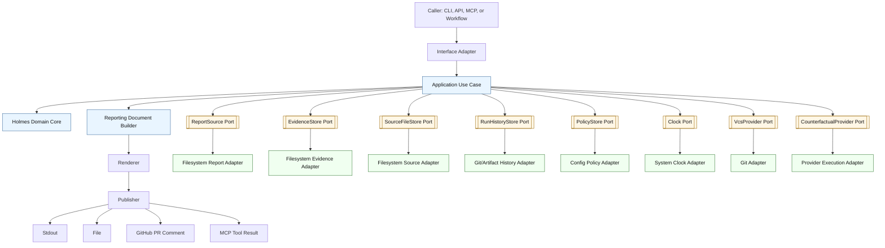

The important rule is dependency direction. Dependencies point inward toward
domain and application policy. The application layer owns the ports. The
adapters implement those ports.

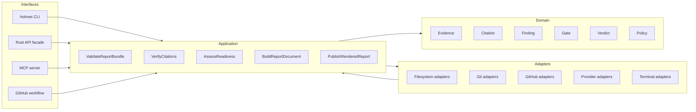

## Proposed Crate Layout

The crate names below are working names. The architectural boundaries matter
more than the final names.

| Crate                            | Responsibility                                                      | Must not depend on                                  |
| -------------------------------- | ------------------------------------------------------------------- | --------------------------------------------------- |
| `crates/wesley-holmes-core`      | Domain models, policies, validation, scoring, citation verification | GitHub, MCP, CLI, filesystem globals, Node packages |
| `crates/wesley-holmes-reporting` | `ReportDocument`, renderers, truncation policy, report composition  | GitHub APIs, MCP transport, process environment     |
| `crates/wesley-holmes-cli`       | CLI command parsing and local adapter wiring                        | Legacy JS packages                                  |
| `crates/wesley-holmes-github`    | GitHub PR comment publisher and GitHub markdown constraints         | Domain internals beyond public API types            |
| `crates/wesley-holmes-mcp`       | MCP tool/resource/prompt adapter over application use cases         | GitHub-specific publishing                          |
| `crates/wesley-holmes-api`       | Optional facade for stable embedding if `core` becomes too granular | Interface adapters                                  |

The initial implementation can combine some crates while APIs stabilize, but
the module boundaries should still match this table. Combining crates is a
temporary packaging choice; combining responsibilities is not.

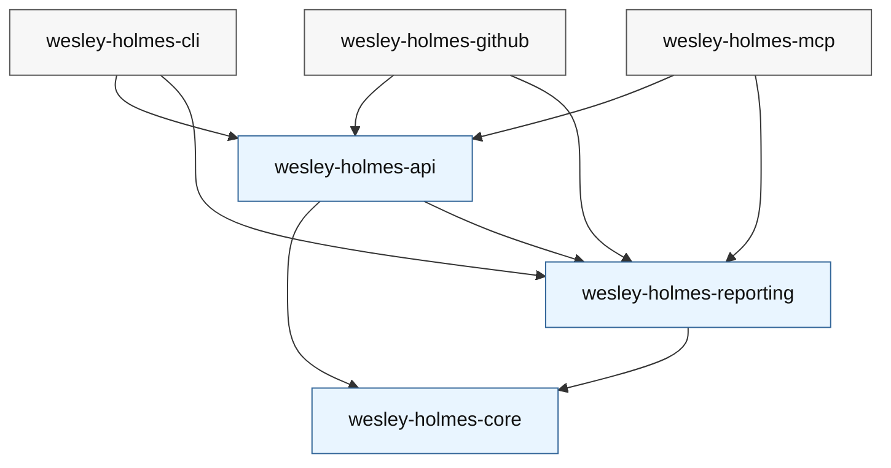

## Domain Model

The domain model is typed and versioned. JSON enters the system at adapter or
boundary layers, then becomes typed Rust data before any decision is made.

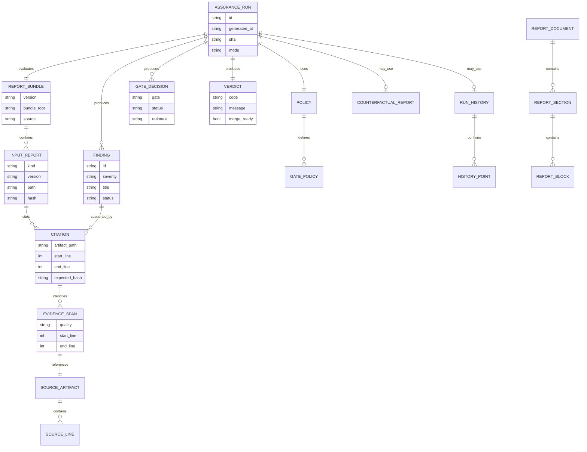

## Use Cases

Application use cases are explicit and independently testable.

| Use case                 | Input                                           | Output                       | Notes                                                                           |
| ------------------------ | ----------------------------------------------- | ---------------------------- | ------------------------------------------------------------------------------- |
| `ValidateReportBundle`   | Bundle reference, schema registry, policy       | `ValidatedBundle`            | Rejects malformed or unsupported report contracts before scoring.               |
| `VerifyCitations`        | Validated reports, source file store            | `CitationVerificationReport` | Checks spans, file availability, exactness, and content matches.                |
| `EvaluateReadiness`      | Validated bundle, citation report, run history  | `ReadinessAssessment`        | Computes gate decisions, trust level, readiness, confidence, and verdict.       |
| `AnalyzeCounterfactuals` | Bundle, policy, provider port                   | Optional `Counterfactual`    | Provider execution is explicit and bounded; unavailable providers are reported. |
| `BuildReportDocument`    | Validated bundle, assessments, render policy    | `ReportDocument`             | Creates interface-neutral report structure.                                     |
| `RenderReport`           | `ReportDocument`, output target                 | `RenderedReport`             | Markdown, JSON, terminal text, MCP content, or future HTML/SARIF/JUnit.         |
| `PublishReport`          | Rendered report, publisher adapter              | `PublishOutcome`             | Stdout, file, GitHub PR comment, MCP response, or another publishing target.    |
| `CompareRuns`            | Two or more run references, history store       | `RunComparison`              | Future use case for regression and trend reporting.                             |
| `ExplainFinding`         | Finding id, bundle, source store, render policy | `FindingExplanation`         | Useful for MCP and future local debugging commands.                             |

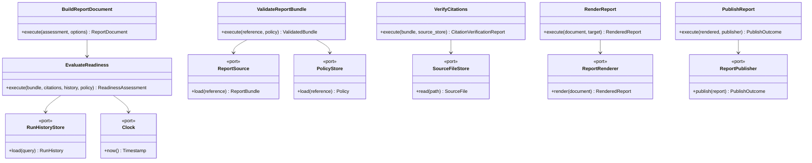

## Ports And Adapters

### Input Ports

These ports feed data into Holmes.

| Port                   | Purpose                                                | Example adapters                                      |
| ---------------------- | ------------------------------------------------------ | ----------------------------------------------------- |
| `ReportSource`         | Load Holmes, Watson, Moriarty, and counterfactual data | Filesystem directory, in-memory test fixture, MCP ref |
| `EvidenceStore`        | Load evidence bundle artifacts                         | Filesystem, archive file, content-addressed store     |
| `SourceFileStore`      | Read source files for citation verification            | Workspace filesystem, Git revision, bundle snapshot   |
| `RunHistoryStore`      | Load historical score/readiness points                 | JSON history file, Git artifact history, database     |
| `PolicyStore`          | Load thresholds, weights, and reporting rules          | Config file, API object, MCP-provided policy          |
| `CounterfactualRunner` | Execute optional external counterfactual analysis      | External process, WASM component, Rust plugin         |
| `VcsProvider`          | Resolve SHA, diff base, changed files, and provenance  | Git CLI adapter, libgit adapter, in-memory fixture    |
| `Clock`                | Provide deterministic timestamps                       | System clock, fake clock                              |

### Output Ports

These ports move decisions out of Holmes.

| Port              | Purpose                                                | Example adapters                                 |
| ----------------- | ------------------------------------------------------ | ------------------------------------------------ |
| `ReportRenderer`  | Convert `ReportDocument` into a concrete output format | Markdown, terminal text, JSON, MCP structured    |
| `ReportPublisher` | Publish rendered output                                | Stdout, file, GitHub PR comment, MCP tool result |
| `EventSink`       | Emit lifecycle events for observability                | Test collector, tracing, JSONL, CI log           |
| `AuditSink`       | Persist a deterministic proof of what was evaluated    | File witness, run ledger, artifact output        |

## Dependency Injection

Every use case takes dependencies explicitly. In Rust this can be generic
traits, trait objects, or a composition root object. The exact syntax can
evolve, but the rule is fixed: construction happens at the edge.

Example composition roots:

| Interface | Composition root owns                                                                   |
| --------- | --------------------------------------------------------------------------------------- |
| CLI       | Argument parsing, filesystem adapters, stdout publisher, system clock, exit-code map.   |
| API       | Caller-supplied adapters, typed config, direct `Result<T, Error>` values.               |
| MCP       | Workspace-aware adapters, MCP request context, structured response publisher.           |
| GitHub    | PR metadata, token/auth adapter, marker policy, GitHub markdown renderer and publisher. |

The domain never calls `std::env::current_dir`, never reads `GITHUB_TOKEN`, and
never chooses whether output should be a PR comment.

## Reporting Model

The central reporting type is a structured document, not Markdown.

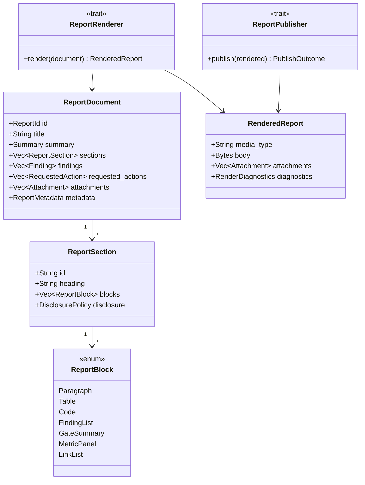

GitHub PR comments are produced by:

```text
ReportDocument -> GitHubMarkdownRenderer -> GitHubPrCommentPublisher
```

CLI terminal output is produced by:

```text
ReportDocument -> TerminalRenderer -> StdoutPublisher
```

MCP structured output is produced by:

```text
ReportDocument -> McpRenderer -> McpToolResponsePublisher
```

JSON output is produced by:

```text
ReportDocument -> JsonRenderer -> StdoutPublisher or FilePublisher
```

This is the key reporting decision. Holmes decides what is true. Renderers
decide how truth should look. Publishers decide where it goes.

## Interface 1: CLI

The CLI is for humans, CI jobs, and local scripts.

Candidate commands:

```bash
holmes validate --bundle <dir> --format text|json
holmes verify-citations --bundle <dir> --source-root <dir> --format text|json
holmes assess --bundle <dir> --history <path> --format text|json|markdown
holmes report --bundle <dir> --output markdown|json|terminal --out <path>
holmes publish github-pr-comment --bundle <dir> --pr <number> --repo <owner/name>
holmes explain finding --bundle <dir> --finding <id> --format text|json
moriarty assess --history <path> --current <bundle> --format text|json
watson verify --bundle <dir> --source-root <dir> --format text|json
```

The binaries may be `holmes`, `watson`, and `moriarty`, or one `holmes`
binary with subcommands. The architectural requirement is that they call the
same use cases as API and MCP.

### CLI Golden Path

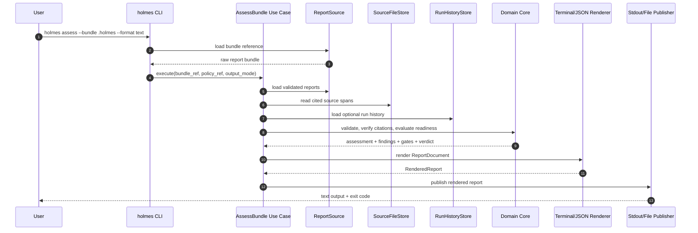

CLI exit-code policy should be explicit:

| Condition                                      | Exit code category                          |
| ---------------------------------------------- | ------------------------------------------- |
| Valid input and passing verdict                | Success                                     |
| Valid input with warnings or non-ready verdict | Domain decision, non-zero only if requested |
| Missing file, bad path, invalid flag           | Usage/input error                           |
| Invalid report contract                        | Validation error                            |
| Citation mismatch or failed evidence check     | Assurance failure                           |
| GitHub/MCP/publisher failure                   | Publication error                           |
| Internal invariant violation                   | Internal error                              |

The default CLI should avoid surprising CI. A command like `holmes assess`
can return success while reporting "not ready" unless `--fail-on not-ready` or
an equivalent gate flag is set. A command specifically named `holmes gate`
should return non-zero when gates fail.

## Interface 2: API

The API is for Rust callers. It should not force callers through CLI argument
strings or filesystem conventions.

Example API shape:

```rust
let assessment = Holmes::builder()
    .report_source(report_source)
    .source_file_store(source_store)
    .history_store(history_store)
    .policy(policy)
    .clock(fake_or_system_clock)
    .build()?
    .assess(bundle_reference)?;

let document = ReportDocumentBuilder::default()
    .assessment(assessment)
    .target(ReportTarget::Json)
    .build()?;
```

The public API should make testability easy:

- Use in-memory `ReportSource` for unit tests.
- Use fake `Clock` for deterministic timestamps.
- Use in-memory `SourceFileStore` for citation tests.
- Use fixed `RunHistoryStore` for Moriarty readiness tests.
- Use `NoopPublisher` for tests that only need render verification.

### API Golden Path

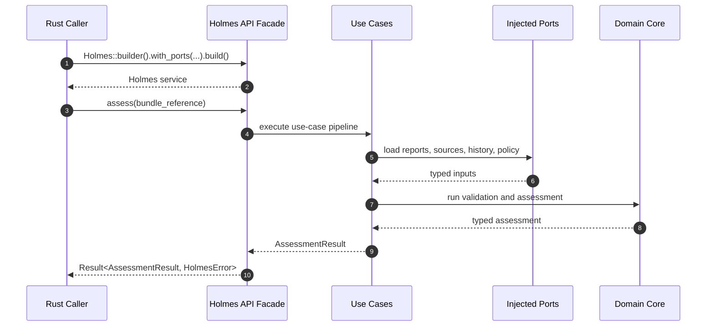

The API never publishes by default. Publishing is explicit. That prevents a
library caller from accidentally writing files, posting comments, or leaking
data into logs.

## Interface 3: MCP

The MCP interface is for agents and external tools. It should expose Holmes as
structured tools and resources, not just as a shell command wrapper.

Candidate MCP tools:

| Tool                        | Purpose                                                                |
| --------------------------- | ---------------------------------------------------------------------- |
| `holmes_assess_bundle`      | Validate and assess a bundle, returning structured findings and gates. |
| `holmes_verify_citations`   | Verify citations against workspace or bundle source files.             |
| `holmes_render_report`      | Render a report document in markdown, JSON, or compact summary form.   |
| `holmes_explain_finding`    | Explain one finding with source context and recommended next actions.  |
| `holmes_compare_runs`       | Compare two run artifacts and highlight regression or readiness drift. |
| `holmes_list_report_schema` | Expose supported report contract versions.                             |

Candidate MCP resources:

| Resource                         | Purpose                                             |
| -------------------------------- | --------------------------------------------------- |
| `holmes://bundle/{id}/summary`   | Read compact summary for a known bundle.            |
| `holmes://bundle/{id}/findings`  | Read findings as structured data.                   |
| `holmes://bundle/{id}/report.md` | Read rendered Markdown without publishing anywhere. |
| `holmes://schemas/{version}`     | Read supported report schemas or type contracts.    |

### MCP Golden Path

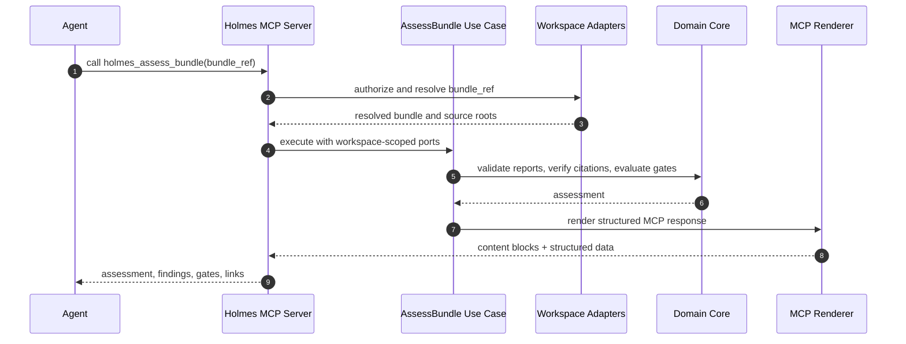

The MCP adapter must respect workspace authorization. It should not let an
agent ask Holmes to read arbitrary machine-local paths unless the MCP server
was explicitly configured to allow that root.

## Reporting Output Modes

Reporting is a two-step process:

1. Build a `ReportDocument`.
2. Render and publish it.

Output modes should be explicit:

| Mode             | Renderer              | Publisher                       | Primary consumer              |
| ---------------- | --------------------- | ------------------------------- | ----------------------------- |
| `terminal`       | Terminal renderer     | Stdout                          | Humans in local shell         |
| `json`           | JSON renderer         | Stdout or file                  | CI, scripts, API consumers    |
| `markdown`       | Markdown renderer     | Stdout or file                  | Docs, artifacts, review notes |
| `github-comment` | GitHub markdown       | GitHub PR comment publisher     | Pull request reviewers        |
| `mcp-structured` | MCP renderer          | MCP tool response publisher     | Agents and tools              |
| `html`           | Future HTML renderer  | File/dashboard publisher        | Humans in browser             |
| `sarif`          | Future SARIF renderer | File or code scanning publisher | Security/review tooling       |
| `junit`          | Future JUnit renderer | File publisher                  | CI test-report surfaces       |

The GitHub path should have a small, explicit adapter:

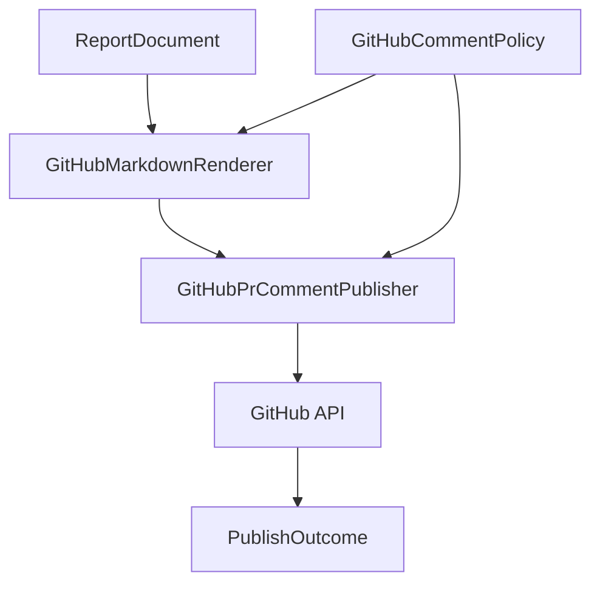

GitHub-specific concerns belong here:

- marker comments
- update versus create behavior
- maximum comment size
- collapsible sections
- PR links
- reviewer mentions
- rate-limit handling
- authentication failure messages
- retry/backoff if we decide to add it

None of those belong in Holmes scoring, Watson citation verification, or
Moriarty readiness analysis.

## GitHub PR Comment Golden Path

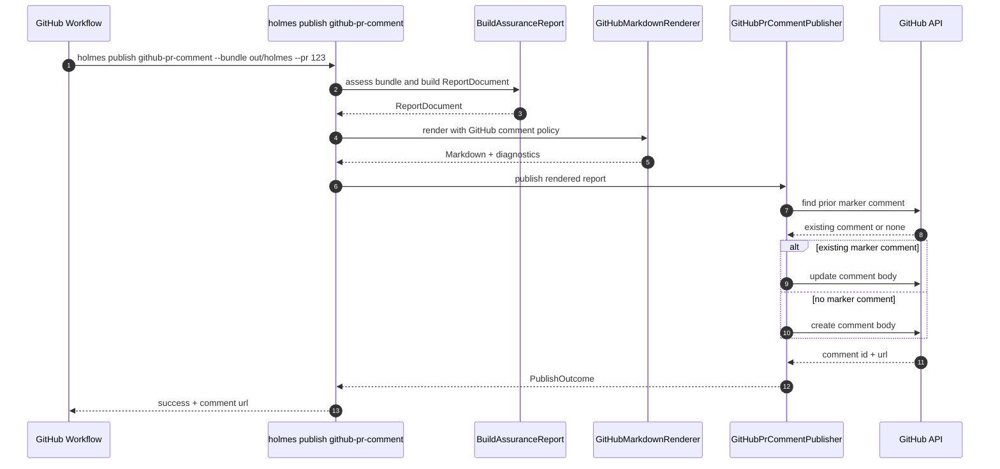

The comment should say what Holmes concluded and what a reviewer should do.
It should not hide failure details in workflow logs only. If the comment is
truncated, the comment must say so and link to the complete artifact.

## Failure Paths

Holmes should treat failure paths as first-class design, not incidental
exceptions.

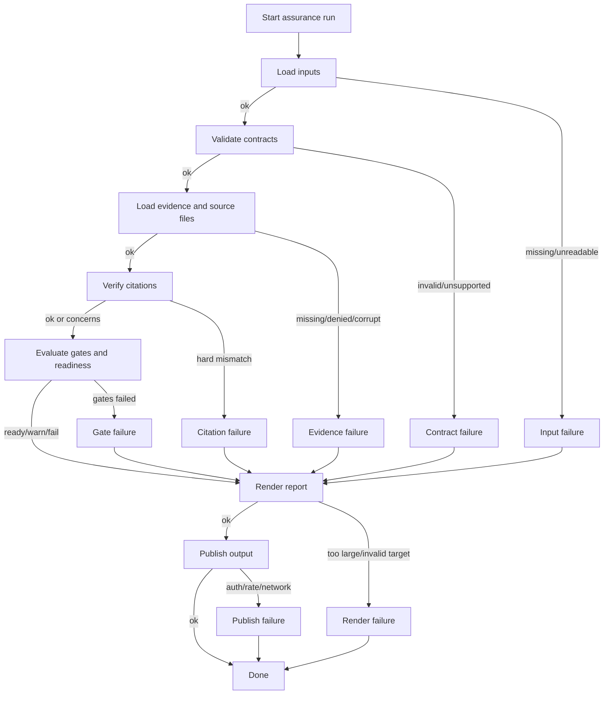

The key decision: most failures should still produce a report document. A
malformed input, missing source file, or failed citation verification is itself
useful evidence. Rendering should be best-effort unless rendering is the broken
part.

### Known Failure Path: Missing Bundle

Expected behavior:

- Classify as `InputError::MissingBundle`.
- Include the attempted path/reference.
- Include the interface-specific remediation:
  - CLI: "Check --bundle path."
  - MCP: "Bundle reference is outside configured workspace or missing."
  - GitHub workflow: "Expected artifact was not produced by prior job."
- Do not panic.
- Do not create a fake passing report.
- If publishing is requested, publish a failure report if the publisher can run.

### Known Failure Path: Invalid JSON Or Unsupported Schema Version

Expected behavior:

- Parse errors are separate from schema-version errors.
- The report names the file and offset/line when available.
- Unsupported versions list supported versions.
- Unknown fields should be handled according to version policy:
  - strict for authoritative report contracts
  - permissive only for explicitly extension fields
- A contract failure blocks readiness.

### Known Failure Path: Missing Source File

Expected behavior:

- Citation verification marks the citation as unverified or failed according to
  policy.
- The report records the cited path and the source store that was asked.
- If the source path is outside the allowed root, classify as access denied,
  not missing.
- Readiness is downgraded by evidence trust rules.
- The system still completes the report.

### Known Failure Path: Citation Span Out Of Bounds

Expected behavior:

- Reject line spans where start or end are zero, negative, reversed, or beyond
  file length.
- Classify as a citation integrity failure.
- Do not silently clamp spans.
- Include line count and requested span in diagnostics.
- Mark the affected finding or claim as unsupported.

### Known Failure Path: Citation Content Mismatch

Expected behavior:

- Compare only the claimed span when a span is exact.
- Do not require the whole file to match for exact-span claims.
- For whole-file claims, verify the entire file only if whole-file citation is
  permitted by policy.
- For coarse claims, record trust downgrade instead of pretending verification
  is exact.
- Return both a machine-readable result and a reviewer-facing explanation.

### Known Failure Path: Policy Config Invalid

Expected behavior:

- Fail before scoring.
- Include the policy source and invalid field path.
- Use defaults only when policy source is absent, not when it is malformed.
- Do not combine partially-invalid policy with defaults unless the policy
  contract explicitly allows that behavior.

### Known Failure Path: Counterfactual Provider Unavailable

Expected behavior:

- Treat provider execution as optional unless policy marks it required.
- Classify unavailable provider separately from provider failure.
- Include provider name, requested lane, and execution mode.
- Apply a deterministic confidence/readiness rule.
- Do not retry semantic failures.
- Do not load ambient modules from Node compatibility paths.

### Known Failure Path: Counterfactual Provider Timeout

Expected behavior:

- Provider adapters use explicit bounded execution policy.
- Timeout produces a provider execution diagnostic.
- The core sees a typed unavailable or failed counterfactual result.
- No partial provider output is trusted unless the provider protocol marks it
  complete and verifiable.

### Known Failure Path: Run History Missing

Expected behavior:

- Moriarty readiness can run with no history if policy permits.
- The report names that trend analysis is unavailable.
- Confidence is lower than when comparable history exists.
- Missing history is not a system crash.

### Known Failure Path: Run History Corrupt

Expected behavior:

- Corrupt history is distinct from missing history.
- Corrupt points are either rejected entirely or isolated with explicit
  diagnostics, according to policy.
- Readiness should not silently ignore corrupt history if trend analysis is
  gate-bearing.

### Known Failure Path: Git Data Unavailable

Expected behavior:

- Git SHA, changed files, merge base, and author metadata are optional
  provenance inputs unless policy requires them.
- Git adapter failures return typed diagnostics.
- CI mode can require Git provenance.
- Local API mode can omit Git entirely.

### Known Failure Path: GitHub Comment Too Large

Expected behavior:

- Rendering produces diagnostics before publishing.
- GitHub renderer applies a truncation policy.
- The comment includes:
  - compact summary
  - highest-severity findings
  - action list
  - explicit truncation note
  - link or attachment reference to full report if available
- The core assessment remains unchanged by truncation.

### Known Failure Path: GitHub Auth Or Rate Limit Failure

Expected behavior:

- Publishing fails with `PublishError`.
- The rendered report can still be written to stdout or an artifact if the
  interface configured a fallback.
- The failure does not rewrite the assessment verdict.
- CLI exits with a publication error category.

### Known Failure Path: MCP Workspace Denial

Expected behavior:

- The MCP adapter rejects requests outside configured workspace roots before
  invoking core use cases.
- The response is structured and explains the denied reference.
- The denial is not represented as an assurance verdict because no assurance
  run occurred.

## State Model

An assurance run has a lifecycle that should be visible in logs, API responses,
and optional audit artifacts.

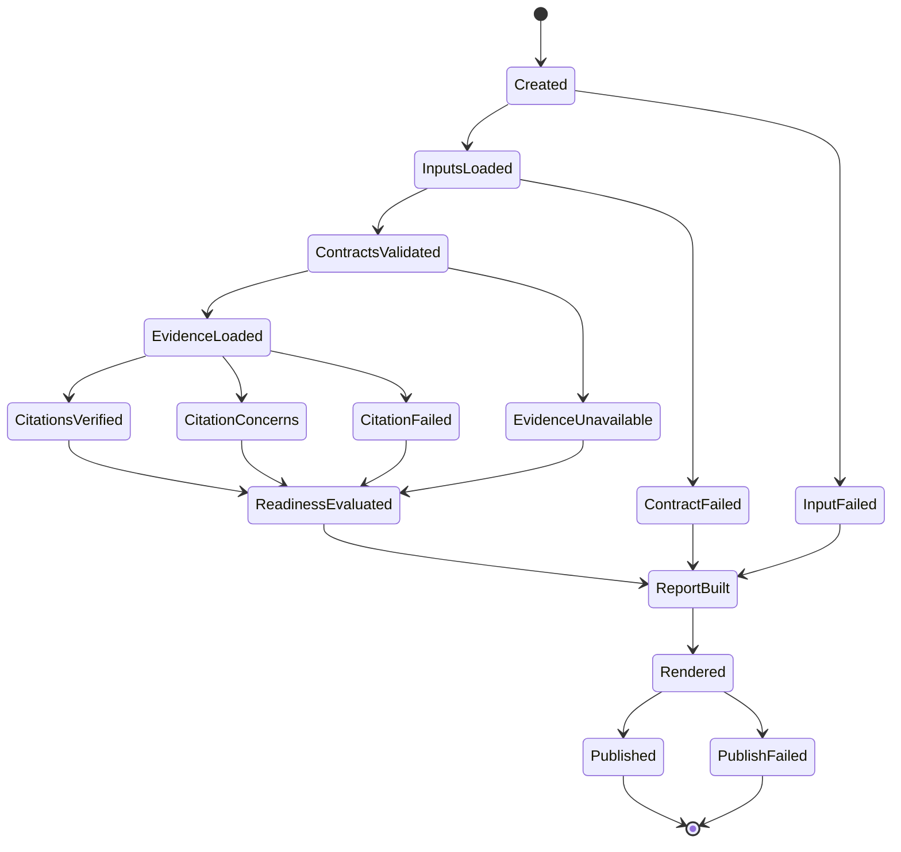

The lifecycle should be evented through an `EventSink` port. Tests can assert
the exact lifecycle for failure paths without scraping terminal output.

## Design Decision: Redesign, Not Port

A direct port would translate current files into Rust modules:

```text
Holmes.mjs -> holmes.rs
Watson.mjs -> watson.rs
pr-comment.mjs -> pr_comment.rs
```

That would be faster at first and worse later. The current package boundaries
are historical. The rewrite should preserve behavior that is valuable, not
file structure that happened to accumulate.

The redesign chooses use cases and ports first:

- "Assess this bundle."
- "Verify these citations."
- "Build a report document."
- "Render this document for a target."
- "Publish this rendered output somewhere."

That gives Holmes a stable center while adapters change around it.

## Design Decision: GitHub Is A Reporting Adapter

GitHub PR comments are visible, so they feel central. They are not central.

They are one delivery channel with strict formatting constraints. Treating that
channel as architecture creates several problems:

- Comment truncation starts influencing truth.
- GitHub API failures look like assurance failures.
- Markdown formatting becomes mixed with scoring.
- Agent and CLI users inherit PR-specific language.
- Testing requires too much GitHub-shaped setup.

The redesigned architecture makes GitHub publishing a leaf adapter. It can be
excellent without being authoritative.

## Design Decision: Report Documents Before Markdown

Markdown is not a good internal representation. It loses structure, makes
truncation hard, and encourages string-based tests.

`ReportDocument` should be the internal reporting contract. It can represent:

- summaries
- findings
- gate status
- evidence tables
- action lists
- attachments
- links
- collapsible sections
- severity ordering
- truncation priorities

Renderers can then make target-specific choices without changing assessment
truth.

## Design Decision: Typed Rust Contracts Before JSON Schemas

The current JS package validates reports dynamically. The Rust system should
use typed contracts as the primary authority and JSON schema only where an
external boundary needs it.

Recommended contract policy:

- Internal core uses Rust structs and enums.
- External JSON input uses versioned serde structs.
- Unknown versions fail clearly.
- Known extension fields are explicit.
- Optional fields have documented defaults.
- Contract fixtures live beside Rust tests.
- JSON schema files can be generated or maintained for external consumers, but
  they do not replace typed tests.

## Design Decision: Counterfactuals Are A Port

Counterfactual analysis is useful, but provider loading is dangerous if it
imports old Node runtime assumptions.

The core should define:

```text
CounterfactualProviderPort
  analyze(request) -> CounterfactualOutcome
```

Adapters can implement that port through:

- Rust plugin registry
- WASM component
- external process protocol
- compatibility bridge during migration

The core should not know how the provider is loaded. It only knows whether the
provider returned a valid, versioned outcome.

## Design Decision: Determinism By Construction

Holmes is an assurance tool. It should not be flaky.

Required deterministic controls:

- Inject `Clock`.
- Sort findings and gates by stable keys.
- Use stable report ids or explicitly generated ids.
- Avoid random temp path data in domain output.
- Avoid wall-clock sleeps in tests.
- Treat provider timeout as adapter behavior, not domain behavior.
- Keep renderer snapshots stable by separating dynamic metadata from content.

## Golden Path: Full CI Assurance With GitHub Comment

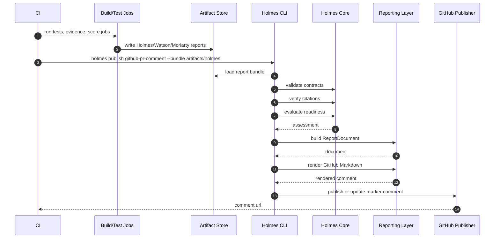

Expected outputs:

- A typed assessment result.
- A rendered GitHub comment.
- A publish outcome with comment id/url.
- Optional full Markdown/JSON artifact.
- Exit status based on publication success and configured gate policy.

## Golden Path: Local Developer Debugging

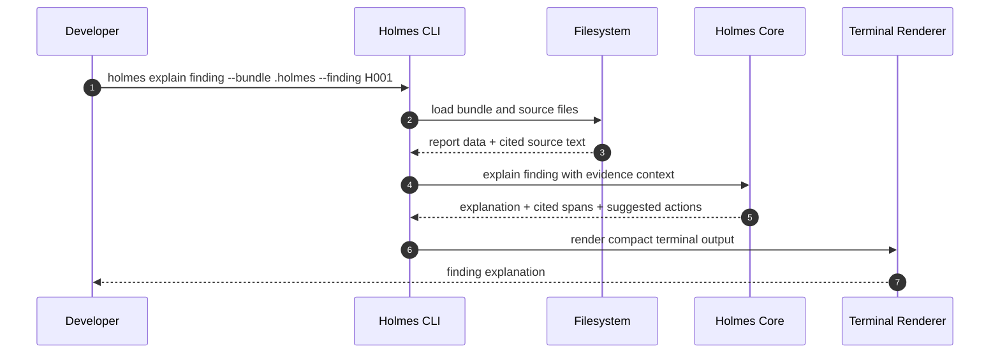

The local path should be optimized for rapid diagnosis. It should not require
GitHub credentials, workflow artifacts, or MCP.

## Golden Path: Agent Uses MCP

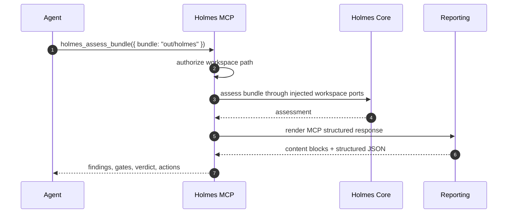

The MCP response should be useful without the agent reading raw files unless it
chooses to. It should include stable ids for follow-up calls:

- finding ids
- gate ids
- citation ids
- artifact references
- report resource URIs

## Golden Path: API Embedding

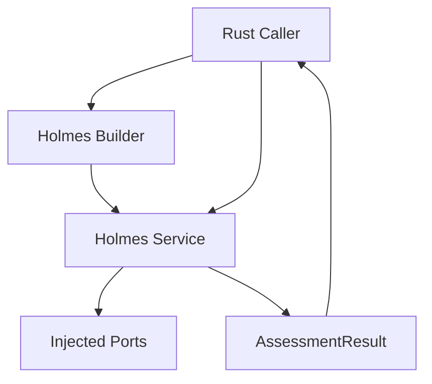

The API should be small enough that another Rust crate can embed Holmes without
pulling in GitHub, MCP, or CLI dependencies.

## Migration Path

The rewrite should be sliced so each PR is useful and reversible.

| Slice | Goal                                                                            |
| ----- | ------------------------------------------------------------------------------- |
| 1     | Add this design packet and wire it into `BEARING`.                              |
| 2     | Create `wesley-holmes-core` with domain types and error taxonomy.               |
| 3     | Add report contract structs and validation fixtures.                            |
| 4     | Port citation span parsing and exactness classification.                        |
| 5     | Port source-backed citation verification through `SourceFileStore`.             |
| 6     | Port evidence trust summary and downgrade policy.                               |
| 7     | Port Holmes gate/verdict construction.                                          |
| 8     | Port Watson report calculation and concerns.                                    |
| 9     | Port Moriarty history normalization and readiness analysis.                     |
| 10    | Add `ReportDocument` and Markdown/JSON renderers.                               |
| 11    | Add CLI `validate`, `verify-citations`, and `assess` commands.                  |
| 12    | Add GitHub PR comment renderer/publisher adapter.                               |
| 13    | Add MCP tool adapter over the same use cases.                                   |
| 14    | Update workflows to use Rust Holmes for validation and comment rendering.       |
| 15    | Turn JS Holmes into a compatibility wrapper or remove selected commands.        |
| 16    | Remove `@wesley/core` imports from the JS Holmes compatibility package.         |
| 17    | Remove `@wesley/runtime-node` imports from the JS Holmes compatibility package. |
| 18    | Retire JS Holmes package once workflows and tests are no longer dependent.      |

The key milestone is not "all files rewritten." The key milestone is:

```text
packages/wesley-holmes no longer keeps packages/wesley-core or
packages/wesley-runtime-node alive.
```

## Backward Compatibility During Migration

The existing JS package can remain temporarily if it becomes an adapter over
Rust output or a compatibility wrapper. It must not remain the source of truth.

Allowed temporary states:

- JS CLI shells out to Rust Holmes for core assessment.
- JS PR comment command consumes a Rust-produced `ReportDocument`.
- JS tests compare old sample reports to Rust output fixtures.
- JS counterfactual compatibility path remains isolated behind an explicit
  adapter while the provider protocol is designed.

Disallowed temporary states:

- New scoring behavior added only in JS.
- New citation verification behavior added only in JS.
- GitHub renderer changes that require editing core verdict logic.
- MCP implemented by shelling to a JS command as the primary path.
- Rust core depending on JS-generated report truth.

## Acceptance

This packet is healthy when the implementation can prove:

1. CLI, API, and MCP call the same application use cases.
2. GitHub PR comments are one report publisher, not a special assurance path.
3. `ReportDocument` is the intermediate reporting contract.
4. Citation verification is deterministic and testable without filesystem
   globals.
5. Policy loading is injected and invalid policy fails before scoring.
6. Counterfactual provider execution is an explicit port.
7. Git, GitHub, filesystem, clock, and process execution are adapters.
8. The Rust core can run tests without Node packages.
9. Legacy JS Holmes no longer imports `@wesley/core` or
   `@wesley/runtime-node`.
10. The Node retirement ledger can mark the Holmes blocker closed or reduced to
    a standalone compatibility shell.

## Open Questions

| Question                                                        | Current leaning                                                                |
| --------------------------------------------------------------- | ------------------------------------------------------------------------------ |
| Should `holmes`, `watson`, and `moriarty` be separate binaries? | Keep one `holmes` binary first; aliases can come later.                        |
| Should GitHub publishing live in the same workspace?            | Yes initially, as a leaf crate; it can externalize later.                      |
| Should MCP ship in the first implementation PR?                 | No. Define ports first, then add MCP once the use cases are stable.            |
| Should JSON schemas still exist?                                | Yes for external consumers, but Rust structs are the internal authority.       |
| Should counterfactual providers use WASM first?                 | Not yet. Define the provider port first, then choose adapter(s) with evidence. |
| Should legacy JS PR comments be deleted immediately?            | No. Keep compatibility until Rust reporting can publish equivalent comments.   |

## Resulting Direction

Holmes becomes a Rust assurance hexagon:

- domain truth in Rust
- output abstraction before Markdown
- GitHub comments as one publisher
- CLI/API/MCP over shared use cases
- explicit ports for external capabilities
- no dependency on legacy Node packages for truth-bearing behavior

That is the path that lets Wesley keep Holmes while still deleting the legacy
Node surface.
