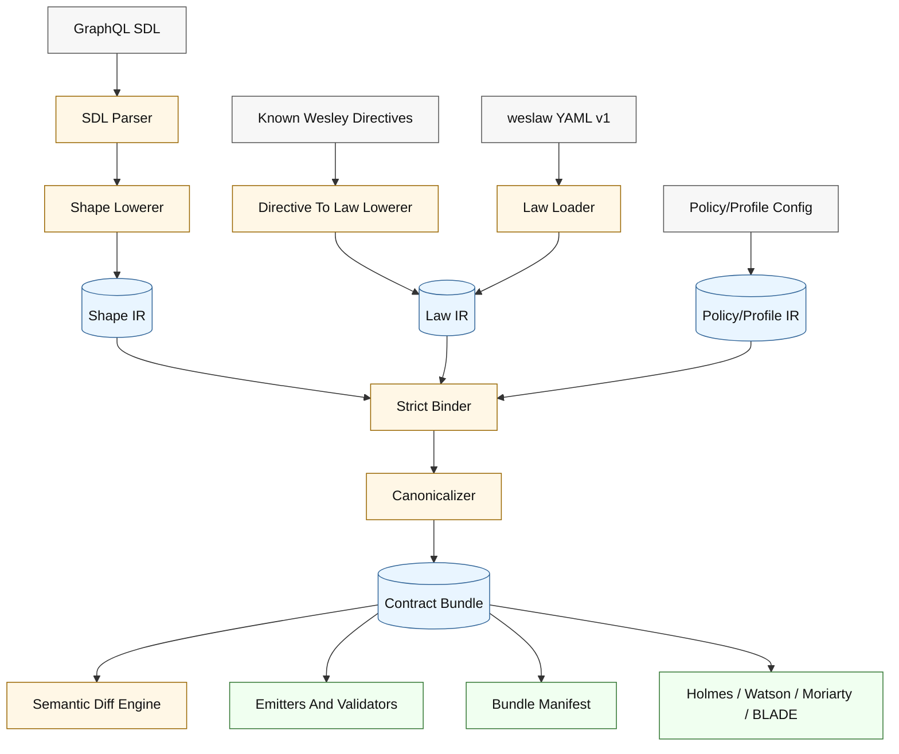
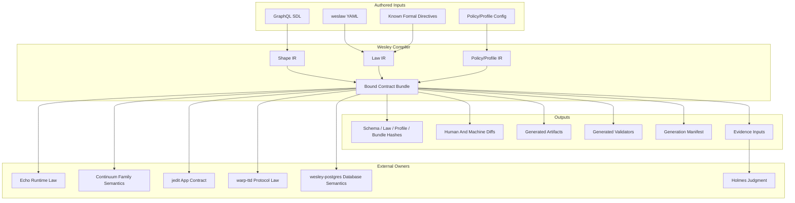
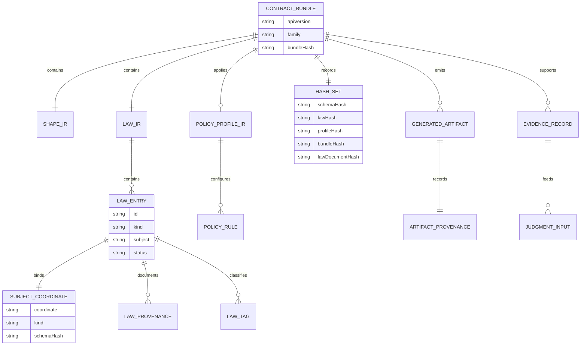
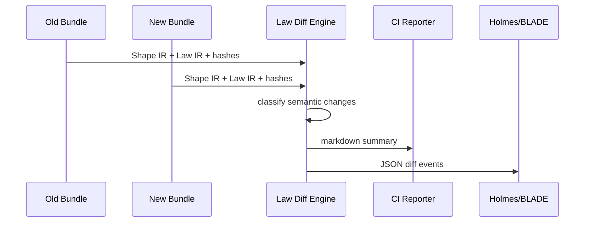
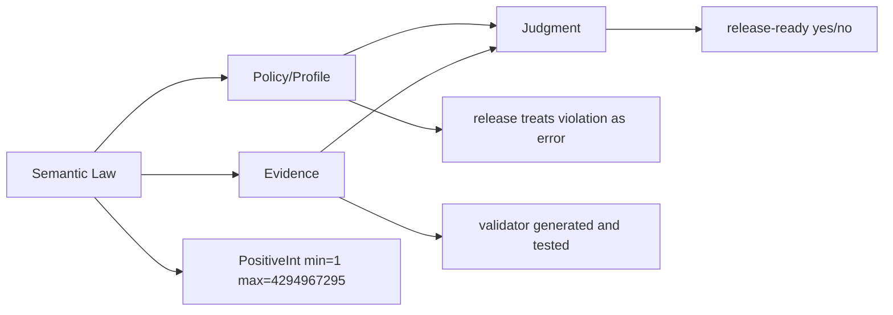
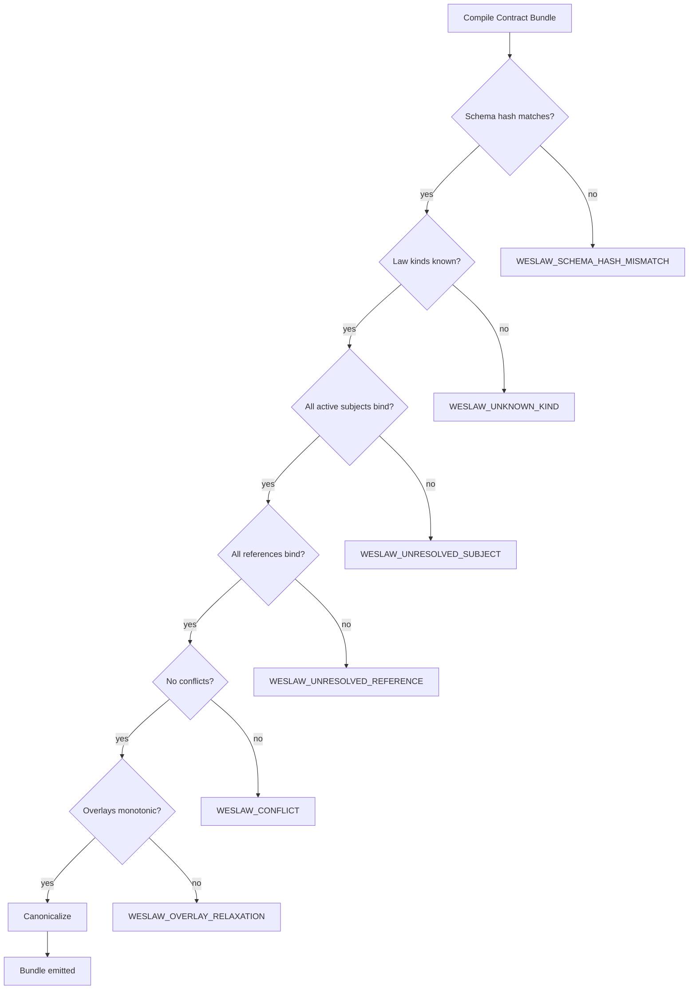

# weslaw Semantic Law IR

## Status

Active design packet.

Decision posture:

```text
ACCEPT:  weslaw as Wesley's semantic law layer.
ENHANCE: the v1 specification before implementation.
DEFER:   Wesley SDL+ until Law IR is stable, boring, and useful.
```

## Question

How should Wesley represent semantic contract law that GraphQL SDL cannot carry
cleanly, without turning Wesley into a product runtime, a policy engine, or a
second drifting source of truth?

## Hill

Wesley compiles contract bundles.

GraphQL SDL remains sovereign over structural shape. `weslaw` becomes sovereign
over semantic law. The combined, bound, canonical contract bundle is the unit
Wesley hashes, diffs, emits, explains, validates, and hands to assurance tools.

The core product is not YAML. The core product is a typed, versioned,
canonical Law IR.

```text
GraphQL SDL + weslaw + policy/profile input
    -> Shape IR + Law IR + Policy/Profile IR
    -> canonical bundle
    -> hashes, diffs, artifacts, validators, manifests, evidence, judgment
```

## Why This Exists

Wesley has intentionally narrowed itself into a Rust-native compiler kernel and
assurance toolchain. That is good. The next pressure is not more runtime
ownership. The pressure is more precise contract meaning.

GraphQL SDL gives Wesley a strong authored shape language:

- type names
- field names
- arguments
- nullability
- enums
- unions
- input objects
- operation signatures
- attached directives

But the surrounding Wesley ecosystem already needs laws that ordinary GraphQL
cannot express cleanly:

- opaque scalar identity and width rules
- logical counters that are not wall-clock timestamps
- discriminated input envelopes standing in for input unions
- operation read/write/create/forbid footprints
- channel ordering and protocol version posture
- cross-object invariants
- evidence and witness posture
- app-specific semantic refinements

Today those laws leak into three places:

1. prose comments;
2. directive mini-languages;
3. downstream interpreter code.

That is not compiler-grade truth. It is scattered meaning. `weslaw` exists to
make that meaning explicit, typed, bound, canonical, hashable, diffable, and
available to generated artifacts and assurance systems.

The diagnosis is simple:

```text
GraphQL has been accidentally hosting two languages:
  1. a shape language;
  2. a hidden semantic-law language.
```

`weslaw` names the second language and moves it into a compiler-controlled
home.

## Non-Negotiables

- Law IR is the product. YAML, directives, and future SDL+ are frontends.
- GraphQL owns structural shape. `weslaw` must not introduce GraphQL types,
  fields, arguments, enum values, input fields, unions, interfaces, or operation
  signatures.
- Active law must bind strictly. Dangling schema coordinates, wrong subject
  kinds, duplicate law ids, conflicting laws, invalid overlays, and unknown
  non-shape symbols are fatal errors.
- Law documents must anchor to a canonical schema hash. Normal compilation
  fails when the active schema hash does not match the law anchor.
- Law IR and the `weslaw/v1` authoring shape must publish machine-readable
  schemas. If the representation is JSON, that means JSON Schema under
  `schemas/`; if a later representation is not JSON, it still needs a published
  schema contract.
- Hashes are computed from normalized Law IR, not YAML bytes.
- Semantic law hashes exclude comments, formatting, source spans, and rationale
  prose.
- Prose rationale may be preserved in a separate document/provenance hash.
- `expr: "..."` string invariants are not v1 executable law.
- v1 invariants use typed predicate forms or external verifier references.
- Policy, evidence, and judgment are separate from semantic law.
- Overlays may refine only when the compiler can prove monotonic refinement.
- Known formal Wesley directives may lower into Law IR.
- Comments and unknown/stringly directives may scaffold provisional law only.
- Wesley SDL+ is deferred until the Law IR, binder, canonicalization, and diffs
  are stable.

## Design Lock Artifacts

This packet's first implementation PR locks the v1 substrate through companion
specs and fixtures:

- [Law IR v1](./LAW_IR_V1.md) defines the closed semantic model, law kinds,
  active/draft behavior, and v1 non-goals.
- [Coordinates And Registries](./COORDINATES_AND_REGISTRIES.md) defines subject
  coordinates, non-shape resource/verifier/channel registries, schema-hash
  anchors, and explicit discovery.
- [Canonicalization And Diagnostics](./CANONICALIZATION_AND_DIAGNOSTICS.md)
  defines canonical byte rules, hash inputs, active versus draft semantics, and
  the v1 diagnostic catalog.
- [weslaw fixtures](../../../test/fixtures/weslaw/README.md) define accepted
  and rejected substrate examples for scalar, variant, footprint, channel, and
  invariant law.

## Vocabulary

| Term               | Meaning                                                                                                                               |
| ------------------ | ------------------------------------------------------------------------------------------------------------------------------------- |
| Shape              | The GraphQL-owned structural contract: types, fields, arguments, enum values, operation signatures, nullability, and lists.           |
| Law                | Semantic facts that constrain or explain meaning: scalar semantics, variants, footprints, channels, invariants, and evidence posture. |
| Contract bundle    | The bound unit containing Shape IR, Law IR, policy/profile IR, hashes, manifests, and provenance.                                     |
| Shape IR           | Wesley's canonical lowered representation of authored GraphQL SDL shape.                                                              |
| Law IR             | Wesley's canonical lowered representation of semantic law.                                                                            |
| Policy/Profile IR  | Enforcement posture for a context, such as local, CI, release, or certification.                                                      |
| Evidence           | What Wesley generated, observed, witnessed, or verified.                                                                              |
| Judgment           | A downstream conclusion over shape, law, policy, and evidence.                                                                        |
| Subject coordinate | A stable reference to a schema or law subject, such as `scalar:WorldlineTick` or `operation:Mutation.replaceRangeAsTick`.             |
| Law id             | A globally stable identifier for one semantic law entry.                                                                              |
| Law frontend       | An authored input form that lowers into Law IR: v1 YAML, known directives, or future SDL+.                                            |
| Overlay            | A law document that refines base law without weakening it.                                                                            |
| Rebind             | An explicit migration workflow that checks whether existing law still binds to a changed schema hash.                                 |

## Architecture

### Contract Bundle Pipeline



The pipeline has one critical property: every authored law frontend converges
into the same Law IR before hashing, diffing, or generation.

### Layer Ownership



Wesley preserves, binds, emits, and explains semantic law. It does not become
the owner of Echo runtime execution, Continuum family meaning, jedit product
behavior, warp-ttd transport behavior, or PostgreSQL semantics.

## Contract Bundle Model

The contract bundle is the durable conceptual unit.



The bundle answers:

1. What structural shape was authored?
2. What semantic law was active?
3. What profile or policy was applied?
4. What hashes identify the exact inputs?
5. What artifacts were generated?
6. What evidence or witness data supports the result?
7. What changed since the previous bundle?

## Law IR v1 Shape

Law IR v1 is a closed, versioned model. It should be extensible by adding new
versioned variants, not by letting arbitrary `kind` strings pass through.

Conceptually:

```rust
enum LawKindV1 {
    ScalarSemantics(ScalarSemanticsLaw),
    VariantLaw(VariantLaw),
    FootprintLaw(FootprintLaw),
    ChannelLaw(ChannelLaw),
    InvariantLaw(InvariantLaw),
}
```

This is not a promise that the implementation must use this exact Rust shape.
It is the type discipline the compiler must enforce.

### Common Law Entry Fields

Every active law entry has:

| Field       | Meaning                                               | Hash posture                                     |
| ----------- | ----------------------------------------------------- | ------------------------------------------------ |
| `id`        | Stable law id.                                        | Semantic hash                                    |
| `kind`      | Closed Law IR variant.                                | Semantic hash                                    |
| `subject`   | Bound schema or law coordinate.                       | Semantic hash                                    |
| `status`    | `active` or `draft`; only active law affects bundles. | Semantic hash if active                          |
| `tags`      | Optional classification tags.                         | Semantic hash when semantically relevant         |
| `profiles`  | Optional profile applicability references.            | Profile hash or semantic hash depending on field |
| `rationale` | Human explanation.                                    | Document/provenance hash only                    |
| `source`    | Authored source span or path.                         | Excluded from semantic hash                      |

Draft entries may exist in files produced by `wesley init-law`, but they do not
bind into active bundles and do not affect generated artifacts.

## v1 Law Categories

### Scalar Semantics Law

Scalar semantics law captures representation, range, identity, ordering, and
preservation requirements that GraphQL scalar declarations cannot express.

Example:

```yaml
apiVersion: weslaw/v1
schema:
  family: echo-runtime-boundary
  hash: sha256:example-schema-hash
laws:
  - id: echo.scalar.positiveInt.u32-positive
    status: active
    kind: scalarSemantics
    subject: scalar:PositiveInt
    semantics:
      representation: integer
      minInclusive: 1
      maxInclusive: 4294967295
      forbids: [silentGraphQLIntNarrowing]
    rationale: >
      PositiveInt is a u32-domain runtime value. GraphQL Int narrowing would
      change the contract even though the visible scalar name stayed the same.
```

The `weslaw/v1` YAML frontend nests scalar-specific fields under `semantics`.
Lowering strips that authoring wrapper before producing the scalar Law IR body.

Compiler expectations:

- `subject` must bind to an existing scalar in the active schema hash.
- range and representation rules must be type checked.
- generated validators may consume these facts.
- semantic diffs must classify range narrowing, range widening, representation
  changes, and ordering changes.

### Variant Law

Variant law captures discriminated input envelopes and input-union stand-ins.

Example:

```yaml
apiVersion: weslaw/v1
schema:
  family: echo-runtime-boundary
  hash: sha256:example-schema-hash
laws:
  - id: echo.input.playbackMode.variant-rules
    status: active
    kind: variantLaw
    subject: input:PlaybackModeInput
    discriminator:
      field: kind
      enum: PlaybackModeKind
    cases:
      - value: PAUSED
        forbids: [target, then]
      - value: PLAY
        forbids: [target, then]
      - value: STEP_FORWARD
        forbids: [target, then]
      - value: STEP_BACK
        forbids: [target, then]
      - value: SEEK
        requires: [target, then]
```

Compiler expectations:

- the subject must bind to an input object;
- the discriminator field must exist on that input object;
- the discriminator enum must exist;
- every case value must bind to an enum value;
- required and forbidden fields must exist on the input object;
- a case may not both require and forbid the same field.

### Footprint Law

Footprint law captures operation access semantics: reads, writes, creates,
forbids, slots, closures, updates, and observed residue.

Example:

```yaml
apiVersion: weslaw/v1
schema:
  family: jedit-hot-text-runtime
  hash: sha256:example-schema-hash
laws:
  - id: jedit.op.replaceRangeAsTick.footprint
    status: active
    kind: footprintLaw
    subject: operation:Mutation.replaceRangeAsTick
    reads: [BufferWorldline, RopeHead, RopeBranch, RopeLeaf, TextBlob, Anchor]
    writes: [BufferWorldline]
    creates: [TextBlob, RopeLeaf, RopeBranch, RopeHead, Tick, TickReceipt]
    forbids: [AstState, Diagnostics, GitWitness, UiState]
    slots:
      - name: worldline
        kind: BufferWorldline
        bindFromArg: input.worldlineId
        access: [read, write]
      - name: baseHead
        kind: RopeHead
        bindFromArg: input.baseHeadId
        access: [read]
    closures:
      - name: touchedRope
        fromSlot: baseHead
        operator: ropeRangeClosure
        argBindings: [input.startByte, input.endByte]
        reads: [RopeBranch, RopeLeaf, TextBlob]
        cardinality: many
      - name: affectedAnchors
        fromSlot: worldline
        operator: anchorsIntersectingEditWindow
        argBindings: [baseHead, input.startByte, input.endByte]
        reads: [Anchor]
        cardinality: many
    createSlots:
      - name: newBlob
        kind: TextBlob
        cardinality: optional
      - name: nextHead
        kind: RopeHead
      - name: tick
        kind: Tick
      - name: receipt
        kind: TickReceipt
    updates:
      - slot: worldline
        fields: [canonicalHead]
```

Compiler expectations:

- the subject must bind to a root operation field;
- operation argument paths must bind to real input paths;
- resource kinds must bind to schema coordinates or explicit law registries;
- slot names must be unique within the footprint;
- updates must target writable slots;
- forbidden resource kinds must not appear in reads, writes, creates, or
  updates;
- footprint expansion and contraction must be reported as semantic diffs.

### Channel Law

Channel law captures protocol channels, ordering, version posture, and message
families.

Example:

```yaml
apiVersion: weslaw/v1
schema:
  family: warp-ttd-protocol
  hash: sha256:example-schema-hash
laws:
  - id: warp-ttd.channel.protocol.v4
    status: active
    kind: channelLaw
    subject: channel:ttd.protocol@4
    ordered: true
    version: 4
    compatibility:
      versioning: channel
      semverCoupled: false
    messages:
      - field: hostHello
        type: HostHello
      - field: laneCatalog
        type: LaneCatalog
      - field: playbackHeadSnapshot
        type: PlaybackHeadSnapshot
      - field: playbackFrame
        type: PlaybackFrame
      - field: receiptSummary
        type: ReceiptSummary
      - field: effectEmissionSummary
        type: EffectEmissionSummary
      - field: deliveryObservationSummary
        type: DeliveryObservationSummary
      - field: executionContext
        type: ExecutionContext
```

Compiler expectations:

- channel subjects must bind to known channel declarations from SDL directives
  or explicit law registries;
- message fields and message types must bind;
- channel version changes must be semantic diffs;
- ordered to unordered changes are semantic changes even when GraphQL shape is
  unchanged.

### Invariant Law

Invariant law is deliberately boring in v1.

v1 does not admit arbitrary executable string expressions. It supports typed
predicate forms and external verifier references.

Typed predicate example:

```yaml
apiVersion: weslaw/v1
schema:
  family: continuum-runtime-boundary
  hash: sha256:example-schema-hash
laws:
  - id: continuum.invariant.translated-evidence-not-native
    status: active
    kind: invariantLaw
    subject: type:TranslatedSubstrateEvidence
    predicate:
      op: fieldEquals
      field: nativeContinuumWitness
      value: false
```

External verifier example:

```yaml
apiVersion: weslaw/v1
schema:
  family: continuum-runtime-boundary
  hash: sha256:example-schema-hash
laws:
  - id: continuum.invariant.bundle-links-source-shell
    status: active
    kind: invariantLaw
    subject: family:continuum-runtime-boundary
    predicate:
      op: external
      verifier: continuum-law-checker
      ref: continuum.invariants.bundleLinksSourceShell
      inputContract: continuum.bundle-invariant-input.v1
```

Compiler expectations:

- typed predicates must be parsed as structured data;
- fields referenced by typed predicates must bind;
- external verifier ids must bind to explicit law registries;
- raw expression strings are rejected as executable v1 law.

## Deferred Law Categories

The following are valuable but should not block v1:

| Category                                | Why defer                                                                                                                                     |
| --------------------------------------- | --------------------------------------------------------------------------------------------------------------------------------------------- |
| Evidence posture law                    | Important for Continuum witness semantics, but less structurally concrete than scalar, variant, footprint, channel, and simple invariant law. |
| Profile-aware severity escalation       | Belongs in Policy/Profile IR; should not be confused with semantic truth.                                                                     |
| Generated test scaffolding              | Useful after residue and observation surfaces are stable.                                                                                     |
| Runtime capability APIs from footprints | High payoff, but depends on stable footprint IR and target-owned runtime adapters.                                                            |
| Law Matrix static site                  | Strong human legibility surface after `wesley law explain` and semantic diffs exist.                                                          |
| LSP support                             | Should use the same engine as `wesley law explain`; do not build it first.                                                                    |
| Wesley SDL+                             | Authoring sugar only after Law IR is stable.                                                                                                  |

## Binding Model

Strict binding is the difference between law and decoration.

### Binding Inputs

The binder receives:

- Shape IR;
- Law IR;
- optional policy/profile IR;
- explicit law registries for non-shape symbols;
- the active schema hash.

### Binding Rules

An active law entry must satisfy all applicable rules:

| Rule                                                          | Failure                       |
| ------------------------------------------------------------- | ----------------------------- |
| `schema.hash` equals active schema hash                       | `WESLAW_SCHEMA_HASH_MISMATCH` |
| `id` is globally unique in the bundle                         | `WESLAW_DUPLICATE_ID`         |
| `kind` is a known closed Law IR variant                       | `WESLAW_UNKNOWN_KIND`         |
| `subject` parses as a coordinate                              | `WESLAW_INVALID_COORDINATE`   |
| `subject` binds to an existing schema or law-registry subject | `WESLAW_UNRESOLVED_SUBJECT`   |
| `subject` kind matches law kind                               | `WESLAW_WRONG_SUBJECT_KIND`   |
| referenced fields, enum values, args, and resource kinds bind | `WESLAW_UNRESOLVED_REFERENCE` |
| entry does not contradict another active entry                | `WESLAW_CONFLICT`             |
| overlay refines instead of relaxes base law                   | `WESLAW_OVERLAY_RELAXATION`   |

Unknown active law is fatal. Unknown draft law may be retained outside the
active bundle as migration scaffolding.

### Diagnostic Shape

Diagnostics should be compiler-grade:

```text
error[WESLAW_UNRESOLVED_SUBJECT]:
  unresolved operation coordinate: operation:Mutation.replaceRange

  law:
    id: jedit.op.replaceRange.footprint
    file: schemas/jedit-hot-text.weslaw.yaml

  active schema:
    hash: sha256:...

  closest matches:
    operation:Mutation.replaceRangeAsTick
```

Diagnostics must name:

- error code;
- law id;
- subject coordinate;
- source path if available;
- active schema hash;
- closest matches when safe and deterministic.

## Schema Hash Anchoring And Rebind

Normal compilation is strict:

```text
law schema hash != active schema hash -> fail
```

That strictness prevents silent semantic drift. But Wesley also needs an
explicit migration workflow.

### Rebind Workflow

```text
wesley law rebind \
  --law schemas/hot-text.weslaw.yaml \
  --from-schema old.graphql \
  --to-schema new.graphql \
  --out schemas/hot-text.rebound.weslaw.yaml
```

The rebind report should classify each entry:

| Class          | Meaning                                                                                      |
| -------------- | -------------------------------------------------------------------------------------------- |
| `unchanged`    | Subject and references bind identically under the new schema.                                |
| `rebuilt`      | Subject binds after a deterministic rename or coordinate migration supplied by the operator. |
| `broken`       | Subject or required references no longer bind.                                               |
| `needs-review` | Law still binds, but semantic surrounding shape changed enough to require human review.      |

Rebind updates schema hash anchors only when the operator explicitly accepts the
new binding result.

## Canonicalization And Hashing

Canonicalization is load-bearing. If semantically identical law hashes
differently because of key order or formatting, the system loses trust.

### Hash Inputs

| Hash              | Includes                                               | Excludes                                                        |
| ----------------- | ------------------------------------------------------ | --------------------------------------------------------------- |
| `schemaHash`      | canonical Shape IR                                     | comments, source spans, formatting                              |
| `lawHash`         | canonical active Law IR semantic fields                | comments, rationale, source spans, file order                   |
| `profileHash`     | canonical active Policy/Profile IR                     | environment variables, source spans                             |
| `bundleHash`      | schemaHash + lawHash + profileHash + compiler identity | prose docs, local paths unless intentionally part of provenance |
| `lawDocumentHash` | semantic law plus rationale/provenance text            | transient source spans                                          |

### Ordering Rules

v1 must define deterministic ordering:

- law entries sort by stable `id`;
- maps sort lexicographically by key;
- set-like arrays sort lexicographically after duplicate rejection;
- order-sensitive arrays remain order-sensitive and are declared as such in the
  IR spec;
- omitted defaults canonicalize to explicit defaults;
- comments never enter semantic hashes;
- file load order does not affect semantic hashes.

### Canonical Bytes

The canonical codec should be named explicitly:

```text
wesley.law-ir.canonical-json.v1
```

The codec owns:

- object key order;
- numeric representation;
- string escaping;
- default materialization;
- null omission rules;
- array semantics.

### Contract Bundle Manifest

After strict binding succeeds, Wesley emits a versioned
`wesley.contract-bundle-manifest/v1` manifest. The manifest records:

- `schemaHash`: the active canonical Shape IR hash, prefixed with `sha256:`;
- `lawHash`: the semantic active Law IR hash;
- `lawDocumentHash`: a provenance-bearing hash that includes retained
  rationale and document-level provenance;
- `profileHash`: the active policy/profile hash, currently the known empty
  profile hash until Policy IR exists;
- `bundleHash`: a canonical hash over schema, law, profile, codec, compiler,
  and compiler-version identity;
- `lawIrCodec` and `bundleHashCodec`: explicit canonicalization codec ids;
- `compiler` and `compilerVersion`: the Wesley compiler identity that built
  the manifest;
- `lawEntryCount`: the number of active law entries bound into the bundle.

The public manifest shape is published at
`schemas/wesley-contract-bundle-manifest-v1.schema.json`.

### Published Schemas

`weslaw` is a compiler contract, not an undocumented Rust struct. Every
externally consumed representation needs a schema artifact.

Initial schema artifacts:

| Artifact                                                 | Status                        | Purpose                                                    |
| -------------------------------------------------------- | ----------------------------- | ---------------------------------------------------------- |
| `schemas/wesley-law-ir-v1.schema.json`                   | v1 implementation requirement | JSON Schema for typed Law IR v1 JSON.                      |
| `schemas/weslaw-v1.schema.json`                          | v1 implementation requirement | JSON Schema for the parsed `weslaw/v1` authoring document. |
| `schemas/wesley-contract-bundle-manifest-v1.schema.json` | v1 implementation requirement | JSON Schema for emitted contract bundle manifests.         |
| `schemas/wesley-law-diff-v1.schema.json`                 | v1 implementation requirement | JSON Schema for machine-readable law diff events.          |

These schemas validate public structure. They are not semantic hash inputs.
Changing comments, descriptions, `$id`, or schema annotations must not change
`lawHash` unless the underlying Law IR semantics also change.

The `weslaw/v1` authoring schema accepts explicitly marked draft scaffolding
with future or ambiguous fields, but the normalized `wesley.law-ir/v1` schema
rejects draft entries entirely. Promotion to active law is therefore the point
where closed kind/body validation becomes mandatory.

JSON is acceptable as the first schema-authoring format, but the design should
not freeze the project there. The open implementation choice is how Rust owns
these schema artifacts over time:

- handwritten schemas checked into `schemas/`;
- generated schemas from Rust types with checked-in outputs;
- generated Rust types from checked-in schemas.

The requirement to publish schemas is not open.

## Semantic Diff Model

Law diffs are first-class outputs. Human summaries are generated from
machine-readable diff events.



Initial `WLAW-046` through `WLAW-050` event classes:

| Event                      | Meaning                                                                             |
| -------------------------- | ----------------------------------------------------------------------------------- |
| `LAW_BUNDLE_CHANGED`       | Bundle-level semantic fields changed.                                               |
| `REGISTRY_CHANGED`         | Semantic registry facts changed.                                                    |
| `LAW_ADDED`                | New active law entry.                                                               |
| `LAW_REMOVED`              | Active law entry removed.                                                           |
| `LAW_TAGS_CHANGED`         | Existing law classifier tags changed.                                               |
| `LAW_CHANGED`              | Existing law changed outside a narrower v1 event class.                             |
| `SCALAR_SEMANTICS_CHANGED` | Scalar representation, range, ordering, scope, or forbidden interpretation changed. |
| `VARIANT_LAW_CHANGED`      | Variant discriminator or case requires/forbids changed.                             |
| `FOOTPRINT_EXPANDED`       | Reads, writes, creates, or closure reach expanded.                                  |
| `FOOTPRINT_CONTRACTED`     | Footprint reach contracted.                                                         |
| `FOOTPRINT_CHANGED`        | Footprint changed in mixed or structural ways.                                      |
| `SCHEMA_HASH_REBOUND`      | Law was explicitly rebound to a new schema hash.                                    |

Self-review repair added these classes before the next planned slice:

| Event                     | Meaning                                       |
| ------------------------- | --------------------------------------------- |
| `CHANNEL_VERSION_CHANGED` | Channel version changed.                      |
| `CHANNEL_LAW_CHANGED`     | Channel law changed without a version change. |
| `PREDICATE_CHANGED`       | Invariant predicate changed.                  |

Semantic-diff completion classes:

| Event              | Meaning                                              |
| ------------------ | ---------------------------------------------------- |
| `LAW_STRENGTHENED` | Constraint narrowed or forbidden behavior increased. |
| `LAW_WEAKENED`     | Constraint widened or forbidden behavior decreased.  |
| `BINDING_BROKEN`   | Previously bound law no longer binds.                |

The report records `oldSchemaHash`, `newSchemaHash`, `oldLawHash`,
`newLawHash`, and an ordered `changes` array. v1 events carry
`reviewPosture: "requires-review"` until policy/profile mapping exists.
Law-specific events include `lawId`, `subject`, and `lawKind`; bundle-level
events omit those fields.

Example JSON:

```json
{
  "apiVersion": "wesley.law-diff/v1",
  "changes": [
    {
      "kind": "FOOTPRINT_EXPANDED",
      "lawId": "jedit.op.replaceRangeAsTick.footprint",
      "subject": "operation:Mutation.replaceRangeAsTick",
      "addedWrites": ["Diagnostics"],
      "reviewPosture": "requires-review"
    }
  ]
}
```

Example human summary:

```text
This PR changes operation:Mutation.replaceRangeAsTick by expanding its write
footprint to include Diagnostics.
```

## Policy And Profiles

Semantic law says what is true about the contract. Policy says what to do with
that truth in a context.

Do not collapse them.



Examples:

| Layer    | Example                                                                 |
| -------- | ----------------------------------------------------------------------- |
| Law      | `PlaybackModeInput SEEK requires target and then`.                      |
| Policy   | `release profile treats missing variant coverage as error`.             |
| Evidence | `TypeScript and Rust validators generated from lawHash abc`.            |
| Judgment | `Holmes says release gate passes because validators and witness exist`. |

Profiles must be explicit. No v1 behavior may infer profile from ambient
environment variables.

## Overlays

Overlays are useful but dangerous. They let shared law be refined by product,
deployment, or app-specific context.

Allowed overlay refinements:

- narrow scalar ranges;
- add forbidden resources;
- require more evidence;
- add stricter variant case requirements;
- add stricter footprint access limits;
- increase policy severity.

Forbidden overlay relaxations:

- widen scalar ranges;
- remove forbidden resources;
- downgrade base policy without explicit override authority;
- contradict invariants;
- change channel ordering;
- remove required variant fields.

Overlays should not ship in v1 unless the monotonic refinement checker ships
with them. Otherwise overlays become a vocabulary for weakening base truth.

## Frontends

### weslaw YAML v1

YAML is the first authoring frontend because it is simple to inspect and easy
to scaffold. It is not canonical.

Minimal shape:

```yaml
apiVersion: weslaw/v1
schema:
  family: example-family
  hash: sha256:example-schema-hash
  source: schemas/example.graphql
laws:
  - id: example.scalar.id.opaque
    status: active
    kind: scalarSemantics
    subject: scalar:ExampleId
    semantics:
      representation: opaqueIdentifier
```

### Known Wesley Directives

Known formal directives may lower directly into Law IR when their semantics are
specified and typed.

Examples:

- formal `@wes_footprint` payloads may lower to `FootprintLaw`;
- formal `@wes_channel` payloads may lower to `ChannelLaw`;
- formal compact scalar directives may lower to `ScalarSemanticsLaw` if
  designed later.

Known but stringly or underspecified directives should lower to provisional
drafts or external verifier references instead of executable law.

### Comments

Comments may inspire law. Comments are not law.

`wesley init-law` may read comments and propose draft entries, but human review
must promote them before they affect Law IR, hashes, generated artifacts, or
judgment.

### Wesley SDL+

Wesley SDL+ is explicitly not v1.

It may become an ergonomic authoring syntax after:

- Law IR v1 is stable;
- binding diagnostics are useful;
- canonical hashes are stable across formatting changes;
- semantic diffs produce useful CI output;
- at least two contract families use companion law successfully.

SDL+ must only lower into GraphQL SDL plus Law IR. It must never become a third
truth source.

## CLI Surface

The CLI should grow in layers.

### `wesley law lint`

Fast local structure check without full schema compilation:

- YAML shape;
- duplicate ids in one file;
- invalid kind names;
- invalid coordinate syntax;
- unknown fields;
- draft entries;
- style and naming checks.

### `wesley law validate`

Full compiler validation:

- schema hash match;
- subject binding;
- reference binding;
- conflict detection;
- overlay refinement;
- canonical hash calculation.

### `wesley law diff`

Structured semantic diff between two bundles or law sets.

Output formats:

- JSON for Holmes/BLADE/Moriarty/CI consumers;
- Markdown for PR comments;
- summary text for operators.

### `wesley law explain`

Human-readable explanation for one subject:

```text
wesley law explain --law schemas/hot-text.weslaw.yaml operation:Mutation.replaceRangeAsTick
```

Expected output:

- subject;
- bound laws;
- reads/writes/creates/forbids;
- variants or scalar rules if relevant;
- source law ids;
- generated artifact implications;
- policy/profile posture if supplied.

`wesley law explain` should become the shared engine for future LSP hover
support and the Law Matrix static site.

### `wesley init-law`

Scaffolds law from existing inputs after Law IR, binding, and canonicalization
are defined.

Inputs:

- GraphQL SDL;
- known formal directives;
- optional comments for suggestions only;
- optional module-specific directive registries.

Outputs:

- active law for formal known directives;
- draft law for comments and ambiguous directives;
- a migration report showing what was promoted, suggested, or skipped.

### `wesley law rebind`

Explicitly revalidates law against a new schema hash and produces a report.

No normal compile path silently updates schema anchors.

### `wesley law capabilities`

Emits report-only capability summaries from active footprint law:

```text
wesley law capabilities --law schemas/hot-text.weslaw.yaml --json
```

The v1 report names reads, writes, creates, and forbids for each footprint law
entry and explicitly sets `runtimeEnforcement: false`. This keeps the first
capability surface useful to operators and assurance tools without implying
that Wesley has generated an enforced runtime sandbox.

### `wesley law coverage`

Reports profile/category-aware law coverage:

```text
wesley law coverage --schema schema.graphql --law law.weslaw.yaml --profile release --json
```

The v1 categories are custom scalar semantics, discriminated input variant law,
mutation footprint law, and channel law. The `release` and `ci-release`
profiles mark those categories as required; exploratory profiles may inspect
the same categories without making uncovered subjects release blockers.

## Generated Artifacts

Generated artifacts should carry active contract identity.

Rust example:

```rust
pub const WESLEY_SCHEMA_HASH: &str = "sha256:...";
pub const WESLAW_HASH: &str = "sha256:...";
pub const WESLEY_PROFILE_HASH: &str = "sha256:...";
pub const WESLEY_BUNDLE_HASH: &str = "sha256:...";
```

TypeScript example:

```ts
export const WESLEY_SCHEMA_HASH = 'sha256:...';
export const WESLAW_HASH = 'sha256:...';
export const WESLEY_PROFILE_HASH = 'sha256:...';
export const WESLEY_BUNDLE_HASH = 'sha256:...';
```

That gives generated artifacts cryptographic traceability to the exact shape,
law, and profile that produced them.

Rust is the first retained emitter to consume active scalar and variant law.
When `wesley emit rust --law <path>` receives validated integer scalar law, it
emits standalone `validate_<scalar>` helpers. When it receives discriminated
input variant law, it emits `validate_<input>_variant` helpers. These helpers
are generated affordances and evidence, not a claim that Wesley owns the
runtime behavior of Echo, jedit, Continuum, or warp-ttd.

## Known Failure Paths



Failure must be loud and structured. Silent law dropping is worse than no law
layer because it creates false confidence.

## Migration Path

### Phase 0: Design Lock

- Publish this packet.
- Publish Law IR v1 schema.
- Name non-goals and failure codes.

### Phase 1: Loader, Binder, Canonicalizer

- Parse `weslaw/v1` YAML.
- Bind subjects to Shape IR and law registries.
- Enforce schema hash anchoring.
- Produce canonical Law IR bytes and `lawHash`.

### Phase 2: Known Directive Lowering

- Lower formal, typed Wesley directives into Law IR.
- Leave comments and ambiguous/stringly directives as provisional suggestions.
- Add tests proving directive-lowered law and YAML-authored law canonicalize to
  the same Law IR.

### Phase 3: Diffs And Manifest

- Add machine-readable law diff events.
- Add human summaries generated from structured diffs.
- Add `schemaHash`, `lawHash`, `profileHash`, and `bundleHash` to generated
  manifests.

### Phase 4: Adoption Tooling

- Add `wesley init-law`.
- Add `wesley law lint`.
- Add `wesley law validate`.
- Add `wesley law explain`.
- Add `wesley law rebind`.
- Add `wesley law capabilities`.
- Add `wesley law coverage`.

### Phase 5: Downstream Consumers

- Let emitters consume scalar and variant law.
- Let footprint law feed generated capability surfaces where target owners opt
  in.
- Let Holmes/BLADE consume machine-readable semantic diffs and bundle hashes.
- Consider Law Matrix and LSP support after CLI explain output stabilizes.

## Implementation Evidence

The v1 runway is closed. This packet no longer carries a live slice ledger; live
work belongs in GitHub Issues and plain version milestones.

Durable evidence from the closed runway covers:

- Law IR v1 model, subject coordinates, registries, discovery rules,
  canonicalization rules, diagnostics, fixtures, and examples.
- Rust Law IR v1 types and the `weslaw/v1` YAML structure loader.
- Strict schema-hash anchoring and schema/operation/law subject binding.
- Canonical semantic Law IR serialization, `lawHash`, optional
  `lawDocumentHash`, profile and bundle hashes, and manifest output.
- `wesley.law-diff/v1`, semantic diff events, Markdown summaries, CI-ready
  fixtures, and Holmes/BLADE-facing fixtures.
- Known directive lowering, `wesley law lint`, `wesley init-law`,
  comment-derived draft suggestions, `wesley law explain`, and
  `wesley law rebind`.
- Rust law-backed scalar and variant validator helpers, footprint capability
  summaries, law coverage reports, and Law Matrix deferral evidence.

The checkpoint and closeout sections below are historical evidence, not active
progress tracking.

## WLAW-050 Drift Checkpoint

The checkpoint result is **continue with the 75-slice runway**.

What held:

- Law IR, binding, canonicalization, manifest hashes, and initial semantic diff
  reports are still a coherent substrate.
- The diff model is rightly data-first: reports are structured JSON events, not
  Markdown prose with metadata inferred later.
- `wesley law diff --json` now follows channel/invariant, strengthened/weakened,
  schema-hash rebound, and binding-break classifications, so the first CLI
  surface ships with a coherent machine-readable diff width.

What changed:

- `schemas/wesley-law-diff-v1.schema.json` is now a v1 schema artifact, not a
  future-only placeholder.
- The first implemented diff classes are added/removed entries, bundle and
  registry changes, law tag changes, scalar semantics, variant cases, footprint
  expansion/contraction/mixed-change events, channel changes, invariant
  predicate changes, and schema-hash rebound events.
- `LAW_STRENGTHENED` and `LAW_WEAKENED` remain follow-on classifications
  because they need the binding cases and final CLI surface to avoid ad hoc
  semantics.

Follow-up completed:

- `WLAW-060` through `WLAW-069` completed directive lowering, law lint/init-law,
  explain, and rebind adoption tooling.

## WLAW-069 Drift Checkpoint

The adoption tooling pull closed `WLAW-060` through `WLAW-069`.

What shipped:

- `@wes_channel` is the first formally known directive family that lowers into
  active Law IR.
- Directive-authored `@wes_channel` law and equivalent YAML-authored channel
  law canonicalize to the same semantic Law IR and `lawHash`.
- `wesley law lint` validates `weslaw/v1` structure without schema binding.
- `wesley init-law` scaffolds active law from known formal directives and emits
  description-derived draft suggestions that require human promotion.
- `wesley law explain` now reports scalar semantics and operation footprint
  law for explicit subjects.
- `wesley law rebind` reports schema-hash anchor drift and requires
  `--accept --out <path>` before writing a rebound law document.

What held:

- Comments still do not become active law automatically.
- SDL directives are only a frontend into canonical Law IR.
- Normal validation still fails on schema-hash mismatch; rebind is an explicit
  operator action.

Follow-up completed:

- `WLAW-070` through `WLAW-075` delivered the first consumer payoff, coverage
  reporting, Law Matrix v1.1 deferral, and packet closeout evidence.

## WLAW-075 Closeout

The v1 implementation runway closed at **75 / 75 slices**.

### Playback

The final pull added the first concrete consumer payoff without expanding
Wesley's ownership boundary:

- Rust emission consumes validated scalar semantics law and emits integer
  scalar validator helpers.
- Rust emission consumes validated discriminated input variant law and emits
  variant-envelope validator helpers.
- `wesley law capabilities` emits report-only footprint capability summaries
  with `runtimeEnforcement: false`.
- `wesley law coverage` emits profile/category-aware coverage for release and
  CI review.
- The `rust-validator-payoff` fixture proves scalar and variant law can drive
  generated Rust helpers while staying bound to the same fixture schema hash.

### Law Matrix Decision

The Law Matrix static site is explicitly deferred to **v1.1**.

Evidence for deferral:

- `wesley law explain` now provides the subject-level explanation engine that a
  Law Matrix should reuse.
- `wesley law diff --json`, `wesley law capabilities --json`, and
  `wesley law coverage --json` now provide machine-readable review data.
- A static site before the explanation, capability, and coverage formats have
  survived PR review would make a second presentation layer the stabilization
  target. That is the wrong v1 risk.

The v1.1 Law Matrix should render those existing outputs instead of inventing a
parallel interpretation of law.

### Retrospective

What worked:

- Centering the implementation on typed Law IR kept YAML, directives, and
  future SDL+ as frontends rather than competing truth sources.
- Strict binding and schema-hash anchors made law drift explicit instead of
  silently permissive.
- The CLI now covers the operator lifecycle: scaffold, lint, validate, diff,
  explain, rebind, report capabilities, and measure coverage.

What remains deliberately out of scope:

- No Wesley SDL+ syntax.
- No executable YAML, CEL, Rego, or bespoke invariant language.
- No footprint runtime enforcement claim.
- No external repo schema rewrites from this packet.

Release-readiness evidence:

- Rust tests cover loader, binding, canonicalization, semantic diffs, directive
  lowering, Rust law-backed helper generation, capability reports, and coverage
  reports.
- Bats fixtures guard the v1 schema artifacts and CLI spelling.
- `pnpm run preflight` remains the full repo gate for this packet.

## Non-Goals

- Do not replace GraphQL SDL.
- Do not introduce Wesley SDL+ in v1.
- Do not make YAML executable.
- Do not create a bespoke expression language.
- Do not use raw CEL, Rego, or other expression strings without normalized
  parsing, typing, binding, and hashing rules.
- Do not let `weslaw` introduce structural GraphQL shape.
- Do not make `weslaw` a junk drawer for ownership, release notes, TODOs,
  deployment scripts, or style preferences.
- Do not auto-promote comments into active law.
- Do not silently apply law to a mismatched schema hash.
- Do not implement overlays without monotonic refinement checks.

## Open Decisions

1. Which schema-artifact ownership model should the Rust implementation use:
   handwritten schemas checked into `schemas/`, schemas generated from Rust
   types, or Rust types generated from checked-in schemas?
2. Should evidence posture enter v1, or wait for v1.1 after scalar, variant,
   footprint, channel, and typed invariant law prove the model?
3. Resolved in `WLAW-060`: `@wes_channel` is the first known formal directive
   family lowered into Law IR.
4. Resolved in `WLAW-070` and `WLAW-071`: Rust emission is the first retained
   target to receive generated scalar and variant helper validators.

Resolved in `WLAW-036` through `WLAW-045`: bundle manifests record compiler
identity, compiler version, Law IR codec, and bundle-hash codec separately;
`lawDocumentHash` is emitted by default when a validated manifest is built.

## Sensei Rule

GraphQL is the map. `weslaw` is the physics. The contract bundle is the thing
Wesley compiles.

The first implementation must be typed, deterministic, and boring enough to
trust.
