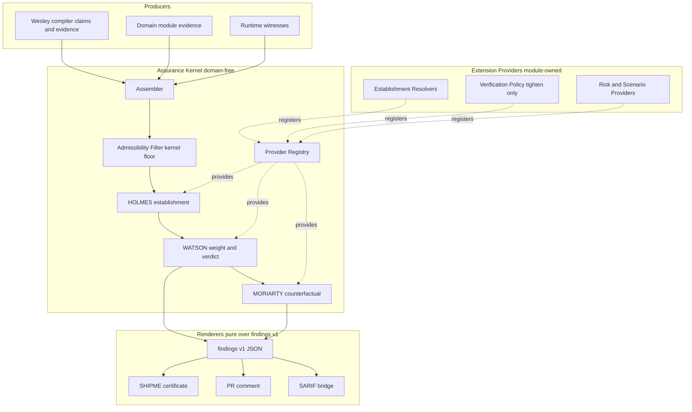
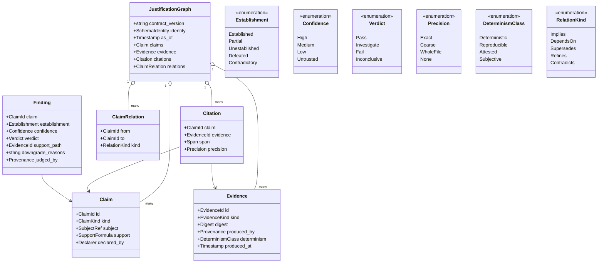
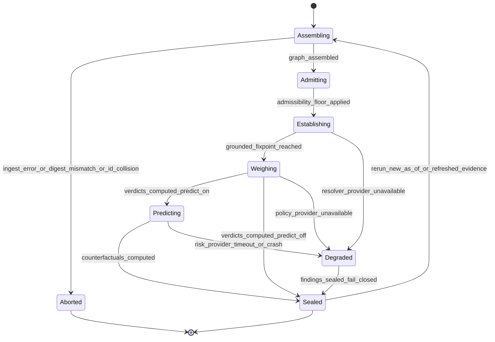
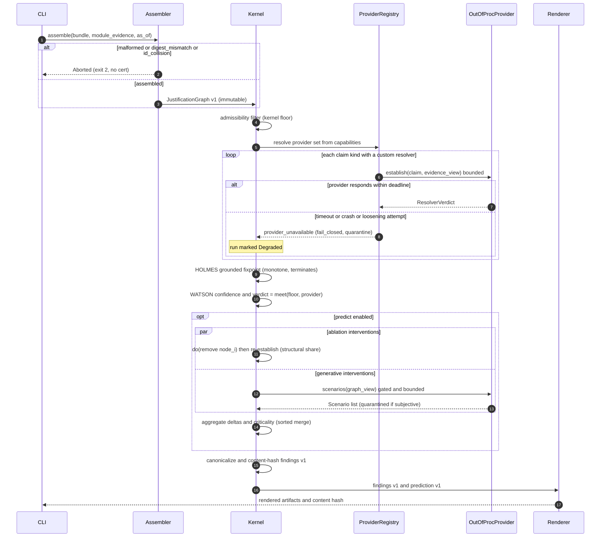

<!-- markdownlint-disable MD025 -->

# Justification Graph Assurance Kernel

Technical Design Document for turning HOLMES, WATSON, and MORIARTY from three
domain-coupled JavaScript programs into a single **domain-free assurance
kernel**: three epistemic stances over one **Justification Graph**, extended by
domain modules through a strict provider seam, and reconciled with Wesley's
core discipline that structure and evidence are compiler-owned while meaning is
module-owned.

This packet is design authority. Live implementation tracking stays in GitHub
Issues (#448, #542, #543, #587). It supersedes the architecture intent of
`0008` (counterfactual providers) and `0018` (assurance hexagon) and expresses
them for the Rust-native kernel.

---

## 1. Executive Summary & Problem Statement

### 1.1 Context

Wesley is domain-free: it compiles GraphQL SDL into deterministic structural IR
and evidence, and refuses to own meaning (`docs/NORTHSTAR.md`). Its assurance
layer never followed that discipline. Today HOLMES/WATSON/MORIARTY are ~10.5k
lines of JavaScript (`packages/wesley-holmes`) that:

- bake domain assumptions into "generic" surfaces (the drift `docs/WARP_DRIFT.md`
  already names);
- emit trust signals that are not machine-checkable — coarse citations,
  whole-file fallbacks, synthetic scores, and placeholder bundle synthesis
  surviving into certified paths (the exact defects behind #448 and #587);
- cannot be extended by a downstream domain without editing generic Holmes;
- couple the Rust release pipeline to npm health (a `pnpm audit` outage and a
  `GIT_DIR` hook-isolation defect both cost release engineering time in
  practice).

The former Rust Holmes foundation was removed with design packet `0023`
because it was coupled to the retired semantic-law subsystem. This packet
defines a future domain-free evidence-review target. Its implementation must
begin from these contracts rather than treating the deleted crate as a
foundation.

### 1.2 The reframe

The trio are not three programs. They are three orthogonal questions asked of
one immutable input — the **Justification Graph** — where the *meaning* of every
claim, the *risk model* for prediction, and the *domain standard* of evidence
are injected by the same modules that own the domain:

| Engine   | Question                                   | Stance      | Domain input needed |
| -------- | ------------------------------------------ | ----------- | ------------------- |
| HOLMES   | What is established from the evidence?     | Deductive   | Almost none         |
| WATSON   | How justified is that establishment?       | Critical    | A policy (defaulted)|
| MORIARTY | How does it change if assumptions change?  | Abductive   | A risk / scenario model |

The unifying principle is Wesley's own lens discipline lifted one level: Wesley
proves *structure*; the kernel proves the *evidence about that structure is
complete, exact, and honestly qualified*; the residual — meaning and risk —
stays module-owned and untouched by the kernel.

### 1.3 Goals

- **G1.** A deterministic, domain-free judgment kernel over a versioned
  Justification Graph. Same `(graph, providers, policy, as_of)` produces
  byte-identical, content-hashable findings.
- **G2.** Three engines with precise, defensible semantics: HOLMES
  (Dung *grounded* establishment over monotone support formulas), WATSON
  (weakest-link confidence and evidentiary verdict), MORIARTY (intervention /
  `do()` counterfactuals with criticality).
- **G3.** A provider seam — in-process Rust traits and an out-of-process JSON
  protocol — through which modules register claim kinds, establishment
  resolvers, verification policy, risk/scenario providers, and renderers.
- **G4.** A **monotonic floor**: providers may only tighten (raise the
  standard, lower confidence, remove admissibility), never loosen. Assurance
  can never become self-certifying.
- **G5.** A **determinism class** on evidence so the broad "assure anything"
  waist never dilutes Wesley's hashable, reproducible certificate.
- **G6.** A strangler migration path from JS Holmes with no capability gap,
  deleting JS per command.

### 1.4 Non-Goals

- **NG1.** Not a general theorem prover (Lean/Coq). Establishment is defeasible
  and legal-standard, not proof-theoretic totality.
- **NG2.** No distributed consensus. Judgment is single-node and deterministic;
  there is no quorum, no replication, no leader election. Multi-source evidence
  is handled by *deterministic merge*, not consensus (Section 5.4).
- **NG3.** Not a runtime enforcement engine. The kernel judges evidence; it does
  not execute operations, admit transactions, or mutate any target. Runtime law
  belongs to owning repos.
- **NG4.** The kernel ships no domain risk models, no domain claim vocabulary,
  and no domain establishment logic. Those are providers.
- **NG5.** Not a replacement for Wesley's compiler-produced claims; it consumes
  them.
- **NG6.** No probabilistic/statistical inference in the certified path.
  Confidence is a discrete lattice, not a float, to preserve determinism.

---

## 2. System Architecture & Component Design

### 2.1 Placement

The kernel is a future Rust library crate, a thin CLI surface, and a set of
adapters. Its final crate and command names are intentionally deferred until an
implementation cycle. It is pure hexagonal: the domain and engines depend only
on ports (traits + data contracts); every I/O, clock, subprocess, and domain
behavior enters through an adapter.

The kernel links **no domain crate**. `wesley-postgres`, Echo, Continuum, and
Edict reach it exclusively as registered providers, discovered through the same
capability/registration protocol Wesley already uses for `target verify`
(`docs/reference/external-target-protocol.md`).

### 2.2 Components

- **Assembler** — merges compiler evidence and module-contributed evidence into
  one `justification-graph/v1`. Pure, deterministic, conflict-detecting
  (Section 5.4).
- **Admissibility Filter** — the kernel floor on which evidence may be
  *considered at all* (distinct from weight). Fail-closed.
- **HOLMES engine** — establishment via grounded extension (Section 3.4).
- **WATSON engine** — weight and verdict under the composed policy (Section 3.5).
- **MORIARTY engine** — intervention counterfactuals and criticality
  (Section 3.6).
- **Provider Registry** — resolves the loaded provider set from capability
  manifests; brokers in-process traits and out-of-process subprocesses; enforces
  bounds, capability denial, and the monotonic floor.
- **Renderers / sinks** — pure functions of `findings/v1`: canonical JSON, the
  SHIPME certificate, the PR-comment markdown, and an optional SARIF bridge.

### 2.3 Architecture diagram



### 2.4 Determinism boundary

Everything inside `Kernel` is a pure function of its inputs. The only clock is a
port; the only "now" the engines ever see is the explicit `as_of` timestamp
carried in the graph and the review request. Out-of-process providers are the
only nondeterminism risk and are contained by Section 6.

---

## 3. Data Model & State Management

### 3.1 The three graphs, one substrate

The Justification Graph is not one flat graph. It is a **support-related claim
graph**, an **evidence graph**, and a **citation profunctor** relating them:

- **Claim graph** — claims plus two relation families that behave differently:
  - *Support relations* (`Implies`, `DependsOn`, `Supersedes`, `Refines`):
    directional, composable — establishment flows along them.
  - *Attack relation* (`Contradicts`): does not compose, is not a morphism;
    it *removes* acceptability. Treating attack as "just an edge" is a bug.
- **Evidence graph** — evidence nodes (witnesses, artifacts, digests, receipts,
  measurements) with intra-relations (`DerivedFrom`, `Aggregates`,
  `Supersedes`), each carrying a `DeterminismClass` and provenance.
- **Citation** — the inter-category relation: `Claim -> Evidence` with a
  `Precision`. Citations are consumed as a **monotone Boolean support formula**
  per claim (Section 3.3), not a flat edge list.

### 3.2 Contracts (class model)



### 3.3 Support formulas

Each `Claim.support` is a **monotone Boolean formula** over atoms, in canonical
(sorted, deduplicated) form:

- an *evidence atom* `E(evidence_id)` is true iff that evidence is present **and
  admissible** (Section 3.4);
- a *sub-claim atom* `C(claim_id)` is true iff that claim is `Established`.

Only `AND` / `OR` are permitted — no negation — which keeps the formula monotone
and guarantees a unique least fixpoint. "Negative" facts are expressed as
separate claims joined by `Contradicts`, never as negation inside a formula.

### 3.4 Establishment states and admissibility

Admissibility is a **kernel-floor predicate on evidence**, evaluated before
HOLMES: stale beyond `as_of` tolerance, digest-unresolvable, or below the
minimum determinism class for its citation role → *inadmissible*, and it does
not appear in any support formula's truth assignment. Admissibility is
`kernel_admits AND provider_admits` — providers can only remove admissibility.

`Establishment` values are exhaustive and fail-closed:

| Value          | Meaning |
| -------------- | ------- |
| `Established`   | Has a grounded argument (support satisfied, not defeated). |
| `Partial`       | Support partially satisfied; not yet a complete grounded argument. |
| `Unestablished` | No admissible evidence / formula unsatisfiable. |
| `Defeated`      | Attacked by an `Established` contradicting claim. |
| `Contradictory` | A claim and its declared negation both have satisfiable support — surfaced as an input inconsistency, never silently dropped. |

### 3.5 Mutation rules

The Justification Graph is **immutable input**. Nothing in the kernel mutates
it. There is exactly one place state "changes":

- **Findings are derived, never stored back.** HOLMES/WATSON produce a new
  `findings/v1` value; the input graph is untouched.
- **MORIARTY interventions produce derived graphs, never mutation.** `do(x)`
  yields a *new* graph value that shadows one node/edge; the original is shared
  immutably (structural sharing). This is what makes intervention fan-out
  embarrassingly parallel and deterministic.

The only stateful object with a lifecycle is the **Assurance Run** (Section 3.6),
and its "state" is pipeline phase, not mutable domain data.

### 3.6 Assurance Run lifecycle



- `Aborted` is terminal failure with no partial cert (ingest could not produce a
  well-formed graph).
- `Degraded` is the recovery path: a provider failed, its claims are marked
  fail-closed (`Unestablished` / `Untrusted`), the run continues and still seals
  a *cert that is honest about the degradation* (Section 6, Section 7).
- `Sealed` is terminal success: findings are canonicalized and content-hashed.
- The only "recovery" is re-run — deterministic and idempotent given inputs.

---

## 4. API & Interface Contracts

### 4.1 CLI plumbing

```text
wesley holmes assemble --bundle <path> [--module-evidence <path> ...]
                       --as-of <rfc3339> --out <graph.json>

wesley holmes review --graph <graph.json> [--providers <manifest.json>]
                     --as-of <rfc3339> [--predict] [--standard <name>]
                     --out <findings.json> [--prediction-out <prediction.json>]

wesley holmes investigate --graph <graph.json> ...     # HOLMES only
wesley holmes verify      --findings <partial.json> ... # WATSON only
wesley holmes predict     --graph <graph.json> ...      # MORIARTY only
```

Exit codes are the assurance verdict, not process success: `0` all `Pass`,
`10` any `Investigate`, `20` any `Fail`, `2` `Aborted` (input error),
`3` `Degraded` with an otherwise-passing set. `--as-of` is **required** for any
command that grades freshness; omission is a usage error, never a silent
`SystemTime::now()`.

### 4.2 `justification-graph/v1`

```json
{
  "contractVersion": "wesley.justification-graph/v1",
  "identity": { "irHash": "sha256:…", "sources": [{ "path": "schema.graphql", "digest": "sha256:…" }] },
  "asOf": "2026-07-15T00:00:00Z",
  "claims": [
    {
      "id": "operation.shape.valid.v1:Query.viewer",
      "kind": "operation.shape.valid.v1",
      "subject": { "ref": "operation:Query.viewer" },
      "declaredBy": "compiler",
      "support": { "all": [ { "evidence": "ev:ir-lower:Query.viewer" } ] }
    }
  ],
  "evidence": [
    {
      "id": "ev:ir-lower:Query.viewer",
      "kind": "ir.lowering",
      "digest": "sha256:…",
      "producedBy": "wesley-core@0.3.0",
      "determinism": "deterministic",
      "producedAt": "2026-07-15T00:00:00Z"
    }
  ],
  "citations": [
    { "claim": "operation.shape.valid.v1:Query.viewer", "evidence": "ev:ir-lower:Query.viewer",
      "span": { "unit": "byte", "start": 0, "end": 42 }, "precision": "exact" }
  ],
  "relations": [
    { "from": "postgres.rls.enforced.v1:User", "to": "deploy.safe.v1:User", "kind": "implies" }
  ]
}
```

Typing constraints (validated at ingest, hard-fail on violation):

- `contractVersion` MUST equal a version the kernel supports; unknown major →
  `Aborted`.
- `id` values are globally unique within the graph; collision on assemble →
  `Aborted` unless byte-identical (Section 5.4).
- `digest` MUST be `sha256:` + 64 lowercase hex.
- `support` is a JSON tree of `{ "all": [...] }` / `{ "any": [...] }` /
  `{ "evidence": id }` / `{ "claim": id }`. Depth is bounded (default 32);
  cycles among `claim` atoms are permitted structurally but resolved by grounded
  semantics (they simply never establish).
- `determinism` ∈ enum; `precision` ∈ enum; unknown → `Aborted`.
- `asOf` is RFC 3339 UTC. Evidence `producedAt` after `asOf` → inadmissible
  (you cannot cite the future).

### 4.3 `findings/v1`

```json
{
  "contractVersion": "wesley.findings/v1",
  "asOf": "2026-07-15T00:00:00Z",
  "graphDigest": "sha256:…",
  "contentHash": "sha256:…",
  "degraded": false,
  "findings": [
    {
      "claim": "operation.shape.valid.v1:Query.viewer",
      "establishment": "established",
      "confidence": "high",
      "verdict": "pass",
      "supportPath": ["ev:ir-lower:Query.viewer"],
      "downgradeReasons": [],
      "judgedBy": "kernel"
    }
  ]
}
```

- `contentHash` is the SHA-256 of the canonical (sorted-key, sorted-array)
  serialization of `findings` + `asOf` + `graphDigest`. It is the determinism
  and drift signal (Section 7).
- `judgedBy` is `kernel` or `provider:<id>`; every provider-influenced finding is
  attributable.

### 4.4 `prediction/v1`

```json
{
  "contractVersion": "wesley.prediction/v1",
  "graphDigest": "sha256:…",
  "scenarios": [
    {
      "id": "ablation:ev:pgtap:User.rls",
      "kind": "ablation",
      "provider": "kernel",
      "intervention": { "remove": "evidence", "id": "ev:pgtap:User.rls" },
      "delta": { "downgraded": ["postgres.rls.enforced.v1:User"], "defeated": [] },
      "criticality": "critical",
      "riskBand": "high",
      "basis": ["postgres.rls.enforced.v1:User"]
    }
  ]
}
```

`riskBand` is a discrete enum (`none|low|medium|high|severe`) — never a float —
so predictions remain hashable. Provider-supplied scenarios carry
`"provider": "postgres"` and are quarantined from the certified path if any
input evidence is `Subjective` (Section 6.4).

### 4.5 Provider seam

**In-process (Rust traits).** Each has a total kernel default so a zero-provider
run is complete.

```rust
trait ClaimKindProvider { fn kinds(&self) -> Vec<ClaimKindSpec>; }
trait EstablishmentResolver {                       // optional, per claim-kind
    fn resolve(&self, claim: &Claim, view: EvidenceView) -> ResolverVerdict;
}
trait VerificationPolicy {                          // tighten-only (Section 3.5, 5.5)
    fn assess(&self, finding: &FindingDraft, floor: Verdict) -> Verdict;
}
trait RiskProvider {                                // MORIARTY, gated
    fn scenarios(&self, view: GraphView) -> Vec<Scenario>;
    fn score(&self, scenario: &Scenario, delta: &Delta) -> RiskBand;
}
trait Renderer { fn render(&self, findings: &Findings) -> Artifact; }
```

**Out-of-process (protocol `wesley.assurance-provider/v1`).** Length-prefixed
JSON request/response over the subprocess's stdio, discovered and bounded
exactly like `target verify`: declared capabilities, egress denial, wall-clock
and output-size limits, and a declared `determinism` class. This is the seam
that lets non-Rust providers extend the kernel — and the transitional home for
the existing JS Moriarty during migration (Section 8).

**Provider manifest (`module.assurance-providers/v1`).**

```json
{
  "contractVersion": "module.assurance-providers/v1",
  "module": "wesley-postgres@0.4.0",
  "claimKinds": ["postgres.rls.enforced.v1"],
  "resolvers": [{ "claimKind": "postgres.rls.enforced.v1", "provider": "inproc:pg-rls" }],
  "verificationPolicy": "inproc:pg-standard",
  "riskProvider": "oop:./pg-moriarty",
  "renderers": [],
  "determinism": "reproducible"
}
```

---

## 5. Execution Flow & Concurrency

### 5.1 Happy path

1. **Assemble** compiler + module evidence into `justification-graph/v1`
   (deterministic merge, Section 5.4).
2. **Admissibility filter**: drop inadmissible evidence (kernel floor AND
   provider tightening).
3. **HOLMES**: compute the grounded extension → per-claim `Establishment`.
4. **WATSON**: for each `Established` claim, `confidence = max over grounded
   arguments of (min over support-path elements of link_confidence)`; verdict =
   `meet(kernel_verdict, provider_verdict)` under the selected standard.
5. **MORIARTY** (if `--predict`): run interventions, compute deltas +
   criticality; provider scenarios where loaded.
6. **Seal**: canonicalize, content-hash, render sinks.

### 5.2 Unhappy paths

- Malformed graph / digest mismatch / id collision → `Aborted` before HOLMES.
- Provider timeout/crash → its claim kinds resolve to `Unestablished`
  /`Untrusted`, run enters `Degraded`, seals honestly.
- Contradiction detected → those claims marked `Contradictory`; the run does not
  crash and does not silently pick a side.
- Intervention budget exceeded → truncate with an explicit logged/telemetered
  count (never a silent cap; Section 6.5, Section 7).

### 5.3 Concurrency model

The judgment is a pure function over immutable input, so there is **no shared
mutable state and therefore no locks and no deadlocks in the kernel**. What
concurrency exists is bounded and determinism-preserving:

- **HOLMES fixpoint** iterates a monotone operator over a finite lattice; it
  terminates in at most `|claims|` iterations (Knaster–Tarski). Within one
  iteration, per-claim evaluation is data-parallel; results are merged into the
  next assignment by a commutative/idempotent join, so thread scheduling cannot
  change the fixpoint.
- **MORIARTY interventions** are independent by construction (each `do(x)`
  operates on its own derived graph via structural sharing). They fan out across
  a bounded worker pool; the aggregate is a sorted merge, so output is identical
  regardless of completion order.
- **Out-of-process providers** run as isolated subprocesses with per-provider
  timeouts and a bounded concurrency pool. There are no inter-provider
  dependencies, so the invocation graph is acyclic and deadlock-free by
  construction. A hung provider is killed at its deadline; its claims fail
  closed. The kernel is the single writer of findings; providers only return
  data.

### 5.4 Multi-source assembly (the honest "distributed" story)

There is no distributed consensus. Evidence arrives from multiple producers
(Wesley, modules, runtime witnesses) and is merged by a **total, deterministic
merge**:

- Nodes are keyed by `id`. Two producers contributing the same `id` MUST be
  byte-identical after canonicalization; otherwise the assemble step `Abort`s
  with a conflict report. Assurance never guesses which of two conflicting facts
  to trust.
- Merge order is the sorted producer order, so the assembled graph is
  independent of arrival order.

### 5.5 The monotonic floor as a lattice meet

Order verdicts `Fail ⊏ Investigate ⊏ Inconclusive ⊏ Pass` with `Pass` most
permissive. Composition is the greatest-lower-bound:
`verdict = meet(kernel_verdict, provider_verdict)`. A provider can only pull a
verdict **down**. Admissibility composes as boolean `AND`. Confidence composes
as `min`. All three are meets, so the invariant "providers may tighten, never
loosen" holds *by construction* — it is not a runtime check that can be
forgotten, it is the algebra.

### 5.6 Sequence diagram



---

## 6. Failure Modes, Edge Cases & Error Handling

Governing principle: **fail closed.** Any ambiguity, absence, or failure
resolves toward *less* establishment and *lower* confidence, never more. Assurance
degrades safely; it never over-claims.

| # | Failure | Detection | Fallback |
| - | ------- | --------- | -------- |
| F1 | Malformed graph / unknown contract major | Ingest schema validation | `Aborted`, exit 2, no partial cert |
| F2 | Digest mismatch (evidence content ≠ digest) | Assemble digest check | Evidence inadmissible; if it was sole support, claim `Unestablished` |
| F3 | Unresolvable citation (evidence id absent) | Citation resolution | Treated as absent atom; fail closed |
| F4 | Duplicate id, non-identical | Assemble merge | `Aborted` with conflict report |
| F5 | Cyclic support (A supports B supports A) | Grounded fixpoint | Cycle never enters least fixpoint → `Unestablished`; no infinite loop |
| F6 | Contradiction (claim and its negation both supported) | Argumentation pass | `Contradictory` finding; surfaced, not resolved |
| F7 | Provider timeout / crash | Deadline + subprocess monitor | Kill; its claims `Unestablished`/`Untrusted`; run `Degraded` |
| F8 | Provider nondeterminism (differs across identical calls) | Replay probe in CI / declared class mismatch | Provider output quarantined from certified path; run `Degraded` |
| F9 | Provider loosening attempt (verdict above floor) | Meet composition | Structurally impossible to take effect; logged as a policy violation |
| F10 | Provider capability/egress violation | Sandbox | Provider terminated; claims fail closed |
| F11 | Intervention explosion (huge graph) | Budget counter | Truncate to budget, **log + telemeter dropped count** (no silent cap) |
| F12 | OOM / graph too large | Pre-flight size guard | `Aborted` with size report before allocation blows up |
| F13 | Subjective evidence in certified path | Determinism class check | Admissible for confidence only; cannot `Establish` a certified claim |

### 6.4 Determinism-class quarantine

Evidence carries `Deterministic | Reproducible | Attested | Subjective`.
**Certified establishment requires `Deterministic` or `Reproducible`.** `Attested`
(signed by a human/authority) and `Subjective` (an LLM opinion, a manual note)
may raise WATSON confidence but can never *establish* a certified claim alone.
This is what lets the same kernel ingest a scientific paper's or legal
document's claims without letting a subjective judgment masquerade as a
machine-checkable fact — the broad waist without diluting the hard cert.

### 6.5 No silent truncation

Any bound the kernel enforces (intervention budget, support-formula depth,
provider count) that drops work MUST be surfaced in `findings/v1` metadata and
telemetry. A cert that quietly stopped looking is worse than one that says it
stopped.

---

## 7. Observability & Telemetry

### 7.1 Metrics

- `assurance_claims_total{establishment}` — gauge by state.
- `assurance_findings_total{verdict}` — gauge by verdict.
- `assurance_run_degraded_total` — counter; nonzero means a provider failed.
- `assurance_provider_calls_total{provider,outcome}` —
  `outcome ∈ ok|timeout|crash|rejected|quarantined`.
- `assurance_provider_latency_seconds{provider}` — histogram.
- `assurance_interventions_total` and `assurance_interventions_dropped_total` —
  the second must be alertable (F11).
- `assurance_graph_size{claims,evidence,citations}` and
  `assurance_judgment_duration_seconds`.

### 7.2 The content hash as the primary signal

Every run emits `findings.contentHash`. For a fixed
`(graphDigest, as_of, provider-set)` it MUST be invariant. CI records it; a
changed hash for unchanged inputs is a determinism regression and fails the
build. This is the assurance analogue of Wesley's structural hash — trust that
shows its work.

### 7.3 Logs & traces

Structured, one event per phase transition (Section 3.6) with the run id and
`graphDigest`; every provider invocation logs its `provider`, `determinism`,
outcome, and latency, so a reviewer can always separate the kernel-floor verdict
from provider-influenced ones. Traces span the pipeline phases and each
out-of-process provider call.

---

## 8. Deployment & Migration Strategy

This ships into a live repo that currently runs JS Holmes. The strategy is a
**contract-first strangler**, not a big-bang rewrite.

### 8.1 Phases

1. **Contracts first (#587, #543).** Land `justification-graph/v1`,
   `findings/v1`, and the determinism class. These are the seam every consumer
   binds to and are needed for either path.
2. **Kernel + `investigate`/`verify` (#448, #542).** Build HOLMES/WATSON and the
   `wesley holmes review` command against the contracts, behind provider
   registration. Exact-span citations (#448) land here.
3. **MORIARTY as an out-of-process provider bridge.** During transition, the
   existing JS Moriarty runs as a `wesley.assurance-provider/v1` subprocess
   (bounded, capability-denied), so there is *no capability gap* while the Rust
   intervention engine and per-domain risk providers are built.
4. **Strangle.** For each JS command, when the Rust equivalent passes the same
   fixtures, delete the JS bin. The last deletion removes `packages/wesley-holmes`,
   `pnpm`, ESLint, dependency-cruiser, the JS CI workflows, and the
   `package.json`/preflight coupling — the ~90% "trivial-to-medium" cleanup from
   the eradication audit becomes pure deletion.

### 8.2 Feature flags & compatibility

- Provider registration *is* the feature flag: a run with no providers is the
  domain-free kernel; loading a module's manifest turns on its behavior.
- Contracts are versioned (`…/v1`); consumers pin a major. A new major ships
  side-by-side; the SHIPME certificate declares which `findings` major it
  consumed.
- A one-way adapter migrates the legacy `.wesley-cache/bundle.json` into
  `justification-graph/v1` so historical evidence keeps flowing during the
  transition.

### 8.3 Rollback

Because the JS surface is only deleted *after* its Rust replacement is
fixture-green, rollback at any phase is reverting one PR: the JS bin and its
workflow still exist until the checkpoint that deletes them. The determinism
content hash (Section 7.2) gates each checkpoint — a Rust command may not
replace its JS counterpart until it produces a stable, reviewed hash over the
shared fixture corpus.

### 8.4 CI migration

`wesley-holmes.yml` moves from invoking `node …/cli.mjs` to the Rust binary
command-by-command; both may run in parallel behind the flag during a phase for
differential comparison, and the workflow's required check flips to the Rust
path only at the deletion checkpoint.

---

## Appendix A — Reconciliation with prior packets

- **`0008` (Holmes Counterfactual Provider Capability, shipped).** Generalized:
  its "counterfactual provider ownership lives in modules" becomes MORIARTY's
  `RiskProvider` seam plus the ablation-vs-generative split (Section 3.6, 6).
- **`0018` (Holmes Assurance Hexagon, active).** Superseded: the hexagon's ports
  are made concrete as the Section 4.5 traits + out-of-process protocol, and the
  domain-free boundary is stated normatively.
- **`0019` / `0020` (retired semantic-law experiment).** Superseded by `0023`.
  No language types, hashes, or assurance artifacts from those packets carry
  into this kernel. Reusable deterministic test intent must be restated against
  domain-free evidence contracts.

## Appendix B — Why grounded semantics

Dung's *grounded extension* is the unique, skeptical, least-fixpoint semantics
of an argumentation framework. Uniqueness makes it **deterministic** (unlike
preferred/stable, which can be multiple); skepticism makes it **fail-closed**
(it accepts only what is defended against every attack); the least fixpoint over
a finite framework **terminates**. Those three properties are precisely what a
hashable, trustworthy certificate demands, which is why establishment is defined
as the grounded extension rather than any richer or more permissive semantics.
