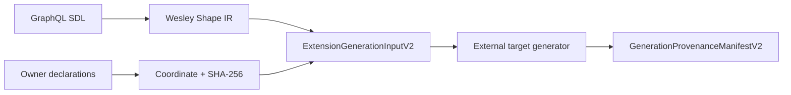

<!-- markdownlint-disable-next-line MD025 -->

# SOURCE - Remove Weslaw

## Linked Issue

- [Remove Weslaw from Wesley](https://github.com/flyingrobots/wesley/issues/768)

## GitHub Work

- Issue: `https://github.com/flyingrobots/wesley/issues/768`
- Goalpost milestone: `Goalpost: Make It Truthful`
- Project: `https://github.com/users/flyingrobots/projects/18`

The issue is assigned to `@flyingrobots`, carries the `v0.3.0` scheduling
label, and is marked `work-in-progress`. The current GitHub token could not add
the issue to the project because it lacks the `read:project` scope.

## Cycle Preparation

The cycle branch `james/remove-weslaw` was created from fetched
`origin/main` at `4891a631f888c5b2f70e117e3704538dd1362c2f` in an isolated
worktree. The existing Wesley `main` checkout and the dirty Wesley-Postgres
checkout remain untouched.

## Decision Summary

Wesley will stop accepting, binding, hashing, diffing, emitting, or assuring
Weslaw artifacts. GraphQL SDL remains Wesley's structural source. Semantic
programs belong to Edict; runtime capabilities belong to their owning runtime
or target adapter; target-specific declarations may cross Wesley's generic
extension boundary only as opaque, content-addressed owner artifacts.

## Sponsored Human

A compiler maintainer wants Wesley to mean `GraphQL -> whatever` so that target
and application semantics have one honest owner, without maintaining a second
language disguised as YAML beside GraphQL.

## Sponsored Agent

An agent needs the exported Rust API, CLI help, schemas, fixtures, and current
documentation to agree that Weslaw is unsupported, without inferring ownership
from historical design packets or dead compatibility shims.

## Hill

By the end of this cycle, an operator can use every supported Wesley compiler
and extension-generation path without a Weslaw artifact, and the repository
proves that no production, CLI, emitter, assurance, schema, fixture, or current
documentation surface still depends on Weslaw.

## Current Truth

At the branch basis:

- `crates/wesley-core/src/domain/law.rs` implements the Weslaw YAML loader,
  typed Law IR, schema binding, canonicalization, hashing, semantic diffing,
  and contract-bundle manifest construction.
- `crates/wesley-cli/src/main.rs` exposes `init-law` and the `law lint`,
  `validate`, `diff`, `explain`, `rebind`, `capabilities`, and `coverage`
  commands. Rust emission accepts an optional `--law` input.
- `crates/wesley-emit-rust/src/lib.rs` emits Weslaw hash constants and
  Weslaw-derived scalar and variant validators.
- `crates/wesley-holmes` is a Weslaw-specific assurance foundation over law
  diffs, law coverage, law capabilities, and law contract-bundle manifests.
- `ExtensionGenerationInputV1` embeds optional `LawIrV1`. Its surrounding
  provenance and content-addressed artifact machinery is otherwise generic.
- `docs/BEARING.md` incorrectly makes Weslaw a current architectural and
  `v0.3.0` release objective.

## Problem

Weslaw assigns unrelated meanings to one generic GraphQL compiler:

- scalar semantics that belong to a source profile, target mapping, or
  programming language;
- variant constraints that should be represented as actual sum types;
- Echo-specific operation footprints;
- protocol/channel contracts;
- target and application invariants.

The YAML sidecar therefore creates a second, weak semantic language while
claiming generic compiler ownership. Keeping it would duplicate Edict,
misplace runtime capabilities, and force every downstream GraphQL target to
pass through concepts it does not own.

## Scope

This cycle includes:

- deleting Weslaw source parsing, Law IR, binding, canonicalization, hashes,
  semantic diffs, and contract-bundle manifests;
- deleting Weslaw CLI commands and the `--law` emitter option;
- deleting Weslaw-derived Rust validators and provenance constants;
- deleting the current Weslaw-specific Holmes crate;
- deleting Weslaw schemas, fixtures, workflow triggers, and configuration;
- replacing extension-generation v1 with a law-free v2 contract;
- correcting current architecture, guide, CLI, schema, and release-direction
  documentation;
- marking historical Weslaw packets as superseded while retaining them as
  evidence.

## Non-Goals

This cycle does not include:

- moving Weslaw syntax or types into Edict;
- defining Edict modules, capability packages, or an Echo target adapter;
- implementing the justification-graph assurance kernel;
- designing PostgreSQL semantics;
- rewriting historical audits to pretend Weslaw never existed;
- maintaining a deprecated Weslaw compatibility parser or CLI alias.

## Compiler / CLI Contract

The following public surfaces are removed:

- all `wesley_core` Law IR and Weslaw APIs;
- `wesley init-law`;
- the complete `wesley law ...` command family;
- `wesley emit ... --law`;
- `emit_rust_with_operations_and_hashes`;
- `emit_rust_with_operations_and_law`;
- the Weslaw-specific `wesley-holmes` crate;
- the `weslaw/v1`, `wesley.law-ir/v1`, `wesley.law-diff/v1`, and
  `wesley.contract-bundle-manifest/v1` schemas.

Removed commands and flags receive the ordinary typed CLI usage failure. No
compatibility alias accepts or ignores a semantic input.

The generic extension-generation contract becomes:

```rust
ExtensionGenerationInputV2::new(
    shape_ir,
    operations,
    owner_declarations,
    settings_digest,
    projection_roles,
)
```

`ExtensionGenerationInputV2` contains no interpreted semantic field. External
modules may identify target-owned semantic declarations through
`owner_declarations`; Wesley validates only their coordinates and exact
digests. Generation provenance, verification, and review types move to v2
because their exact contract-version closure selects the v2 input.

## Data / State / Schema Model

GraphQL Shape IR and normalized operations remain compiler-owned inputs.
Target-owned declarations remain opaque bytes outside Wesley and enter
generation only as content-addressed references.



The removed v1 extension artifacts are not reinterpreted as v2. Producers must
regenerate them from the authoritative SDL and explicit owner declarations.

## Security / Trust Boundary

Removing Weslaw eliminates a YAML input parser and a false generic authority
boundary. Owner declarations remain untrusted external bytes. Wesley binds
their exact coordinates and SHA-256 digests but does not parse or execute
their meaning. External target execution and capability enforcement remain
governed by the existing target/module boundary.

## Agent Inspectability

An agent can inspect:

- CLI help, which contains no Weslaw command or option;
- the exported Rust API and v2 JSON Schemas;
- the extension-generation v2 fixtures;
- a repository-wide residual-reference audit that distinguishes superseded
  historical evidence from supported surfaces.

## Accessibility Posture

| Surface                           | Requirement                                      |
| --------------------------------- | ------------------------------------------------ |
| Exit codes and error envelopes    | Removed commands fail through normal CLI usage.  |
| Structured JSON output            | v2 generation artifacts remain deterministic.    |
| Human-readable Markdown summaries | Current docs name the removal and new ownership.  |
| Agent-safe summary fields         | Versioned API identities select exact v2 shapes. |

## Localization / Directionality Posture

| String or surface         | Requirement                                         |
| ------------------------- | --------------------------------------------------- |
| Diagnostic messages       | No new domain-specific diagnostic vocabulary.       |
| CLI help text             | Remove Weslaw entries; preserve existing CLI style. |
| Report or summary strings | Remove Weslaw-specific report language.              |

## Linked Invariants

- `schema-source-of-truth` — GraphQL SDL remains sovereign over structural
  shape.
- `domain-empty-core` — target and runtime semantics do not live in Wesley.
- `evidence-truth` — versioned artifacts describe only implemented behavior.
- `docs-runtime-honesty` — current docs match the supported CLI and crates.
- `deterministic-ir` — canonical Shape IR and content hashes remain stable.

## Alternatives Considered

### Option A: Deprecate Weslaw

Pros:

- minimizes immediate downstream compilation failures.

Cons:

- preserves two sources of semantic authority;
- leaves Echo footprints and language-specific rules in generic Wesley;
- makes dead architecture look supported;
- creates a migration path to nowhere.

### Option B: Delete Weslaw and version the generic seam

Pros:

- restores one owner per semantic concern;
- keeps generic generation provenance without interpreting target meaning;
- makes unsupported inputs fail closed;
- gives changed exact artifacts new identities.

Cons:

- intentionally breaks Weslaw consumers;
- removes the current Rust Holmes implementation foundation;
- requires regeneration of extension-generation artifacts.

## Decision

Choose Option B. Weslaw is removed without a deprecation shim. Historical
packets remain available with supersession notices. Generic generation
provenance is retained through exact v2 contracts.

## GitHub Slice Plan

| Slice          | GitHub issue                                              | Required proof                                  |
| -------------- | --------------------------------------------------------- | ----------------------------------------------- |
| Remove Weslaw  | [#768](https://github.com/flyingrobots/wesley/issues/768) | CLI, crate, schema, fixture, and preflight proof |

## Tests To Write First

Behavior tests required:

- top-level help does not advertise `init-law` or `law`;
- removed Weslaw commands and `--law` fail as unsupported CLI input;
- extension-generation v2 canonical bytes have no semantic-law field;
- v2 deserialization rejects a `law` field rather than ignoring it;
- generic extension provenance still verifies exact source and output bytes;
- Rust emission still produces structural types and operation bindings.

Documentation or process tests:

- the native workflow no longer watches deleted Weslaw fixtures;
- generated schema tests select the v2 extension-generation artifacts.

## Proof Matrix

| Claim                                     | Required proof                                      |
| ----------------------------------------- | --------------------------------------------------- |
| Weslaw CLI is gone                        | `crates/wesley-cli/tests/cli.rs`                    |
| Law IR is gone from the public core       | Rust workspace compilation and residual audit       |
| Generic provenance survives independently | `crates/wesley-core/tests/extension_generation.rs`  |
| Weslaw validators are gone                | `crates/wesley-emit-rust` tests                     |
| Current docs are truthful                 | docs lint and targeted residual audit                |
| Repository remains releasable             | `cargo xtask preflight`                             |

## Acceptance Criteria

The work is done when:

- no production crate parses or exports Weslaw or Law IR;
- no supported CLI command or flag accepts Weslaw;
- no emitter generates behavior from Weslaw;
- no current assurance crate or schema names Weslaw artifacts;
- extension-generation v2 preserves generic exact provenance without Law IR;
- historical packets are visibly superseded and are the only intentional
  Weslaw documentation references;
- `CHANGELOG.md` records the breaking removal;
- focused tests and `cargo xtask preflight` pass.

## Validation Plan

```bash
cargo test -p wesley-core
cargo test -p wesley-cli
cargo test -p wesley-emit-rust
cargo xtask preflight
rg -n -i 'weslaw|LawIr|LawEntry|LawKind|law_ir' \
  crates schemas test .github README.md docs
```

The residual search must be reviewed manually so superseded historical design
evidence is not confused with supported product surfaces.

## Playback / Witness

A reviewer can inspect the CLI help and v2 fixtures, then run the commands in
the validation plan. The v2 input fixture must carry Shape IR, operations,
owner declarations, settings, and projection roles without any Weslaw field.

## Open Questions

None. Semantic ownership is explicit:

- Edict owns executable language semantics.
- Echo and other runtimes own their capability semantics.
- target modules own target-specific generation declarations.
- Wesley owns GraphQL structural compilation and generic generation evidence.

## Follow-On Issues

Future justification-graph assurance implementation remains governed by packet
`0022`. It must start from domain-free evidence rather than the removed Weslaw
artifact family.

## Retrospective

The removal confirmed that Weslaw was a semantic subsystem rather than a small
sidecar format. Deleting it required one coordinated break across the public
core API, CLI, Rust emitter, assurance foundation, schemas, fixtures, release
version sources, workflow triggers, and current documentation.

The useful generic seam survived cleanly. Extension generation is now v2 and
binds canonical Shape IR, normalized operations, owner declarations, settings,
projection roles, generator identity, exact sources, and exact outputs without
embedding a semantic-language document. Its canonical fixtures and independent
verification tests remain green.

The initial RED proved the retired commands and option were still accepted.
The completed GREEN proves they are rejected, the removed paths are absent,
the historical packets are visibly superseded, and the full repository
preflight passes:

```text
cargo test -p wesley-core -p wesley-cli -p wesley-emit-rust
cargo xtask preflight
git diff --check
```

No compatibility parser or alias remains. The retained JavaScript Holmes
package is a separate evidence/reporting surface and contains no Weslaw
implementation.
