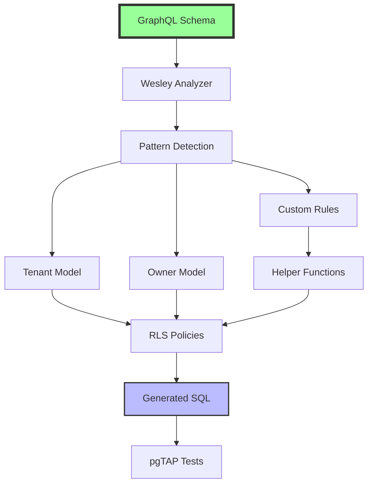

# Row Level Security: From GraphQL Directives to Production Policies

## Overview

Wesley transforms GraphQL directives into comprehensive Row Level Security (RLS) implementations. This includes policies, helper functions, indexes, and tests—all generated from simple directive declarations.



## The Three Patterns of Authorization

### Pattern 1: Multi-Tenant Isolation (80% of cases)

Most SaaS applications need tenant isolation. Wesley recognizes this pattern and generates complete infrastructure.

#### GraphQL Declaration

```graphql
type Organization @table {
  id: ID! @primaryKey
  name: String! @unique
}

type User @table {
  id: ID! @primaryKey
  email: String! @unique
}

type Membership @table {
  user_id: ID! @foreignKey(ref: "User.id") @index
  org_id: ID! @foreignKey(ref: "Organization.id") @index
  role: MemberRole! @index
}

enum MemberRole {
  OWNER
  ADMIN
  MEMBER
  VIEWER
}

type Document @table
  @tenant(by: "org_id")
  @rls(enabled: true) {
  id: ID! @primaryKey
  org_id: ID! @foreignKey(ref: "Organization.id") @index
  title: String!
  content: String
  created_by: ID! @foreignKey(ref: "User.id") @index
}
```

#### Generated Infrastructure

Wesley detects the membership pattern and generates:

```sql
-- 1. Fast membership lookup view
CREATE OR REPLACE VIEW wesley_user_orgs AS
  SELECT m.user_id, m.org_id, m.role 
  FROM membership m
  WHERE m.deleted_at IS NULL;

-- 2. Optimized indexes for policy predicates
CREATE INDEX IF NOT EXISTS idx_membership_user_org 
  ON membership(user_id, org_id) 
  WHERE deleted_at IS NULL;

CREATE INDEX IF NOT EXISTS idx_document_org_id 
  ON document(org_id);

-- 3. Helper functions for clean policies
CREATE OR REPLACE FUNCTION wesley.is_member_of(p_org_id UUID)
RETURNS BOOLEAN 
LANGUAGE sql 
STABLE 
SECURITY DEFINER
AS $$
  SELECT EXISTS (
    SELECT 1 FROM wesley_user_orgs
    WHERE user_id = auth.uid() AND org_id = p_org_id
  )
$$;

-- 4. RLS policies for CRUD operations
ALTER TABLE document ENABLE ROW LEVEL SECURITY;
ALTER TABLE document FORCE ROW LEVEL SECURITY;

-- SELECT: Users see documents in their organizations
CREATE POLICY policy_document_tenant_select ON document
  FOR SELECT
  USING (wesley.is_member_of(org_id));

-- INSERT: Users create documents in their organizations
CREATE POLICY policy_document_tenant_insert ON document
  FOR INSERT
  WITH CHECK (
    wesley.is_member_of(org_id) AND 
    created_by = auth.uid()
  );

-- UPDATE: Users update documents in their organizations
CREATE POLICY policy_document_tenant_update ON document
  FOR UPDATE
  USING (wesley.is_member_of(org_id))
  WITH CHECK (wesley.is_member_of(org_id));

-- DELETE: Only admins/owners can delete
CREATE POLICY policy_document_tenant_delete ON document
  FOR DELETE
  USING (
    EXISTS (
      SELECT 1 FROM wesley_user_orgs uo
      WHERE uo.user_id = auth.uid() 
        AND uo.org_id = document.org_id
        AND uo.role IN ('OWNER', 'ADMIN')
    )
  );
```

#### Generated Tests

```sql
BEGIN;
SELECT plan(8);

-- Test setup
SELECT tests.seed_user('alice_id', 'alice@example.com');
SELECT tests.seed_user('bob_id', 'bob@example.com');
SELECT tests.seed_org('acme_id', 'ACME Corp');
SELECT tests.seed_org('umbrella_id', 'Umbrella Inc');
SELECT tests.add_membership('alice_id', 'acme_id', 'MEMBER');
SELECT tests.add_membership('bob_id', 'umbrella_id', 'OWNER');

-- Test: Alice can insert into her organization
SET LOCAL request.jwt.claim.sub TO 'alice_id';
SELECT lives_ok(
  $$INSERT INTO document (id, org_id, title, created_by)
    VALUES (gen_random_uuid(), 'acme_id', 'Test Doc', 'alice_id')$$,
  'Member can insert into their organization'
);

-- Test: Alice cannot insert into other organizations
SELECT throws_ok(
  $$INSERT INTO document (id, org_id, title, created_by)
    VALUES (gen_random_uuid(), 'umbrella_id', 'Test Doc', 'alice_id')$$,
  'new row violates row-level security policy',
  'Member cannot insert into other organizations'
);

-- Test: Bob can delete as owner
SET LOCAL request.jwt.claim.sub TO 'bob_id';
SELECT lives_ok(
  $$DELETE FROM document WHERE org_id = 'umbrella_id'$$,
  'Owner can delete in their organization'
);

SELECT * FROM finish();
ROLLBACK;
```

### Pattern 2: Complex Authorization with Sharing (15% of cases)

When simple tenant isolation isn't enough, Wesley supports complex authorization rules through composable functions.

#### GraphQL Declaration

```graphql
type DocumentShare @table {
  document_id: ID! @foreignKey(ref: "Document.id") @index
  user_id: ID! @foreignKey(ref: "User.id") @index
  can_edit: Boolean! @default(value: "false")
  can_comment: Boolean! @default(value: "true")
}

type Document @table
  @tenant(by: "org_id")
  @owner(column: "created_by")
  @rls(
    enabled: true,
    select: "tenant_or_shared",
    insert: "tenant_and_owner",
    update: "owner_or_editor",
    delete: "owner_or_admin"
  ) {
  id: ID! @primaryKey
  org_id: ID! @foreignKey(ref: "Organization.id") @index
  created_by: ID! @foreignKey(ref: "User.id") @index
  title: String!
  content: String
}
```

#### Generated Helper Functions

Wesley generates SECURITY DEFINER functions to encapsulate complex logic:

```sql
-- Check if document is shared with user
CREATE OR REPLACE FUNCTION wesley.is_shared_with(p_doc_id UUID)
RETURNS BOOLEAN 
LANGUAGE sql 
STABLE 
SECURITY DEFINER
AS $$
  SELECT EXISTS (
    SELECT 1 FROM document_share
    WHERE document_id = p_doc_id AND user_id = auth.uid()
  )
$$;

-- Check if user can edit shared document
CREATE OR REPLACE FUNCTION wesley.can_edit_shared(p_doc_id UUID)
RETURNS BOOLEAN 
LANGUAGE sql 
STABLE 
SECURITY DEFINER
AS $$
  SELECT COALESCE(
    (SELECT can_edit FROM document_share 
     WHERE document_id = p_doc_id AND user_id = auth.uid()),
    FALSE
  )
$$;

-- Check if user owns document
CREATE OR REPLACE FUNCTION wesley.is_owner(p_created_by UUID)
RETURNS BOOLEAN 
LANGUAGE sql 
IMMUTABLE
AS $$
  SELECT p_created_by = auth.uid()
$$;

-- Composite policies using helper functions
CREATE POLICY policy_document_select_complex ON document
  FOR SELECT
  USING (
    wesley.is_member_of(org_id) OR 
    wesley.is_shared_with(id)
  );

CREATE POLICY policy_document_update_complex ON document
  FOR UPDATE
  USING (
    wesley.is_member_of(org_id) AND 
    (wesley.is_owner(created_by) OR wesley.can_edit_shared(id))
  )
  WITH CHECK (wesley.is_member_of(org_id));
```

### Pattern 3: Custom Business Logic (5% of cases)

For complex business rules, Wesley provides escape hatches while maintaining structure and testability.

#### GraphQL Declaration

```graphql
type Invoice @table 
  @rls(
    enabled: true, 
    select: "can_view_invoice"
  ) {
  id: ID! @primaryKey
  org_id: ID! @foreignKey(ref: "Organization.id")
  amount: Decimal!
  status: InvoiceStatus! @index
}

enum InvoiceStatus {
  DRAFT
  ISSUED
  PAID
  OVERDUE
}
```

#### Custom Function Integration

You provide the business logic:

```sql
-- Your custom business logic
CREATE OR REPLACE FUNCTION app_can_view_invoice(p_user_id UUID, p_invoice_id UUID)
RETURNS BOOLEAN 
LANGUAGE plpgsql 
SECURITY DEFINER
AS $$
DECLARE
  v_status invoice_status;
  v_role member_role;
BEGIN
  -- Get invoice status and user role
  SELECT i.status INTO v_status
  FROM invoice i WHERE i.id = p_invoice_id;
  
  SELECT m.role INTO v_role
  FROM invoice i
  JOIN membership m ON m.org_id = i.org_id
  WHERE i.id = p_invoice_id AND m.user_id = p_user_id;
  
  -- Business rules:
  -- - Owners/Admins see all invoices
  -- - Members see only issued/paid invoices
  -- - Viewers see only paid invoices
  RETURN CASE
    WHEN v_role IN ('OWNER', 'ADMIN') THEN TRUE
    WHEN v_role = 'MEMBER' AND v_status IN ('ISSUED', 'PAID') THEN TRUE
    WHEN v_role = 'VIEWER' AND v_status = 'PAID' THEN TRUE
    ELSE FALSE
  END;
END;
$$;
```

Wesley wraps it with standard interface:

```sql
-- Wesley-generated wrapper for consistent calling convention
CREATE OR REPLACE FUNCTION wesley.can_view_invoice(p_invoice_id UUID)
RETURNS BOOLEAN 
LANGUAGE sql 
STABLE 
SECURITY DEFINER
AS $$
  SELECT app_can_view_invoice(auth.uid(), p_invoice_id)
$$;

-- Clean policy using the wrapper
CREATE POLICY policy_invoice_select_custom ON invoice
  FOR SELECT
  USING (wesley.can_view_invoice(id));
```

## Advanced Features

### Role-Based Variations

Wesley supports role-specific policies through the `@rls` directive:

```graphql
type AdminPanel @table
  @rls(
    enabled: true,
    select: "admin_only",
    insert: "admin_only",
    update: "admin_only",
    delete: "never"
  ) {
  id: ID! @primaryKey
  setting_key: String! @unique
  setting_value: JSON
}
```

Generates:

```sql
CREATE POLICY policy_admin_panel_select ON admin_panel
  FOR SELECT
  USING (
    EXISTS (
      SELECT 1 FROM wesley_user_orgs
      WHERE user_id = auth.uid() 
        AND role IN ('ADMIN', 'OWNER')
    )
  );

-- Delete is completely blocked
CREATE POLICY policy_admin_panel_delete ON admin_panel
  FOR DELETE
  USING (FALSE);
```

### Performance Optimizations

Wesley automatically generates performance-critical components:

#### Partial Indexes for Common Queries

```sql
-- Index for active members only
CREATE INDEX idx_membership_active 
  ON membership(user_id, org_id) 
  WHERE deleted_at IS NULL;

-- Index for documents by status
CREATE INDEX idx_document_published 
  ON document(org_id, created_at) 
  WHERE is_published = TRUE;
```

#### Materialized Views for Complex Permissions

```sql
-- For expensive permission calculations
CREATE MATERIALIZED VIEW wesley_user_permissions AS
  SELECT 
    u.id as user_id,
    o.id as org_id,
    m.role,
    array_agg(DISTINCT p.permission) as permissions
  FROM user u
  JOIN membership m ON m.user_id = u.id
  JOIN organization o ON o.id = m.org_id
  LEFT JOIN role_permission p ON p.role = m.role
  GROUP BY u.id, o.id, m.role;

CREATE UNIQUE INDEX ON wesley_user_permissions(user_id, org_id);
```

### Audit Trail Integration

When combined with `@audit` directive:

```graphql
type Document @table
  @tenant(by: "org_id")
  @audit(operations: ["INSERT", "UPDATE", "DELETE"])
  @rls(enabled: true) {
  # ... fields
}
```

Wesley generates audit-aware policies:

```sql
-- Audit trigger that respects RLS
CREATE OR REPLACE FUNCTION wesley.audit_document()
RETURNS TRIGGER 
LANGUAGE plpgsql 
SECURITY DEFINER
AS $$
BEGIN
  INSERT INTO audit_log (
    table_name,
    operation,
    user_id,
    org_id,
    record_id,
    old_data,
    new_data
  ) VALUES (
    'document',
    TG_OP,
    auth.uid(),
    COALESCE(NEW.org_id, OLD.org_id),
    COALESCE(NEW.id, OLD.id),
    to_jsonb(OLD),
    to_jsonb(NEW)
  );
  RETURN NEW;
END;
$$;
```

## Migration Safety

Wesley ensures RLS policies are migration-safe:

### Pre-Migration Validation

```javascript
// Wesley checks before migration
const validation = await wesley.validateRLS({
  checkOrphanedPolicies: true,
  checkPolicyConflicts: true,
  checkIndexCoverage: true
});

if (!validation.safe) {
  console.error('RLS migration would break:', validation.issues);
  process.exit(1);
}
```

### Phased RLS Rollout

```sql
-- Phase 1: Create policies in permissive mode
CREATE POLICY policy_document_select ON document
  FOR SELECT
  USING (TRUE); -- Temporarily permissive

-- Phase 2: Add logging to verify behavior
CREATE OR REPLACE FUNCTION wesley.log_rls_check()...

-- Phase 3: Activate real policies
ALTER POLICY policy_document_select ON document
  USING (wesley.is_member_of(org_id));

-- Phase 4: Enable RLS enforcement
ALTER TABLE document ENABLE ROW LEVEL SECURITY;
```

## Testing Strategy

### Unit Tests for Helper Functions

```sql
-- Test: is_member_of function
SELECT ok(
  wesley.is_member_of('acme_id') = TRUE,
  'Member correctly identified'
);

SELECT ok(
  wesley.is_member_of('other_org_id') = FALSE,
  'Non-member correctly rejected'
);
```

### Integration Tests for Policies

```sql
-- Test: Full CRUD cycle with RLS
BEGIN;
  -- Setup test data
  PERFORM tests.setup_test_org('test_org');
  PERFORM tests.setup_test_user('test_user', 'test_org', 'MEMBER');
  
  -- Set JWT claims
  SET LOCAL request.jwt.claim.sub TO 'test_user';
  
  -- Test INSERT
  INSERT INTO document (org_id, title, created_by)
  VALUES ('test_org', 'Test', 'test_user')
  RETURNING id INTO v_doc_id;
  
  -- Test SELECT
  SELECT COUNT(*) INTO v_count FROM document WHERE id = v_doc_id;
  SELECT is(v_count, 1, 'User can select their document');
  
  -- Test UPDATE
  UPDATE document SET title = 'Updated' WHERE id = v_doc_id;
  SELECT is(title, 'Updated', 'User can update their document')
  FROM document WHERE id = v_doc_id;
  
  -- Test DELETE (should fail for MEMBER role)
  SELECT throws_ok(
    $$DELETE FROM document WHERE id = v_doc_id$$,
    'User cannot delete as member'
  );
ROLLBACK;
```

### Performance Tests

```sql
-- Test: Policy performance with large datasets
EXPLAIN (ANALYZE, BUFFERS) 
SELECT * FROM document 
WHERE org_id = 'test_org';

SELECT ok(
  (SELECT COUNT(*) FROM performance_results WHERE uses_index = TRUE) > 0,
  'RLS policies use indexes effectively'
);
```

## Configuration and Customization

### Global RLS Settings

```yaml
# wesley.config.yaml
rls:
  default_roles: ['authenticated']
  force_row_level_security: true
  audit_failed_checks: true
  helper_schema: 'wesley'
  
  # Performance tuning
  use_materialized_views: true
  refresh_interval: '1 hour'
  
  # Testing
  generate_tests: true
  test_coverage_threshold: 90
```

### Environment-Specific Policies

```graphql
type Document @table
  @rls(
    enabled: true,
    environments: {
      development: { select: "true" },  # Open in dev
      staging: { select: "tenant" },    # Tenant-only in staging
      production: { select: "tenant_or_shared" }  # Full logic in prod
    }
  ) {
  # ... fields
}
```

## Best Practices

### 1. Start Simple, Evolve Gradually

Begin with basic tenant isolation:
```graphql
@tenant(by: "org_id")
```

Add complexity only when needed:
```graphql
@tenant(by: "org_id")
@owner(column: "created_by")
@rls(select: "tenant_or_shared", update: "owner_only")
```

### 2. Use Helper Functions for Readability

Instead of inline SQL:
```sql
-- Bad: Complex inline logic
CREATE POLICY complex_policy ON document
  FOR SELECT USING (
    EXISTS (
      SELECT 1 FROM membership m
      JOIN organization o ON o.id = m.org_id
      WHERE m.user_id = auth.uid()
        AND m.org_id = document.org_id
        AND o.active = TRUE
        AND m.role != 'SUSPENDED'
    )
  );
```

Use helper functions:
```sql
-- Good: Clear, testable function
CREATE POLICY clear_policy ON document
  FOR SELECT USING (wesley.can_access_org_documents(org_id));
```

### 3. Always Generate Indexes

RLS policies are only as fast as their indexes:

```graphql
type Document @table {
  org_id: ID! @foreignKey(ref: "Organization.id") @index  # Always index tenant column
  created_by: ID! @foreignKey(ref: "User.id") @index      # Always index owner column
  status: Status! @index(where: "status = 'PUBLISHED'")   # Partial index for common filters
}
```

### 4. Test Edge Cases

Wesley generates standard tests, but add your own for business logic:

```sql
-- Test: Document sharing expires
SELECT tests.create_document_share('doc_1', 'user_1', 
  expires_at => NOW() - INTERVAL '1 day');

SET LOCAL request.jwt.claim.sub TO 'user_1';
SELECT throws_ok(
  $$SELECT * FROM document WHERE id = 'doc_1'$$,
  'Expired shares are not accessible'
);
```

## Troubleshooting

### Common Issues and Solutions

#### 1. Policies Not Applying

```sql
-- Check if RLS is enabled
SELECT relname, relrowsecurity, relforcerowsecurity
FROM pg_class
WHERE relname = 'your_table';

-- Solution: Ensure both are true
ALTER TABLE your_table ENABLE ROW LEVEL SECURITY;
ALTER TABLE your_table FORCE ROW LEVEL SECURITY;
```

#### 2. Performance Degradation

```sql
-- Analyze policy performance
EXPLAIN (ANALYZE, BUFFERS, VERBOSE)
SELECT * FROM document WHERE org_id = 'test_org';

-- Look for sequential scans
-- Solution: Add missing indexes
CREATE INDEX CONCURRENTLY idx_document_org_id ON document(org_id);
```

#### 3. Testing RLS Locally

```sql
-- Simulate authenticated user
SET LOCAL request.jwt.claim.sub TO 'user_uuid';
SET LOCAL request.jwt.claim.role TO 'authenticated';

-- Test policy
SELECT * FROM document;  -- Should only see allowed rows
```

## Conclusion

Wesley's RLS generation transforms security from a complex, error-prone task into a declarative, testable process. By recognizing common patterns and generating appropriate infrastructure, Wesley ensures your row-level security is:

1. **Correct**: Generated from proven patterns
2. **Fast**: Includes all necessary indexes
3. **Testable**: Comes with comprehensive test suites
4. **Maintainable**: Changes flow from GraphQL declarations
5. **Auditable**: Every policy decision is traceable

The magic isn't in the complexity—it's in making security simple, automatic, and bulletproof.