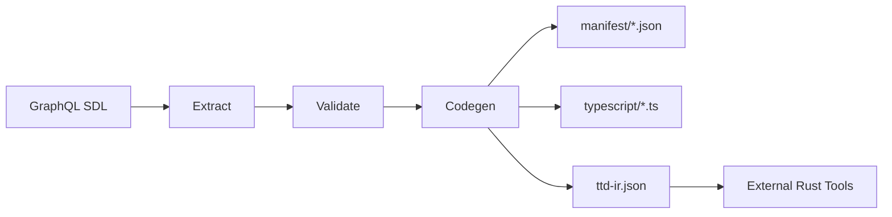

# TTD Protocol Compiler

> Compile typed protocols with deterministic verification from GraphQL SDL

## Overview

The TTD (Type-Driven Development) Protocol Compiler extends Wesley to generate deterministic protocol definitions from annotated GraphQL schemas. It produces typed protocols, registries, enforcement tables, and verification infrastructure for the Echo Time Travel Debugger.

## Current Repo Truth

Wesley's repo-local authored TTD schema currently lives in
[`schemas/ttd-protocol.graphql`](../../schemas/ttd-protocol.graphql). The
current local compile path is:

```bash
pnpm wesley compile-ttd --schema schemas/ttd-protocol.graphql --dry-run --json
```

That command currently validates the checked-in schema and reports generated
`manifest/*.json` and `typescript/*.ts` outputs. Those files are derived
artifacts from SDL, not a second authored source surface.

The shipped directive contract for this path is the `@wes_*` TTD family
documented in [`docs/DIRECTIVES.md`](../DIRECTIVES.md) and implemented in
[`packages/wesley-core/src/ttd/directives.mjs`](../../packages/wesley-core/src/ttd/directives.mjs).
The broader cross-repo publication boundary is still tracked as active backlog
work in
[`SOURCE_WESLEY_protocol-surface-cutover`](../method/backlog/v0.1.0/SOURCE_WESLEY_protocol-surface-cutover.md).

### Key Doctrine

> "schema_hash is the universe identity"

- Every protocol version is content-addressed and hashable
- Determinism is the product—every byte is canonical
- Codegen is deterministic: same manifest → same output bytes

## Quick Start

### CLI Usage

```bash
# Compile the checked-in Wesley TTD schema
pnpm wesley compile-ttd --schema schemas/ttd-protocol.graphql --out-dir .wesley-cache/ttd-out

# Basic compilation
pnpm wesley compile-ttd --schema schema.graphql --out-dir ttd-out/

# Specify targets
pnpm wesley compile-ttd --schema schema.graphql --target manifest,typescript

# Dry-run to preview
pnpm wesley compile-ttd --schema schema.graphql --dry-run

# JSON output for scripting
pnpm wesley compile-ttd --schema schema.graphql --dry-run --json

# Read from stdin
cat schema.graphql | pnpm wesley compile-ttd --schema - --out-dir ttd-out/
```

### Simple Schema Example

```graphql
enum OrderState { PENDING CONFIRMED SHIPPED DELIVERED }

type OrderEvents @wes_channel(name: "orders", version: 1, ordered: true) {
  orderConfirmed: OrderConfirmed!
  orderShipped: OrderShipped!
}

type OrderConfirmed @wes_registry(id: 1) @wes_codec(format: "cbor") {
  orderId: ID!
  confirmedAt: String!
}

type OrderShipped @wes_registry(id: 2) @wes_codec(format: "cbor") {
  orderId: ID!
  trackingNumber: String!
}

type Order @wes_version(major: 1, minor: 0) {
  id: ID! @wes_stateField(key: true)
  state: OrderState! @wes_stateField
}

type Mutation {
  confirmOrder(orderId: ID!): Order!
    @wes_op(name: "confirmOrder")
    @wes_rule(name: "confirm", from: ["PENDING"], to: "CONFIRMED")
    @wes_emission(channel: "orders", event: "OrderConfirmed")
    @wes_footprint(reads: ["Order"], writes: ["Order"])
}

type OrderSystem
  @wes_invariant(name: "valid_transitions", expr: "forall o in Order: o.state != PENDING || o.state == CONFIRMED", severity: "error")
{
  _placeholder: Boolean
}
```

## Directives Reference

The current shipped directive surface for `wesley compile-ttd` is the
`@wes_*` family below. The newer `@channel` / `@op` / `@rule` noun vocabulary
described in the extracted plan doc is still target-state design work, not the
checked-in compiler contract on `main`.

### Channel Directives

| Directive | Purpose | Example |
|-----------|---------|---------|
| `@wes_channel` | Define an event channel | `@wes_channel(name: "orders", version: 1, ordered: true)` |
| `@wes_codec` | Specify serialization format | `@wes_codec(format: "cbor", canonical: true)` |

### Operation Directives

| Directive | Purpose | Example |
|-----------|---------|---------|
| `@wes_op` | Define an operation | `@wes_op(name: "confirmOrder", idempotent: true)` |
| `@wes_rule` | State transition rule | `@wes_rule(name: "confirm", from: ["PENDING"], to: "CONFIRMED")` |
| `@wes_emission` | Event emission contract | `@wes_emission(channel: "orders", event: "OrderConfirmed")` |
| `@wes_footprint` | Read/write declarations | `@wes_footprint(reads: ["Order"], writes: ["Order"])` |

### Type Directives

| Directive | Purpose | Example |
|-----------|---------|---------|
| `@wes_registry` | Register type with ID | `@wes_registry(id: 1)` |
| `@wes_version` | Type version | `@wes_version(major: 1, minor: 0)` |
| `@wes_stateField` | Mark as state field | `@wes_stateField(key: true)` |
| `@wes_constraint` | Field constraints | `@wes_constraint(min: 0, max: 100)` |

### Invariant Directives

| Directive | Purpose | Example |
|-----------|---------|---------|
| `@wes_invariant` | System-level invariant | `@wes_invariant(name: "bounds", expr: "...", severity: "error")` |

## Generated Outputs

All generated files in this section are derived outputs from the SDL input.

### Manifest Files

| File | Contents |
|------|----------|
| `manifest/schema.json` | Full TTD schema with channels, ops, rules, types |
| `manifest/contracts.json` | Emission contracts, footprints, state machines |
| `manifest/manifest.json` | Registry entries with type hashes |
| `manifest/ttd-ir.json` | Raw TTD IR for external tools (e.g., Rust codegen) |

### TypeScript Files

| File | Contents |
|------|----------|
| `typescript/types.ts` | TypeScript interfaces and enums |
| `typescript/zod.ts` | Zod validators with constraints |
| `typescript/registry.ts` | Type and op registry lookups |
| `typescript/index.ts` | Barrel export |

### For Rust Codegen

Rust code is NOT generated directly by Wesley. Instead, external Rust tools consume the `ttd-ir.json`:

```bash
# Using echo-ttd-gen from the Echo repo
cat manifest/ttd-ir.json | echo-ttd-gen --out rust/
```

## Architecture



### Pipeline Stages

1. **Extract** - Parse GraphQL SDL and extract TTD directives into AST
2. **Validate** - Check channels, ops, rules, invariants for consistency
3. **Codegen** - Generate manifest JSON and TypeScript code
4. **Hash** - Compute deterministic schema hash

## Programmatic API

```typescript
import { compileTtdProtocol } from '@wesley/core/ttd';

const result = await compileTtdProtocol({
  sdl: schemaContent,
  targets: ['manifest', 'typescript'],
  deps: { clock, crypto }, // optional DI for testing
});

console.log(result.schemaHash);     // "23dc0e310ad5658b89..."
console.log(result.files);          // [{ path, content }, ...]
console.log(result.validation);     // { valid: true, errors: [], warnings: [] }
console.log(result.schema);         // Extracted TTD schema object
```

### Options

| Option | Type | Default | Description |
|--------|------|---------|-------------|
| `sdl` | `string` | required | GraphQL SDL with TTD directives |
| `targets` | `string[]` | `['manifest', 'typescript']` | Output targets |
| `deps.clock` | `ClockPort` | `systemClock` | Clock for timestamps |
| `deps.crypto` | `CryptoPort` | required | Crypto adapter for hashing |

## Determinism Guarantees

### What IS Guaranteed Byte-for-Byte

- Same SDL + same clock → identical output bytes
- JSON uses canonical key ordering (alphabetical)
- Arrays sorted by `id`, `op_id`, or `name` where applicable
- Schema hash is deterministic for identical SDL

### What is NOT Guaranteed

- File ordering if consumer re-reads directory
- Timestamps vary unless you use `FakeClock`
- Line endings depend on platform (normalize before comparing)

### Schema Hash Inputs

The schema hash is computed from:
- Full SDL text (after whitespace normalization)
- Uses SHA-256 with canonical encoding
- Does NOT include timestamps or generated code

### Testing Determinism

```typescript
import { FakeClock } from '@wesley/core/ports';

const clock = new FakeClock('2025-01-01T00:00:00.000Z');
const result1 = await compileTtdProtocol({ sdl, deps: { clock, crypto } });
const result2 = await compileTtdProtocol({ sdl, deps: { clock, crypto } });

// These will be identical
expect(result1.schemaHash).toBe(result2.schemaHash);
expect(result1.files).toEqual(result2.files);
```

## Stability / Compatibility

### Schema Hash as Universe Identity

- **schema_hash mismatch = different universe**
- Two systems with different hashes are incompatible
- Use hash to detect schema drift in distributed systems

### Versioned Manifests

```json
{
  "version": "1.0.0",
  "hash": "23dc0e310ad5658b...",
  "generatedBy": "@wesley/core/ttd"
}
```

### Decoder Policy

- **Strict by default**: Unknown fields cause errors
- Registry entries include type hashes for verification
- Op signatures are hashed for compatibility checks

## Verification

### Invariant Expressions

Invariants use a simple expression language:

```graphql
@wes_invariant(
  name: "value_bounded",
  expr: "forall c in Counter: c.value >= 0 && c.value <= 1000000",
  severity: "error"
)
```

#### Expression Grammar

```
expr       = logical_or
logical_or = logical_and ( "||" logical_and )*
logical_and = comparison ( "&&" comparison )*
comparison = additive ( ( "==" | "!=" | "<" | "<=" | ">" | ">=" ) additive )?
additive   = multiplicative ( ( "+" | "-" ) multiplicative )*
unary      = ( "!" | "-" ) unary | postfix
postfix    = primary ( "." IDENT ( "(" args? ")" )? )*
primary    = NUMBER | STRING | BOOL | IDENT | "(" expr ")" | quantified
quantified = "forall" IDENT "in" IDENT ":" expr
```

### Using the Verifier

```typescript
import { extractTtdSchema, createVerifier } from '@wesley/core/ttd';

const schema = extractTtdSchema(sdl, { crypto });
const verifier = createVerifier(schema);

const state = {
  Counter: [
    { id: '1', value: 100, state: 'COUNTING' },
    { id: '2', value: -5, state: 'IDLE' },  // violates invariant!
  ],
};

const result = verifier.verify(state);
// result.ok === false
// result.violations[0].invariant === 'value_bounded'
```

## Examples

### Counter Protocol

See the complete example in `packages/wesley-cli/test/fixtures/basic-ttd-protocol.graphql`:

- 4 state enum (IDLE, COUNTING, PAUSED, COMPLETED)
- 1 event channel with 3 event types
- 8 operations with state transition rules
- 3 system invariants

### State Machine Transitions

```graphql
type Mutation {
  start(id: ID!): Counter!
    @wes_op(name: "start")
    @wes_rule(name: "idle_to_counting", from: ["IDLE"], to: "COUNTING")

  pause(id: ID!): Counter!
    @wes_op(name: "pause")
    @wes_rule(name: "counting_to_paused", from: ["COUNTING"], to: "PAUSED")

  resume(id: ID!): Counter!
    @wes_op(name: "resume")
    @wes_rule(name: "paused_to_counting", from: ["PAUSED"], to: "COUNTING")
}
```

The compiler extracts these into a state machine specification in `contracts.json`.

## Related

- [TTD Protocol Compiler Plan](../plans/ttd-protocol-compiler.md) - Implementation details
- [Echo Time Travel Debugger](https://github.com/flyingrobots/echo) - Consumer of TTD output
