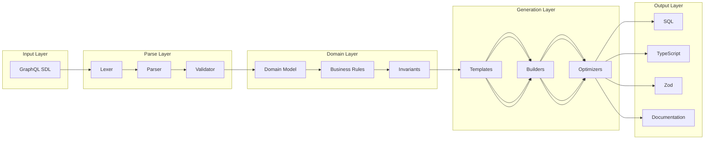

# Wesley Internals: Deep Dive

## Core Philosophy

Wesley is built on three fundamental principles:

1. **Zero Dependencies in Core**: The domain logic has absolutely no external dependencies
2. **Everything is a Transform**: Each operation transforms data from one shape to another
3. **Events Drive Everything**: Every significant action emits an event

## The Transform Pipeline



## Memory Management

### Schema Representation

Wesley uses an immutable data structure for schemas:

```javascript
class Schema {
  constructor(tables = {}) {
    // Freeze to ensure immutability
    this.tables = Object.freeze({ ...tables });
    Object.freeze(this);
  }
  
  addTable(table) {
    // Return new instance (immutable update)
    return new Schema({
      ...this.tables,
      [table.name]: table
    });
  }
}
```

### Why Immutability?

1. **Thread Safety**: Can be shared across workers
2. **Time Travel**: Previous schemas remain unchanged
3. **Debugging**: State changes are explicit
4. **Caching**: Can safely cache by reference

### Memory Pools

For performance, Wesley uses object pools for frequently created objects:

```javascript
class FieldPool {
  constructor(size = 1000) {
    this.pool = [];
    this.size = size;
    
    // Pre-allocate
    for (let i = 0; i < size; i++) {
      this.pool.push(new Field());
    }
  }
  
  acquire(props) {
    const field = this.pool.pop() || new Field();
    Object.assign(field, props);
    return field;
  }
  
  release(field) {
    if (this.pool.length < this.size) {
      // Reset and return to pool
      field.reset();
      this.pool.push(field);
    }
  }
}
```

## Parser Internals

### Tokenization

The GraphQL parser first tokenizes the input:

```javascript
class Tokenizer {
  constructor(input) {
    this.input = input;
    this.position = 0;
    this.tokens = [];
  }
  
  tokenize() {
    while (this.position < this.input.length) {
      this.skipWhitespace();
      
      if (this.position >= this.input.length) break;
      
      const token = 
        this.readKeyword() ||
        this.readIdentifier() ||
        this.readDirective() ||
        this.readPunctuation();
      
      if (token) {
        this.tokens.push(token);
      } else {
        throw new ParseError(`Unexpected character at position ${this.position}`);
      }
    }
    
    return this.tokens;
  }
  
  readKeyword() {
    const keywords = ['type', 'interface', 'enum', 'scalar', 'union'];
    for (const keyword of keywords) {
      if (this.match(keyword)) {
        return { type: 'KEYWORD', value: keyword };
      }
    }
    return null;
  }
}
```

### AST Construction

The parser builds an Abstract Syntax Tree:

```javascript
class ASTBuilder {
  constructor(tokens) {
    this.tokens = tokens;
    this.current = 0;
  }
  
  build() {
    const definitions = [];
    
    while (!this.isAtEnd()) {
      definitions.push(this.definition());
    }
    
    return {
      kind: 'Document',
      definitions
    };
  }
  
  definition() {
    const token = this.peek();
    
    switch (token.value) {
      case 'type':
        return this.objectTypeDefinition();
      case 'interface':
        return this.interfaceDefinition();
      case 'enum':
        return this.enumDefinition();
      default:
        throw new ParseError(`Unexpected token: ${token.value}`);
    }
  }
  
  objectTypeDefinition() {
    this.consume('type');
    const name = this.identifier();
    const directives = this.directives();
    const fields = this.fieldDefinitions();
    
    return {
      kind: 'ObjectTypeDefinition',
      name,
      directives,
      fields
    };
  }
}
```

### Semantic Analysis

After parsing, Wesley performs semantic analysis:

```javascript
class SemanticAnalyzer {
  analyze(ast) {
    const errors = [];
    const warnings = [];
    
    // Check for duplicate type names
    const typeNames = new Set();
    for (const def of ast.definitions) {
      if (def.kind === 'ObjectTypeDefinition') {
        if (typeNames.has(def.name.value)) {
          errors.push(`Duplicate type name: ${def.name.value}`);
        }
        typeNames.add(def.name.value);
      }
    }
    
    // Validate foreign key references
    for (const def of ast.definitions) {
      for (const field of def.fields || []) {
        const fk = this.getForeignKey(field);
        if (fk) {
          const [refTable, refField] = fk.ref.split('.');
          if (!typeNames.has(refTable)) {
            errors.push(`Invalid foreign key reference: ${refTable}`);
          }
        }
      }
    }
    
    // Check for circular dependencies
    const cycles = this.detectCycles(ast);
    if (cycles.length > 0) {
      warnings.push(`Circular dependencies detected: ${cycles.join(' -> ')}`);
    }
    
    return { errors, warnings };
  }
  
  detectCycles(ast) {
    // Depth-first search for cycles
    const graph = this.buildDependencyGraph(ast);
    const visited = new Set();
    const stack = new Set();
    const cycles = [];
    
    for (const node of graph.keys()) {
      if (!visited.has(node)) {
        this.dfs(node, graph, visited, stack, cycles);
      }
    }
    
    return cycles;
  }
}
```

## Event System Internals

### Event Bus Implementation

```javascript
class EventBus {
  constructor() {
    this.handlers = new Map();
    this.middleware = [];
    this.history = [];
    this.maxHistory = 1000;
  }
  
  use(middleware) {
    this.middleware.push(middleware);
  }
  
  subscribe(eventType, handler, options = {}) {
    const wrappedHandler = this.wrapHandler(handler, options);
    
    if (!this.handlers.has(eventType)) {
      this.handlers.set(eventType, []);
    }
    
    this.handlers.get(eventType).push(wrappedHandler);
    
    // Return unsubscribe function
    return () => {
      const handlers = this.handlers.get(eventType);
      const index = handlers.indexOf(wrappedHandler);
      if (index > -1) {
        handlers.splice(index, 1);
      }
    };
  }
  
  wrapHandler(handler, options) {
    return async (event) => {
      // Apply middleware
      let processedEvent = event;
      for (const mw of this.middleware) {
        processedEvent = await mw(processedEvent);
      }
      
      // Call handler with timeout
      if (options.timeout) {
        return await this.withTimeout(
          handler(processedEvent),
          options.timeout
        );
      }
      
      return await handler(processedEvent);
    };
  }
  
  async publish(event) {
    // Record in history
    this.recordHistory(event);
    
    // Get handlers
    const specificHandlers = this.handlers.get(event.type) || [];
    const wildcardHandlers = this.handlers.get('*') || [];
    const allHandlers = [...specificHandlers, ...wildcardHandlers];
    
    // Execute in parallel with error boundaries
    const results = await Promise.allSettled(
      allHandlers.map(handler => 
        this.executeWithErrorBoundary(handler, event)
      )
    );
    
    // Process results
    const failures = results.filter(r => r.status === 'rejected');
    if (failures.length > 0 && !event.metadata?.allowFailures) {
      throw new EventHandlingError(failures);
    }
    
    return results;
  }
  
  recordHistory(event) {
    this.history.push({
      ...event,
      timestamp: Date.now()
    });
    
    // Trim history if needed
    if (this.history.length > this.maxHistory) {
      this.history.shift();
    }
  }
  
  async executeWithErrorBoundary(handler, event) {
    try {
      return await handler(event);
    } catch (error) {
      console.error(`Handler error for ${event.type}:`, error);
      throw error;
    }
  }
}
```

### Event Replay

Wesley can replay events for debugging:

```javascript
class EventReplayer {
  constructor(eventBus) {
    this.eventBus = eventBus;
  }
  
  async replay(events, options = {}) {
    const results = [];
    
    for (const event of events) {
      if (options.delay) {
        await this.delay(options.delay);
      }
      
      if (options.filter && !options.filter(event)) {
        continue;
      }
      
      const result = await this.eventBus.publish({
        ...event,
        metadata: {
          ...event.metadata,
          replayed: true,
          originalTimestamp: event.timestamp
        }
      });
      
      results.push(result);
      
      if (options.onEvent) {
        options.onEvent(event, result);
      }
    }
    
    return results;
  }
  
  delay(ms) {
    return new Promise(resolve => setTimeout(resolve, ms));
  }
}
```

## Code Generation Internals

### Template Engine

Wesley uses a custom template engine optimized for code generation:

```javascript
class TemplateEngine {
  constructor() {
    this.templates = new Map();
    this.helpers = new Map();
    this.partials = new Map();
  }
  
  registerTemplate(name, template) {
    // Pre-compile template
    const compiled = this.compile(template);
    this.templates.set(name, compiled);
  }
  
  compile(template) {
    const ast = this.parseTemplate(template);
    
    // Generate optimized render function
    return new Function('context', 'helpers', 
      this.generateRenderCode(ast)
    );
  }
  
  parseTemplate(template) {
    const tokens = [];
    const regex = /{{(#|\/|>)?([^}]+)}}/g;
    let lastIndex = 0;
    let match;
    
    while ((match = regex.exec(template)) !== null) {
      // Add literal text
      if (match.index > lastIndex) {
        tokens.push({
          type: 'TEXT',
          value: template.slice(lastIndex, match.index)
        });
      }
      
      // Add template token
      const prefix = match[1] || '';
      const content = match[2].trim();
      
      tokens.push({
        type: this.getTokenType(prefix),
        value: content
      });
      
      lastIndex = regex.lastIndex;
    }
    
    // Add remaining text
    if (lastIndex < template.length) {
      tokens.push({
        type: 'TEXT',
        value: template.slice(lastIndex)
      });
    }
    
    return tokens;
  }
  
  generateRenderCode(ast) {
    let code = 'let output = "";\n';
    
    for (const token of ast) {
      switch (token.type) {
        case 'TEXT':
          code += `output += ${JSON.stringify(token.value)};\n`;
          break;
        case 'VARIABLE':
          code += `output += context.${token.value} || '';\n`;
          break;
        case 'HELPER':
          const [helper, ...args] = token.value.split(' ');
          code += `output += helpers.${helper}(${args.join(', ')});\n`;
          break;
      }
    }
    
    code += 'return output;';
    return code;
  }
  
  render(templateName, context) {
    const template = this.templates.get(templateName);
    if (!template) {
      throw new Error(`Template not found: ${templateName}`);
    }
    
    return template(context, this.helpers);
  }
}
```

### Code Builder Pattern

Wesley uses builders for complex code generation:

```javascript
class SQLBuilder {
  constructor() {
    this.statements = [];
    this.currentTable = null;
    this.indentLevel = 0;
  }
  
  createTable(name) {
    this.currentTable = {
      name,
      columns: [],
      constraints: [],
      indexes: []
    };
    return this;
  }
  
  addColumn(name, type, options = {}) {
    let definition = `"${name}" ${type}`;
    
    if (options.notNull) {
      definition += ' NOT NULL';
    }
    
    if (options.default) {
      definition += ` DEFAULT ${options.default}`;
    }
    
    this.currentTable.columns.push(definition);
    return this;
  }
  
  addPrimaryKey(column) {
    this.currentTable.constraints.push(
      `PRIMARY KEY ("${column}")`
    );
    return this;
  }
  
  addForeignKey(column, reference, options = {}) {
    let constraint = `FOREIGN KEY ("${column}") REFERENCES ${reference}`;
    
    if (options.onDelete) {
      constraint += ` ON DELETE ${options.onDelete}`;
    }
    
    if (options.onUpdate) {
      constraint += ` ON UPDATE ${options.onUpdate}`;
    }
    
    this.currentTable.constraints.push(constraint);
    return this;
  }
  
  addIndex(name, columns, options = {}) {
    let index = `CREATE`;
    
    if (options.unique) {
      index += ' UNIQUE';
    }
    
    index += ` INDEX IF NOT EXISTS "${name}" ON "${this.currentTable.name}"`;
    index += ` (${columns.map(c => `"${c}"`).join(', ')})`;
    
    if (options.where) {
      index += ` WHERE ${options.where}`;
    }
    
    this.currentTable.indexes.push(index + ';');
    return this;
  }
  
  build() {
    if (!this.currentTable) {
      return this.statements.join('\n\n');
    }
    
    // Build CREATE TABLE statement
    let sql = `CREATE TABLE IF NOT EXISTS "${this.currentTable.name}" (\n`;
    
    const allItems = [
      ...this.currentTable.columns,
      ...this.currentTable.constraints
    ];
    
    sql += allItems.map(item => `  ${item}`).join(',\n');
    sql += '\n);';
    
    this.statements.push(sql);
    
    // Add indexes
    this.statements.push(...this.currentTable.indexes);
    
    this.currentTable = null;
    
    return this.statements.join('\n\n');
  }
}
```

## Optimization Internals

### Query Optimization

Wesley optimizes generated SQL queries:

```javascript
class QueryOptimizer {
  optimize(statements) {
    return statements
      .map(stmt => this.optimizeStatement(stmt))
      .filter(stmt => stmt !== null);
  }
  
  optimizeStatement(statement) {
    // Remove redundant indexes
    if (this.isRedundantIndex(statement)) {
      return null;
    }
    
    // Combine adjacent ALTER statements
    if (this.canCombineWithPrevious(statement)) {
      return this.combineStatements(this.previous, statement);
    }
    
    // Reorder for optimal execution
    const priority = this.getStatementPriority(statement);
    statement.priority = priority;
    
    this.previous = statement;
    return statement;
  }
  
  isRedundantIndex(statement) {
    // Check if index is redundant (covered by PK or unique)
    if (!statement.includes('CREATE INDEX')) {
      return false;
    }
    
    const columns = this.extractIndexColumns(statement);
    const table = this.extractTableName(statement);
    
    // Check if primary key covers this index
    if (this.primaryKeyCovers(table, columns)) {
      return true;
    }
    
    // Check if unique constraint covers this index
    if (this.uniqueConstraintCovers(table, columns)) {
      return true;
    }
    
    return false;
  }
  
  getStatementPriority(statement) {
    // Execution order optimization
    if (statement.includes('CREATE TABLE')) return 1;
    if (statement.includes('ALTER TABLE')) return 2;
    if (statement.includes('CREATE INDEX')) return 3;
    if (statement.includes('CREATE TRIGGER')) return 4;
    return 5;
  }
}
```

### Memory Optimization

Wesley uses streaming for large schemas:

```javascript
class StreamingGenerator {
  constructor(writer) {
    this.writer = writer;
    this.buffer = [];
    this.bufferSize = 1024 * 16; // 16KB chunks
  }
  
  async *generate(schema) {
    for (const table of schema.getTables()) {
      const sql = await this.generateTable(table);
      
      // Yield in chunks
      for (let i = 0; i < sql.length; i += this.bufferSize) {
        yield sql.slice(i, i + this.bufferSize);
      }
    }
  }
  
  async generateTable(table) {
    // Generate SQL for single table
    const builder = new SQLBuilder();
    builder.createTable(table.name);
    
    for (const field of table.getFields()) {
      if (!field.isVirtual()) {
        builder.addColumn(
          field.name,
          this.mapType(field),
          { notNull: field.nonNull }
        );
      }
    }
    
    return builder.build();
  }
}
```

## Error Handling Internals

### Error Types

Wesley has a rich error hierarchy:

```javascript
class WesleyError extends Error {
  constructor(message, code, details = {}) {
    super(message);
    this.name = this.constructor.name;
    this.code = code;
    this.details = details;
    this.timestamp = new Date().toISOString();
  }
  
  toJSON() {
    return {
      name: this.name,
      message: this.message,
      code: this.code,
      details: this.details,
      timestamp: this.timestamp,
      stack: this.stack
    };
  }
}

class ParseError extends WesleyError {
  constructor(message, position, line, column) {
    super(message, 'PARSE_ERROR', { position, line, column });
  }
}

class ValidationError extends WesleyError {
  constructor(message, field, constraint) {
    super(message, 'VALIDATION_ERROR', { field, constraint });
  }
}

class GenerationError extends WesleyError {
  constructor(message, generator, input) {
    super(message, 'GENERATION_ERROR', { generator, input });
  }
}
```

### Error Recovery

Wesley attempts to recover from errors:

```javascript
class ErrorRecovery {
  async tryRecover(error, context) {
    const strategies = [
      this.recoverFromParse,
      this.recoverFromValidation,
      this.recoverFromGeneration
    ];
    
    for (const strategy of strategies) {
      const result = await strategy.call(this, error, context);
      if (result.recovered) {
        return result;
      }
    }
    
    return { recovered: false, error };
  }
  
  async recoverFromParse(error, context) {
    if (error.code !== 'PARSE_ERROR') {
      return { recovered: false };
    }
    
    // Try to fix common parse errors
    const fixes = [
      this.fixMissingBrace,
      this.fixMissingQuote,
      this.fixTypo
    ];
    
    for (const fix of fixes) {
      const fixed = fix(context.input, error.details.position);
      if (fixed) {
        try {
          const result = await context.parser.parse(fixed);
          return { recovered: true, result };
        } catch {
          // Try next fix
        }
      }
    }
    
    return { recovered: false };
  }
}
```

## Performance Profiling

Wesley includes built-in profiling:

```javascript
class Profiler {
  constructor() {
    this.metrics = new Map();
    this.enabled = process.env.WESLEY_PROFILE === 'true';
  }
  
  measure(name, fn) {
    if (!this.enabled) {
      return fn();
    }
    
    const start = performance.now();
    const memory = process.memoryUsage();
    
    try {
      const result = fn();
      
      if (result instanceof Promise) {
        return result.finally(() => {
          this.record(name, start, memory);
        });
      }
      
      this.record(name, start, memory);
      return result;
    } catch (error) {
      this.record(name, start, memory, error);
      throw error;
    }
  }
  
  record(name, start, startMemory, error = null) {
    const duration = performance.now() - start;
    const endMemory = process.memoryUsage();
    
    const metric = {
      name,
      duration,
      memoryDelta: {
        heapUsed: endMemory.heapUsed - startMemory.heapUsed,
        external: endMemory.external - startMemory.external
      },
      error: error?.message,
      timestamp: Date.now()
    };
    
    if (!this.metrics.has(name)) {
      this.metrics.set(name, []);
    }
    
    this.metrics.get(name).push(metric);
  }
  
  report() {
    const report = {};
    
    for (const [name, metrics] of this.metrics) {
      const durations = metrics.map(m => m.duration);
      const memories = metrics.map(m => m.memoryDelta.heapUsed);
      
      report[name] = {
        count: metrics.length,
        totalTime: durations.reduce((a, b) => a + b, 0),
        avgTime: durations.reduce((a, b) => a + b, 0) / metrics.length,
        minTime: Math.min(...durations),
        maxTime: Math.max(...durations),
        avgMemory: memories.reduce((a, b) => a + b, 0) / metrics.length,
        errors: metrics.filter(m => m.error).length
      };
    }
    
    return report;
  }
}
```

## Conclusion

Wesley's internals are designed for:

1. **Performance**: Object pooling, streaming, optimization passes
2. **Reliability**: Error recovery, event replay, profiling
3. **Extensibility**: Plugin architecture, template engine, builders
4. **Debugging**: Event history, error details, performance metrics
5. **Correctness**: Semantic analysis, validation, immutability

The internal architecture reflects the external simplicity—complex operations are composed from simple, well-tested primitives.