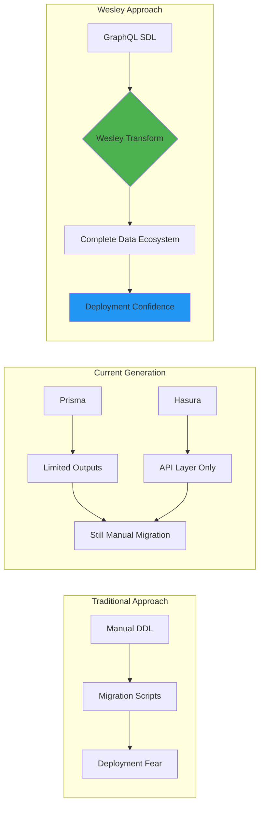

# Wesley Marketing Narrative: The Wesley Crusher Journey

## Executive Summary

Wesley's marketing narrative draws from the Star Trek: The Next Generation character arc of Wesley Crusher—from eager ensign to transcendent being who masters time and space. This metaphor perfectly captures Wesley's evolution from basic code generator to reality-bending database transformation platform.

**Core Message**: Like Wesley Crusher's journey from enthusiasm to mastery, Wesley platform guides teams from database chaos to transcendent data operations.

## The Wesley Crusher Metaphor: Three Acts

### Act I: The Eager Ensign (Basic Generator)

**Wesley Crusher Context**: Young, enthusiastic, eager to help but prone to mistakes
**Wesley Platform Context**: Early-stage teams learning database operations

**Character Traits**:
- Boundless enthusiasm for technology
- Sometimes causes more problems than solutions
- Learning fundamental principles
- Needs guidance and safety rails

**Marketing Messages**:
- "Every expert was once a beginner"
- "Transform your data layer with confidence"
- "Start simple, grow sophisticated"
- "Wesley makes database operations approachable"

**Target Persona**: Junior developers, startups, teams new to database operations

**Example Copy**:
> "Remember when Wesley Crusher first stepped onto the Enterprise bridge? All enthusiasm, boundless curiosity, but needing guidance to avoid catastrophic mistakes. Wesley platform is designed for teams at every level—providing safety rails for beginners while enabling expert-level transformations."

### Act II: Acting Ensign Wesley (Capable Compiler)

**Wesley Crusher Context**: Growing competence, trusted with real responsibilities, still learning
**Wesley Platform Context**: Teams comfortable with basic operations, ready for advanced features

**Character Traits**:
- Proven competence in specific areas
- Trusted with important tasks
- Developing judgment and wisdom
- Bridge between junior and senior levels

**Marketing Messages**:
- "Ready for production-grade operations"
- "Advanced transformations with safety guarantees"
- "Beyond basic generation to intelligent compilation"
- "Certificate-backed deployment confidence"

**Target Persona**: Growing teams, scale-up companies, established development shops

**Example Copy**:
> "Acting Ensign Wesley earned Captain Picard's trust through demonstrated competence and sound judgment. Wesley platform earns your production trust through Shadow REALM validation, certificate-backed deployments, and cryptographic proof of safety. Ready for your next-level database operations?"

### Act III: The Transcendent (Reality-Bending Transformer)

**Wesley Crusher Context**: Transcends normal limitations, sees patterns others miss, masters time and space
**Wesley Platform Context**: Advanced teams orchestrating complex multi-environment transformations

**Character Traits**:
- Sees patterns invisible to others
- Operates beyond conventional constraints
- Masters complex relationships and dependencies
- Guides others on their journey

**Marketing Messages**:
- "Transcend traditional database limitations"
- "Master time and space in your data transformations"
- "See patterns others miss in your schema evolution"
- "Guide your team to database mastery"

**Target Persona**: Enterprise teams, platform engineers, database architects

**Example Copy**:
> "When Wesley Crusher transcended to a higher plane of existence, he could manipulate time and space, see patterns across dimensions, and guide others on their journey. Wesley platform offers that same transcendence for database operations—multi-dimensional transformations, pattern recognition across schemas, and the ability to guide your entire organization toward data mastery."

## Core Positioning Framework

### The Wesley Difference: Beyond Traditional Tools

**vs. Prisma**:
- **Prisma**: "Database toolkit for TypeScript & Node.js"
- **Wesley**: "Data layer transformation platform that transcends traditional boundaries"

**vs. Hasura**:
- **Hasura**: "GraphQL API for your database"
- **Wesley**: "Transform your entire data ecosystem from a single source of truth"

**vs. Traditional Migration Tools**:
- **Traditional**: "Execute SQL scripts"
- **Wesley**: "Orchestrate reality-bending database transformations"

### Unique Value Propositions

#### 1. "Go On, Deploy on a Friday"

**The Problem**: Friday deployments are universally feared in software engineering
**Wesley's Solution**: Certificate-backed deployment confidence through Shadow REALM validation
**Emotional Hook**: Freedom from deployment anxiety

**Campaign Elements**:
- Testimonials: "We deployed our billing system on a Friday afternoon and went home confident"
- Evidence: Real certificate examples showing deployment safety proof
- Character: SHA-lock HOLMES providing mathematical certainty

#### 2. "GraphQL is the Schema. Everything Else is Generated."

**The Problem**: Schema drift, multiple sources of truth, manual synchronization
**Wesley's Solution**: Single GraphQL SDL source generates entire data ecosystem
**Technical Hook**: End-to-end type safety and consistency

**Campaign Elements**:
- Developer Experience: Show the transformation from single schema to full stack
- Productivity Claims: "10x faster than traditional schema-first development"
- Technology Leadership: Position as evolution beyond current tools

#### 3. "Data Done Right"

**The Problem**: Database operations are complex, risky, and error-prone
**Wesley's Solution**: Enterprise-grade safety with approachable personality
**Brand Hook**: Reliability with character

**Campaign Elements**:
- Safety Stories: Real examples of Wesley catching dangerous operations
- Personality Showcase: CLI interactions that make complex operations approachable
- Trust Building: Mathematical proof combined with human understanding

## Target Audience Segmentation

### Primary: Scale-Up Engineering Teams (50-500 engineers)

**Characteristics**:
- Outgrowing basic tools but not ready for enterprise complexity
- Need production-grade safety without enterprise overhead
- Value developer experience and team productivity
- Facing scaling challenges with database operations

**Wesley Value**:
- Certificate system provides enterprise safety without enterprise complexity
- Character-driven CLI makes advanced operations approachable
- Shadow REALM eliminates deployment anxiety at scale

**Messaging**:
- "Enterprise-grade database operations without the enterprise complexity"
- "Scale your data layer as fast as your team"
- "Deployment confidence for growing companies"

### Secondary: Enterprise Platform Teams

**Characteristics**:
- Responsible for database operations across multiple teams
- Need governance, compliance, and audit trails
- Value standardization and best practices enforcement
- Focus on risk reduction and operational excellence

**Wesley Value**:
- Cryptographic certificates provide audit trails and compliance evidence
- Standardized transformation processes across teams
- Risk elimination through comprehensive validation

**Messaging**:
- "Bring order to database chaos across your organization"
- "Compliance-ready database operations with cryptographic proof"
- "Platform engineering for the data layer"

### Tertiary: Individual Developers/Small Teams

**Characteristics**:
- Building side projects, early-stage startups
- Need simple but powerful database operations
- Value learning and growth opportunities
- Price-sensitive but quality-focused

**Wesley Value**:
- Easy onboarding with progressive complexity
- Educational character interactions
- Open-source with premium features

**Messaging**:
- "Learn database operations the right way"
- "Start simple, grow sophisticated"
- "Professional-grade tools for personal projects"

## Competitive Positioning

### Wesley vs. The Database Ecosystem

### Feature Comparison Matrix

| Feature | Traditional Tools | Prisma | Hasura | Wesley |
|---------|-------------------|--------|--------|--------|
| Single Source of Truth | ❌ | ✅ | ❌ | ✅ |
| Multi-Target Generation | ❌ | ⚠️ | ❌ | ✅ |
| Zero-Downtime Migrations | ⚠️ | ⚠️ | ❌ | ✅ |
| Production Safety Rails | ❌ | ❌ | ❌ | ✅ |
| Cryptographic Deployment Proof | ❌ | ❌ | ❌ | ✅ |
| Shadow Realm Validation | ❌ | ❌ | ❌ | ✅ |
| Character-Driven UX | ❌ | ❌ | ❌ | ✅ |
| Friday Deployment Confidence | ❌ | ❌ | ❌ | ✅ |

## Campaign Concepts

### Campaign 1: "The Friday Deploy Challenge"

**Concept**: Challenge teams to deploy significant database changes on Friday afternoon
**Execution**:
- Video series: Teams attempting Friday deploys with and without Wesley
- Social proof: Companies sharing their Friday deploy success stories
- Landing page: Certificate gallery showing real Friday deployment proofs
- Conference talks: "How we made Friday deploys boring"

**Success Metrics**:
- Number of teams taking the challenge
- Friday deploy success rate improvements
- Social media shares of deployment certificates

### Campaign 2: "Database Operations Transcendence"

**Concept**: Position Wesley as evolutionary leap beyond current tools
**Execution**:
- Technical blog series: Deep dives into transformation philosophy
- Webinar series: "Transcending Traditional Database Operations"
- Conference sponsorship: Focus on platform engineering and DevOps events
- Developer advocacy: Thought leadership on schema-driven development

**Success Metrics**:
- Technical blog engagement and shares
- Webinar attendance and conversion rates
- Developer conference speaking opportunities
- Industry analyst recognition

### Campaign 3: "Meet the Characters"

**Concept**: Humanize the technical complexity through character storytelling
**Execution**:
- Character spotlight videos: SHA-lock HOLMES solving real problems
- Interactive demos: Chat with Dr. Wat-SUM about performance analysis
- Community content: User-generated character interactions
- Easter eggs: Hidden character features discovered by community

**Success Metrics**:
- Character interaction engagement
- Community content creation
- Social media mentions of characters
- User retention and feature adoption

## Content Strategy

### Educational Content (Top of Funnel)

**Blog Series**: "Database Operations Mastery"
- "Why Friday Deploys Don't Have to be Scary"
- "The Psychology of Deployment Confidence"
- "Schema-First Development: Beyond the Hype"
- "Multi-Target Generation: One Schema, Infinite Possibilities"

**Video Series**: "Wesley Crusher's Guide to Database Operations"
- Episode 1: "From Ensign to Acting Ensign" (Basic to Intermediate)
- Episode 2: "The Shadow Realm Explained" (Advanced Validation)
- Episode 3: "Transcendent Transformations" (Enterprise Features)

**Interactive Content**:
- Schema transformation playground
- Certificate generator demo
- Shadow REALM simulator

### Technical Content (Middle of Funnel)

**Documentation**:
- Comprehensive getting started guides
- Advanced transformation patterns
- Production deployment playbooks
- Troubleshooting and debugging guides

**Case Studies**:
- "How [Company] Achieved 99.99% Deployment Success"
- "From Schema Chaos to Data Harmony: A Transformation Story"
- "Zero-Downtime Migration: A Real-World Case Study"

**Technical Comparisons**:
- Wesley vs. Prisma: Feature-by-feature analysis
- Migration from Hasura to Wesley: A complete guide
- ROI Analysis: Cost of database downtime vs. Wesley investment

### Community Content (Bottom of Funnel)

**Community Platform**:
- Wesley Discourse forum with character-themed categories
- GitHub discussions for feature requests and technical support
- Discord server for real-time community interaction

**User-Generated Content**:
- Certificate showcase: Users sharing deployment success stories
- Character interaction galleries: Favorite CLI moments
- Schema transformation showcases: Before/after comparisons

**Events and Meetups**:
- Wesley User Conference: Annual gathering of the community
- Local meetups: City-specific Wesley user groups
- Virtual office hours: Direct access to Wesley team

## Brand Voice and Personality

### Tone of Voice

**Professional yet Mystical**: Serious about safety, playful about personality
- "We provide cryptographic proof of deployment safety" (professional)
- "The Shadow REALM whispers approval" (mystical)

**Confident yet Humble**: Know our strengths, acknowledge learning journey
- "Wesley eliminates Friday deployment fear" (confident)
- "Every master was once a beginner" (humble)

**Technical yet Accessible**: Deep technical capability, approachable presentation
- "Zero-downtime lock-aware DDL operations" (technical)
- "Database operations that just work" (accessible)

### Visual Identity

**Color Palette**:
- Primary: Wesley Blue (#2196F3) - Trust, intelligence, technology
- Secondary: Transformation Purple (#9C27B0) - Mystery, transformation, advanced capability
- Accent: Certificate Green (#4CAF50) - Safety, approval, success

**Typography**:
- Headers: Modern, geometric font suggesting precision and advancement
- Body: Clean, readable font prioritizing clarity and approachability
- Code: Monospace font with syntax highlighting

**Imagery Style**:
- Abstract geometric patterns suggesting transformation
- Starship/space imagery referencing Star Trek metaphor
- Technical diagrams with mystical elements
- Character illustrations maintaining professional appearance

## Sales Enablement

### Qualification Framework

**BANT+ Wesley**:
- **Budget**: Can invest in developer productivity and operational safety
- **Authority**: Technical decision makers (CTOs, VPs of Engineering, Platform Teams)
- **Need**: Database operation challenges (downtime, complexity, fear)
- **Timeline**: Immediate pain or upcoming scaling challenges
- **Wesley Fit**: Values both technical excellence and developer experience

### Sales Tools

**Demo Environment**:
- Interactive Wesley transformation playground
- Pre-built scenarios showing common problems and Wesley solutions
- Real-time character interactions during demonstrations
- Certificate generation examples with actual deployment scenarios

**ROI Calculator**:
- Database downtime cost analysis
- Developer productivity improvements
- Deployment confidence value quantification
- Risk reduction benefits measurement

**Competitive Battle Cards**:
- Wesley vs. Prisma feature comparison with migration guide
- Wesley vs. Hasura positioning with use case analysis
- Wesley vs. Manual DDL risk comparison with safety analysis

### Customer Success Framework

**Onboarding Journey**:
1. **Ensign Level**: Basic schema transformation success
2. **Acting Ensign Level**: Shadow REALM validation comfort
3. **Transcendent Level**: Advanced multi-environment orchestration

**Success Metrics**:
- Time to first successful transformation
- Friday deployment adoption rate
- Certificate generation frequency
- Character interaction engagement

**Expansion Opportunities**:
- Additional environments (staging, production)
- Advanced features (multi-tenant, compliance)
- Team/enterprise features (governance, audit trails)

## Metrics and KPIs

### Brand Awareness Metrics

**Organic Reach**:
- Brand mention tracking across social media and forums
- Share of voice in database/DevOps conversations
- Technical blog backlinks and citations

**Community Growth**:
- GitHub stars and repository engagement
- Discord/forum active members
- Conference speaking opportunities and attendance

### Demand Generation Metrics

**Content Performance**:
- Blog post engagement and conversion rates
- Video view completion rates and sharing
- Interactive content usage and progression

**Lead Quality**:
- Trial-to-paid conversion rates by source
- Sales qualified lead rates from marketing campaigns
- Customer acquisition cost by channel

### Product Adoption Metrics

**Feature Utilization**:
- Character interaction rates during CLI usage
- Shadow REALM validation adoption
- Certificate system usage and sharing

**Customer Success**:
- Net Promoter Score with Wesley-specific questions
- Customer lifetime value and expansion rates
- Friday deployment success rates (Wesley's signature metric)

## Future Marketing Evolution

### Phase 1: Foundation (Months 1-6)
- Establish Wesley Crusher metaphor in market
- Build core content library and community platform
- Launch Friday Deploy Challenge campaign

### Phase 2: Scale (Months 7-12)
- Expand character ecosystem and interactions
- Launch enterprise features and positioning
- Establish thought leadership in schema-driven development

### Phase 3: Transcendence (Year 2+)
- Position Wesley as category creator for "Data Transformation Platforms"
- Expand beyond database operations to complete data ecosystem
- Build partner ecosystem and integration marketplace

---

**Wesley's marketing narrative transforms the mundane world of database operations into an inspiring journey of growth, mastery, and transcendence. Like Wesley Crusher's evolution from eager ensign to reality-bending entity, Wesley platform guides teams from database chaos to transcendent data operations.**

*"The journey from database chaos to data mastery begins with a single transformation. Let Wesley be your guide."* - Wesley Marketing Team