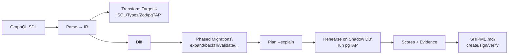

# Wesley MVP Roadmap

Make deployments boring by transforming one GraphQL schema into provably safe database changes, types, tests, and a signed SHIPME certificate.

## Executive Summary
- Goal: A minimal, credible end-to-end flow that proves “Transform → Plan → Rehearse → Certify (SHIPME)”.
- Output: Real SQL/Types/Zod/pgTAP from canonical IR; phased migrations; shadow rehearsal (REALM‑lite) with explain/dry-run; SHIPME.md with signatures and verdict.
- Promise: Zero‑surprise schema changes, default zero‑downtime patterns, and CI‑grade evidence (scores + tests + rehearsal) that gates production safely.

## MVP Outcomes (What’s In)
- `wesley transform schema.graphql --target postgres,typescript,zod,pgtap`
- Canonical IR schema (JSON) shared by parser/generators; evidence bundle + artifact hashes
- Diff → phased migration artifacts: expand/backfill/validate/switch/contract (additive changes)
- `wesley plan --explain` lock‑aware plan preview; `wesley rehearse --dsn` applies plan on a shadow DB and runs pgTAP
- `wesley cert {create,sign,verify}` produces/verifies SHIPME.md including REALM verdict (PASS/FAIL) and HOLMES/Wat‑SUM signatures

## Out of Scope (MVP)
- Destructive diffs (DROP TABLE/COLUMN) beyond “explain only”
- Full TASKS v3 planning artifacts and SLAPS advanced scheduler
- Traffic mirroring for REALM (we start with smoke tests)
- Rich UI/visualizer (CLI-first MVP)

## Success Metrics and Gates
- Evidence validation passes (schemas), SCS/MRI/TCI computed
- Rehearsal: plan executes on shadow DB; pgTAP suites pass
- SHIPME.md verified with REALM block and dual signatures
- Demo: “From Schema to SHIPME” reproducible on a clean machine in < 15 minutes

## High-level Flow

## Risks & Mitigation
- Lock‑safety claims need proof → Additive-only diffs; VALIDATE + CIC; explain mode; rehearsal mandatory
- Package drift → Freeze canonical IR + contract tests; single CLI entry
- Scope slip → Strict MVP boundaries; ship the vertical slice; postpone advanced planning

## Documents
- Example: docs/milestones/MVP/Example.md
- User Stories: docs/milestones/MVP/UserStories.md
- Implementation Plan: docs/milestones/MVP/ImplementationPlan.md
- Spec: docs/milestones/MVP/Spec.md
- DX Spec: docs/milestones/MVP/DX.md
- PRD: docs/milestones/MVP/PRD.md
- Functional Spec: docs/milestones/MVP/FunctionalSpec.md
- Technical Architecture: docs/milestones/MVP/TechnicalArchitecture.md
- UX Design: docs/milestones/MVP/UXDesign.md
- API Spec: docs/milestones/MVP/APISpec.md
- Data Model Spec: docs/milestones/MVP/DataModelSpec.md
- Test Plan: docs/milestones/MVP/TestPlan.md

