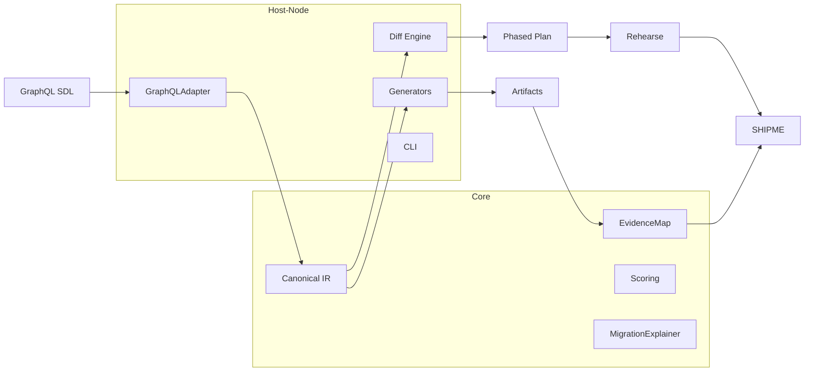

# Technical Architecture — MVP

## System Overview
Wesley is a schema-first transformer with a pure core (IR, evidence, scoring) and host adapters (Node). The CLI orchestrates targets, planning, rehearsal, and certification.

## Technology Decisions (MVP)
- Node 18+, pnpm; pino logger
- graphql-js in GraphQLAdapter; ajv for schema validation
- pgTAP for DB tests; Postgres for rehearsal

## Scalability & Performance
- CLI-first; transform is fast and pure
- Rehearsal bounded via `--timeout`; pg pool size small by default

## Security & Compliance
- No secrets in evidence; SHIPME signatures stored locally for MVP
- Future: KMS/HSM for signing, role‑based approvals

## ADRs (Pointers)
- ADR-0001: GraphQL as single source of truth
- ADR-0002: Additive-only diffs for MVP

