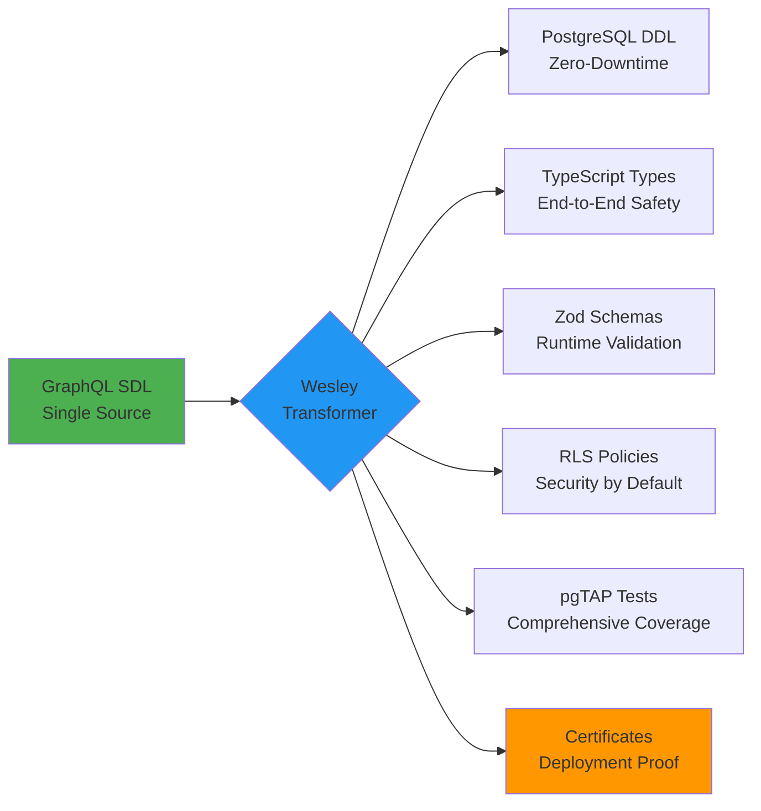

# Wesley Philosophy: Data Transformation Done Right

## Executive Summary

Wesley isn't just another code generator—it's a **Data Layer Compiler** that transforms GraphQL SDL into production-grade database infrastructure. Our mission is simple: be the "adult in the room" for database operations. No surprises, no 3am pages, just boring reliability backed by cryptographic proof.

## The Wesley Evolution

### From Generator to Transformer

Wesley has evolved through three distinct philosophical phases:

1. **Generator Era**: "Create code from schemas"
2. **Data Layer Compiler Era**: "Compile schemas into infrastructure"  
3. **Data Transformer Era**: "Transform data definitions into living systems"

This evolution reflects our understanding that data infrastructure isn't just generated—it's **transformed** through a series of rigorous validations, rehearsals, and certifications.

## Core Philosophy: "Data Done Right"

### Single Source of Truth Principle

```graphql
# This isn't just a schema file—it's your entire data contract
type User @table {
  id: ID! @pk
  email: String! @unique
  profile: Profile @fk(ref: "Profile.userId")
} @rls(enable: true) @tenant(by: "organizationId")
```

**GraphQL SDL is the schema. PostgreSQL, TypeScript, Zod, and pgTAP are generated.**

This means:
- No drift between types and database
- No manual DDL scripting
- No out-of-sync documentation
- No production schema surprises

### Multi-Target Transformation Architecture

Wesley doesn't just generate SQL—it transforms your schema into a complete data ecosystem:



## The Transformation Mindset

### Beyond Code Generation

Traditional generators produce static output. Wesley **transforms** your data layer through:

1. **Analysis**: Deep schema introspection with conflict detection
2. **Planning**: Multi-phase migration strategies with lock optimization
3. **Rehearsal**: Shadow REALM validation with traffic replay
4. **Certification**: Cryptographic proof of safety and integrity
5. **Execution**: Monitored deployment with automatic rollback

### Language of Transformation

Wesley speaks in transformation metaphors:

- **"Transform applied. The shapes align anew."**
- **"A circuit breaker has split the rolling frontier."**
- **"The Shadow REALM is animated by a new projection."**
- **"It is as it was, as it remains, and as it has been. At rest, until it isn't."**

This isn't marketing fluff—it's a deliberate choice to frame database operations as careful transformations rather than reckless changes.

## Production Safety Through Transformation

### The Wesley Way: Boring Reliability

We achieve production confidence through:

**Cryptographic Integrity**: Every transformation is signed and verifiable
- SHA-lock HOLMES ensures build integrity
- Dr. Wat-SUM validates statistical evidence
- Human-readable certificates with machine verification

**Rehearsed Execution**: No surprises in production
- Shadow REALM pre-production validation
- Traffic replay with performance measurement  
- Migration rehearsal with rollback testing

**Lock-Aware Operations**: Minimize downtime impact
- DDL Planner rewrites operations for concurrency
- Advisory locks prevent conflicting operations
- Resource awareness (one CREATE INDEX CONCURRENTLY per table)

### "Go On, Deploy on a Friday" Confidence

Real example from our test suite:

```
DEPLOYMENT CERTIFICATE - FRIDAY AFTERNOON SPECIAL
===============================================
Schema Hash: sha256:a7f2c8d9e4b1f6a3...
Migration Plan: 7 phases, 0 blocking locks detected
Shadow REALM: 15,000 queries replayed, 0 failures
Performance Impact: +2ms average, acceptable

SIGNED BY:
  SHA-lock HOLMES: Build integrity verified ✓
  Dr. Wat-SUM: Statistical evidence confirms safety ✓
  
This deployment has been rehearsed and certified safe
for production execution during peak hours.

Deploy with confidence. - Wesley
```

## The Wesley Character Universe

### Enterprise Safety Meets Mystical Personality

Wesley combines enterprise-grade safety with a unique personality ecosystem:

**SHA-lock HOLMES**: The methodical detective
- "The evidence is conclusive. This migration path is sound."
- Focuses on build integrity and cryptographic proof

**Dr. Wat-SUM**: The statistical analyst  
- "The data suggests a 0.003% probability of lock contention."
- Validates performance metrics and evidence integrity

**Moriarty**: The adversarial tester
- Challenges every assumption
- Finds edge cases others miss

This isn't whimsy—it's intentional positioning that makes complex database operations approachable while maintaining technical rigor.

## Wesley's Journey: From Ensign to Commander

### The Star Trek TNG Metaphor

Like Wesley Crusher's journey from enthusiastic ensign to seasoned commander, Wesley the platform represents:

**Phase 1**: Eager Generator (Ensign Wesley)
- Basic schema compilation
- Simple file output
- Learning the fundamentals

**Phase 2**: Capable Compiler (Acting Ensign Wesley)  
- Multi-target transformation
- Safety-first operations
- Growing responsibilities

**Phase 3**: Transcendent Transformer (Traveler Wesley)
- Reality-bending database operations
- Seeing patterns others miss
- Mastering time and space (migrations and schemas)

This progression reflects our commitment to continuous evolution while honoring our roots in careful, methodical database operations.

## Competitive Positioning

### Why Wesley vs. Traditional Tools

**vs. Prisma**: Schema-first vs. code-first approach
- Wesley: GraphQL SDL drives everything
- Prisma: Prisma schema drives limited outputs

**vs. Hasura**: Transform vs. API wrapper approach  
- Wesley: Generates your entire data layer
- Hasura: Provides API layer over existing database

**vs. Manual DDL**: Transformation vs. scripting approach
- Wesley: Declarative transformations with safety rails
- Manual: Imperative scripts with manual validation

**vs. ORMs**: Generation vs. abstraction approach
- Wesley: Generates native code in your language
- ORMs: Runtime abstraction with performance overhead

## Implementation Philosophy

### Hexagonal Architecture for Transformation

```
GraphQL SDL → Core Domain → Transformation Ports → Platform Adapters
```

**Core Domain**: Pure transformation logic
- Schema analysis and validation
- Migration planning and optimization  
- Certificate generation and signing

**Transformation Ports**: Abstract transformation interfaces
- ParserPort: Schema → Internal Representation
- GeneratorPort: Internal Representation → Target Output
- ValidatorPort: Safety and integrity checking

**Platform Adapters**: Concrete implementations
- File system operations
- Database connections
- Console output and logging

### Event-Driven Transformation Pipeline

Every transformation emits progress events:

```javascript
transformer.emit('analysis.started', { schema: 'user.graphql' });
transformer.emit('conflicts.detected', { conflicts: [...] });
transformer.emit('planning.complete', { phases: 5, locks: 0 });
transformer.emit('rehearsal.running', { queries: 1000 });
transformer.emit('certificate.signed', { signers: ['HOLMES', 'WAT-SUM'] });
transformer.emit('transformation.complete', { outputs: [...] });
```

This provides transparency into complex operations while enabling progress tracking and error recovery.

## The Future of Data Transformation

Wesley represents a new approach to data layer development:

1. **Schema-Driven Development**: GraphQL SDL as the single source of truth
2. **Cryptographic Safety**: Signed certificates for deployment confidence  
3. **Rehearsed Operations**: Shadow REALM validation before production
4. **Character-Driven UX**: Enterprise tools can have personality
5. **Transformation Thinking**: Moving beyond generation to true transformation

**Our Vision**: Every database operation should be as reliable and boring as turning on a light switch. Wesley makes that possible through rigorous transformation, comprehensive validation, and cryptographic proof.

---

*"Data Done Right isn't just a tagline—it's a commitment to treating your data layer with the respect it deserves."* - Wesley Team