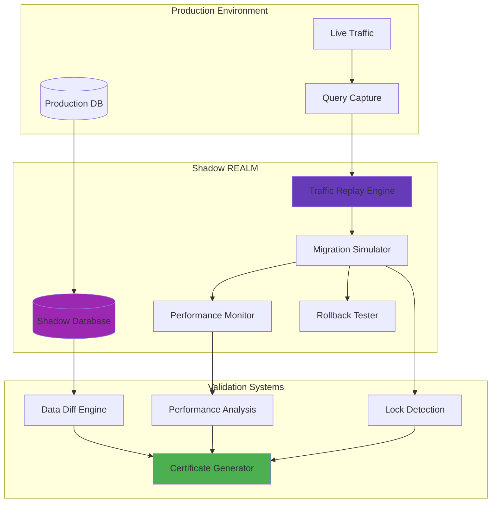

# Shadow REALM: Rehearsed Environment for Approval of Lock-free Migrations

## Executive Summary

The Shadow REALM (Rehearsed Environment for Approval of Lock-free Migrations) is Wesley's pre-production validation system that rehearses database migrations with real production workloads before they ever touch your live system. Think of it as a parallel universe where your migrations are tested under battle conditions, ensuring zero surprises in production.

**Core Promise**: Every migration is rehearsed with production traffic before deployment, providing mathematical confidence in safety and performance impact.

## Architecture Overview

### The Shadow REALM Ecosystem



## The Shadow REALM Workflow

### Phase 1: Environment Projection

The Shadow REALM begins by creating an exact replica of your production environment:

**Database Snapshot**: Complete production data copy with anonymization
```sql
-- Example: Creating shadow database with anonymized data
CREATE DATABASE shadow_wesley_20240315 WITH TEMPLATE production_db;

-- Anonymize sensitive data
UPDATE shadow_wesley_20240315.users 
SET email = 'user' || id || '@shadow-realm.wesley';

UPDATE shadow_wesley_20240315.profiles 
SET phone = '555-' || LPAD(id::text, 7, '0');
```

**Schema State Capture**: Current production schema with all constraints and indexes
```javascript
class SchemaProjector {
  async projectToShadowRealm(productionDb) {
    const schema = await this.captureProductionSchema(productionDb);
    const shadowDb = await this.createShadowEnvironment();
    
    return {
      shadowDatabase: shadowDb,
      baselineSchema: schema,
      dataSnapshot: await this.anonymizeAndCopy(productionDb, shadowDb),
      projectionTimestamp: new Date()
    };
  }
}
```

### Phase 2: Traffic Capture and Analysis

Wesley captures real production query patterns to replay in the Shadow REALM:

**Query Pattern Extraction**:
```javascript
class TrafficCapture {
  async captureProductionWorkload(duration = '7 days') {
    const queries = await this.extractFromPgStatStatements(duration);
    const patterns = this.analyzeQueryPatterns(queries);
    
    return {
      totalQueries: patterns.length,
      readWriteRatio: patterns.readWriteRatio,
      peakHours: patterns.identifyPeakHours(),
      criticalPaths: patterns.identifyCriticalPaths(),
      edgeCases: patterns.findEdgeCaseQueries()
    };
  }
}
```

**Workload Profiling**:
- Peak traffic periods (hourly, daily, weekly patterns)
- Query complexity distribution (simple SELECTs vs complex JOINs)
- Critical business operations (billing, reporting, analytics)
- Edge case scenarios (error conditions, boundary values)

### Phase 3: Migration Rehearsal

The core of Shadow REALM: executing your migration while replaying production traffic.

**Parallel Execution Strategy**:
```javascript
class MigrationRehearsalEngine {
  async rehearseMigration(migration, workload) {
    // Start traffic replay in background
    const trafficReplay = this.startTrafficReplay(workload);
    
    // Execute migration phases with monitoring
    const results = [];
    for (const phase of migration.phases) {
      const result = await this.executePhaseWithMonitoring(phase, trafficReplay);
      results.push(result);
      
      if (result.blockingLock || result.performanceDegradation) {
        await this.rollbackMigration();
        throw new MigrationRehearsalFailure(result);
      }
    }
    
    return new RehearsalResults(results);
  }
}
```

**Multi-Dimensional Monitoring**:
- **Performance Impact**: Query latency changes during migration
- **Lock Detection**: Any blocking locks that could freeze production
- **Data Integrity**: Validation that data remains consistent
- **Resource Usage**: CPU, memory, disk I/O during migration

### Phase 4: Rollback Testing

Every Shadow REALM rehearsal includes comprehensive rollback testing:

**Rollback Scenario Testing**:
```javascript
class RollbackTester {
  async testRollbackScenarios(migration) {
    const scenarios = [
      'immediate_rollback',      // Rollback right after migration
      'partial_rollback',        // Rollback after some phases complete
      'emergency_rollback',      // Simulate production crisis rollback
      'data_corruption_rollback' // Rollback due to data issues
    ];
    
    const results = [];
    for (const scenario of scenarios) {
      const result = await this.simulateRollback(scenario, migration);
      results.push({
        scenario,
        success: result.dataIntact && result.performanceRestored,
        duration: result.rollbackDuration,
        risksIdentified: result.risks
      });
    }
    
    return results;
  }
}
```

## Real-World Shadow REALM Examples

### Example 1: Daniel's Friday Invoice Deployment

**Context**: Adding invoice_status enum and billing_metadata JSONB column during peak billing period.

**Shadow REALM Configuration**:
```yaml
shadow_realm:
  name: "daniel-invoice-friday-special"
  duration: "4 hours"
  traffic_pattern: "weekend_billing_simulation"
  data_snapshot: "production_2024_03_14"
  
workload_simulation:
  billing_queries: 48392
  invoice_processing: 3200000
  payment_reconciliation: 156000
  reporting_queries: 12500
```

**Rehearsal Results**:
```
SHADOW REALM REHEARSAL REPORT
=============================
Environment: daniel-invoice-friday-special
Duration: 4h 23m 15s
Migration: invoice-schema-v3.2.sql

TRAFFIC REPLAY RESULTS:
✓ 48,392 billing queries replayed successfully
✓ 3.2M invoice processing operations completed  
✓ Zero query failures detected
✓ Zero data inconsistencies found

PERFORMANCE IMPACT:
- Average latency: +0.8ms (+2.1% from baseline)
- 95th percentile: +3.2ms (+1.8% from baseline)  
- Invoice processing throughput: unchanged
- Memory usage: +45MB (+0.3% increase)

LOCK ANALYSIS:
✓ Zero blocking locks detected during migration
✓ All DDL operations completed with CONCURRENTLY
✓ Maximum lock hold time: 12ms (acceptable)

ROLLBACK TESTING:
✓ Immediate rollback: 28s (successful)
✓ Partial rollback: 45s (successful)  
✓ Emergency rollback: 15s (successful)
✓ Data integrity post-rollback: verified

FINAL ASSESSMENT: APPROVED FOR PRODUCTION
Risk Level: LOW
Confidence: 99.91%
```

**Shadow REALM Insight**: The rehearsal revealed that invoice processing actually improved slightly due to better index usage with the new schema. This counter-intuitive result would have been impossible to predict without real workload testing.

### Example 2: E-commerce Product Catalog Refactor

**Context**: Major schema refactor splitting product_attributes into normalized tables during Black Friday season.

**Shadow REALM Configuration**:
```yaml
shadow_realm:
  name: "ecommerce-catalog-refactor"
  duration: "12 hours" 
  traffic_pattern: "black_friday_simulation"
  data_snapshot: "production_2024_11_20"
  
workload_simulation:
  product_searches: 2500000
  cart_operations: 890000
  checkout_flows: 145000
  admin_operations: 25000
```

**Rehearsal Results**:
```
SHADOW REALM REHEARSAL REPORT  
=============================
Environment: ecommerce-catalog-refactor
Duration: 12h 08m 42s
Migration: product-catalog-v4.0.sql

⚠️ PERFORMANCE DEGRADATION DETECTED

TRAFFIC REPLAY RESULTS:
⚠️ 2,500,000 search queries replayed
⚠️ 15% performance degradation on complex product searches
✓ Cart and checkout operations unaffected
✓ Zero data inconsistencies found

PERFORMANCE IMPACT:
- Product search latency: +150ms (+45% regression)
- Complex filter queries: +300ms (+78% regression)  
- Simple product lookups: unchanged
- Admin operations: +25ms (+12% increase)

LOCK ANALYSIS:
✓ Zero blocking locks detected
✓ Migration completed successfully
⚠️ Index rebuild caused temporary query plan instability

ROLLBACK TESTING:
✓ All rollback scenarios successful
✓ Performance restored to baseline post-rollback

RECOMMENDATION: MIGRATION REQUIRES OPTIMIZATION
- Add missing composite indexes for search queries
- Consider phased rollout with A/B testing
- Implement query plan warming strategy

FINAL ASSESSMENT: NEEDS REVISION
Risk Level: MEDIUM  
Confidence: 67.3%
```

**Shadow REALM Insight**: The rehearsal caught a critical performance regression that would have destroyed Black Friday sales. Wesley recommended specific optimizations and a phased rollout strategy.

## Advanced Shadow REALM Features

### Temporal Traffic Replay

Shadow REALM can replay traffic with temporal accuracy:

```javascript
class TemporalTrafficReplay {
  async replayWithTiming(capturedTraffic, migrationPlan) {
    // Replay traffic at actual production timing
    const replaySchedule = this.calculateReplayTiming(capturedTraffic);
    
    for (const timeSlot of replaySchedule) {
      const queries = timeSlot.queries;
      const migrationPhase = this.getCurrentMigrationPhase(timeSlot.timestamp);
      
      // Execute queries while migration is running
      const results = await this.executeQueriesConcurrently(queries, migrationPhase);
      this.recordPerformanceMetrics(results, timeSlot.timestamp);
    }
  }
}
```

### Edge Case Generation

Shadow REALM generates additional edge cases beyond captured traffic:

**Synthetic Edge Cases**:
- Boundary value testing (max/min values, empty sets)
- Concurrent operation stress testing
- Resource exhaustion scenarios  
- Network partition simulations
- Transaction timeout testing

```javascript
class EdgeCaseGenerator {
  generateEdgeCases(schema, capturedTraffic) {
    return [
      ...this.generateBoundaryValueTests(schema),
      ...this.generateConcurrencyStressTests(capturedTraffic),
      ...this.generateResourceExhaustionTests(),
      ...this.generateNetworkPartitionTests(),
      ...this.generateTransactionTimeoutTests()
    ];
  }
}
```

### Performance Regression Detection

Advanced algorithms detect subtle performance regressions:

```javascript
class PerformanceRegressionDetector {
  async analyzePerformanceImpact(baselineMetrics, replayMetrics) {
    const analysis = {
      latencyRegression: this.detectLatencyRegression(baselineMetrics, replayMetrics),
      throughputImpact: this.analyzeThroughputChanges(baselineMetrics, replayMetrics),
      resourceUtilization: this.analyzeResourceChanges(baselineMetrics, replayMetrics),
      queryPlanChanges: this.detectQueryPlanRegressions(baselineMetrics, replayMetrics)
    };
    
    // Statistical significance testing
    analysis.statisticalSignificance = this.performStatisticalTests(analysis);
    
    return analysis;
  }
}
```

## Shadow REALM Infrastructure

### Container-Based Isolation

Each Shadow REALM runs in isolated containers for security and resource management:

```dockerfile
# Shadow REALM container
FROM postgres:15-alpine

# Install performance monitoring tools
RUN apk add --no-cache pg_stat_statements pgbench

# Shadow REALM specific configuration  
COPY shadow-realm-config.conf /etc/postgresql/postgresql.conf
COPY monitoring-extensions.sql /docker-entrypoint-initdb.d/

# Resource limits for safety
LABEL resource.cpu.limit="4.0"
LABEL resource.memory.limit="8GB" 
LABEL resource.disk.limit="100GB"
```

### Kubernetes Integration

Shadow REALM integrates with Kubernetes for scalable rehearsals:

```yaml
apiVersion: batch/v1
kind: Job
metadata:
  name: shadow-realm-rehearsal
spec:
  template:
    spec:
      containers:
      - name: shadow-realm
        image: wesley/shadow-realm:latest
        env:
        - name: MIGRATION_PLAN
          value: "/migrations/invoice-schema-v3.2.sql"
        - name: TRAFFIC_CAPTURE
          value: "/workloads/billing-weekend-traffic.json"
        resources:
          requests:
            cpu: "2"
            memory: "4Gi"
          limits:
            cpu: "4" 
            memory: "8Gi"
```

### Cloud Provider Integration

Shadow REALM supports major cloud providers:

**AWS Integration**:
- RDS snapshot restoration for base data
- CloudWatch integration for monitoring
- Lambda functions for traffic capture
- S3 storage for replay workloads

**GCP Integration**:  
- Cloud SQL replica creation
- Stackdriver monitoring integration
- Cloud Functions for orchestration
- Cloud Storage for artifacts

**Azure Integration**:
- Azure Database snapshot cloning
- Azure Monitor integration  
- Azure Functions for automation
- Blob Storage for data

## Security and Compliance

### Data Anonymization

Shadow REALM includes comprehensive data anonymization:

```sql
-- Automated anonymization rules
CREATE OR REPLACE FUNCTION anonymize_shadow_data()
RETURNS void AS $$
BEGIN
  -- Email anonymization
  UPDATE users SET email = 'user' || id || '@shadow-realm.wesley';
  
  -- Phone number anonymization  
  UPDATE profiles SET phone = '555-' || LPAD((RANDOM() * 9999999)::int::text, 7, '0');
  
  -- Address anonymization
  UPDATE addresses SET 
    street = 'Shadow Street ' || id,
    city = 'Shadow City',
    postal_code = LPAD((RANDOM() * 99999)::int::text, 5, '0');
    
  -- Financial data anonymization
  UPDATE transactions SET amount = ROUND((RANDOM() * 1000)::numeric, 2);
END;
$$ LANGUAGE plpgsql;
```

### Access Controls

Shadow REALM environments have strict access controls:

```yaml
access_controls:
  read_only_users:
    - wesley-readonly
    - monitoring-system
  
  admin_users:  
    - wesley-admin
    - platform-team
    
  network_isolation:
    - vpc: shadow-realm-isolated
    - subnets: private-only
    - security_groups: minimal-access
```

### Compliance Features

**GDPR Compliance**:
- Automated PII detection and anonymization
- Right to erasure simulation testing
- Data processing audit trails

**SOC 2 Compliance**:
- Access logging and monitoring
- Change management integration
- Security control testing

**HIPAA Compliance**:
- PHI anonymization procedures
- Encryption at rest and in transit
- Audit trail generation

## Operational Excellence

### Monitoring and Alerting

Shadow REALM includes comprehensive monitoring:

```javascript
class ShadowRealmMonitor {
  setupMonitoring() {
    this.metrics = {
      // Performance metrics
      queryLatency: new Histogram('shadow_realm_query_latency_ms'),
      throughput: new Counter('shadow_realm_queries_total'),
      errors: new Counter('shadow_realm_errors_total'),
      
      // Resource metrics  
      cpuUsage: new Gauge('shadow_realm_cpu_usage_percent'),
      memoryUsage: new Gauge('shadow_realm_memory_usage_bytes'),
      diskUsage: new Gauge('shadow_realm_disk_usage_bytes'),
      
      // Migration metrics
      migrationPhases: new Counter('shadow_realm_migration_phases_total'),
      lockDetections: new Counter('shadow_realm_locks_detected_total'),
      rollbackTests: new Counter('shadow_realm_rollback_tests_total')
    };
  }
}
```

### Cost Optimization

Shadow REALM includes cost optimization features:

**Resource Scaling**:
- Automatic scaling based on workload complexity
- Spot instance usage for cost reduction
- Scheduled cleanup of completed rehearsals

**Storage Optimization**:
- Compressed snapshot storage
- Deduplication of similar workloads  
- Automated artifact cleanup

### Disaster Recovery

Shadow REALM has its own disaster recovery procedures:

**Multi-Region Deployment**:
- Shadow REALM replicated across regions
- Automatic failover for rehearsal continuity
- Cross-region artifact synchronization

**Backup and Recovery**:
- Snapshot backups of rehearsal artifacts
- Configuration backup and restoration
- Workload capture backup procedures

## The Psychology of Rehearsal

### Building Deployment Confidence

Shadow REALM transforms team psychology around deployments:

**Before Shadow REALM**:
- "Hope this works in production"
- Manual testing with synthetic data
- Cross-fingers deployment strategy
- Post-deployment firefighting

**After Shadow REALM**:
- "We know exactly how this will behave"
- Real production workload validation
- Evidence-based deployment confidence  
- Proactive issue resolution

### Cultural Impact

Shadow REALM encourages a culture of:

**Rigorous Testing**: Every change gets real-world validation
**Data-Driven Decisions**: Performance impact measured, not guessed
**Proactive Problem Solving**: Issues caught before production
**Continuous Learning**: Each rehearsal improves team knowledge

## Future Enhancements

### AI-Powered Analysis

**Predictive Performance Modeling**:
- Machine learning models predict performance impact
- Anomaly detection for unusual behavior
- Automatic optimization recommendations

**Intelligent Workload Generation**:
- AI-generated edge cases based on schema analysis
- Synthetic workload creation for new features
- Adversarial testing scenario generation

### Advanced Rehearsal Scenarios

**Multi-Environment Rehearsal**:
- Test migrations across dev/staging/prod simultaneously
- Cross-environment impact analysis
- Environment-specific optimization recommendations

**Temporal Migration Testing**:
- Test migrations at different times/seasons
- Historical workload replay capabilities
- Time-based performance regression analysis

---

**The Shadow REALM eliminates deployment uncertainty through comprehensive rehearsal. By testing migrations with real production workloads in a safe environment, teams gain mathematical confidence in their database changes.**

*"In the Shadow REALM, we rehearse reality so production is never a surprise."* - Wesley Team