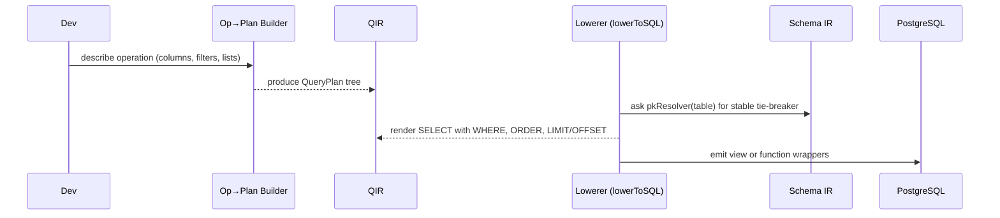
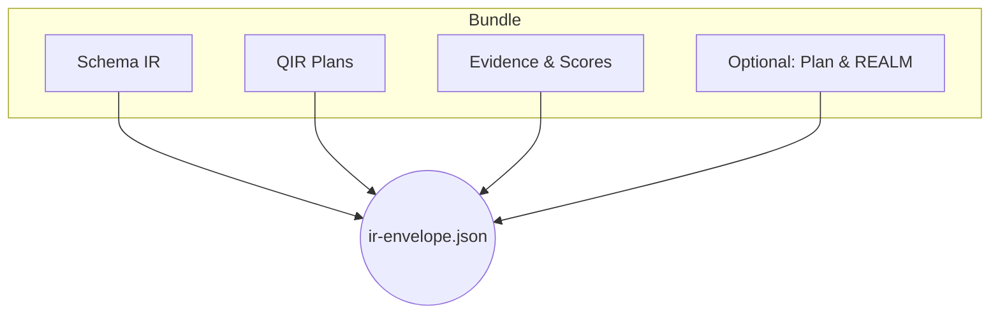

# The Wesley IR Family — Specification and Design

Wesley treats “IR” not as a single type but as a small, coherent family of representations that each speak for a different stage in the pipeline. This document explains the family in prose, shows how the pieces fit, and links each member to the JSON Schema that keeps it honest. The intent is to make the pipeline self‑describing, machine‑validated, and easy to reason about from your editor to CI.

At a high level, the Schema IR captures the shape of your world, the Query IR (QIR) captures what you want to read from that world, the Plan and REALM IRs explain and rehearse the impact of changes, and the Envelope bundles proofs and artifacts so humans and tools can trust the result.

```mermaid
flowchart LR
  subgraph Authoring
    SDL[GraphQL SDL]
  end

  subgraph Core
    SIR[Schema IR\n(schemas/ir.schema.json)]
    QIR[Query IR\n(schemas/qir.schema.json)]
    PLAN[Plan IR\n(schemas/plan.schema.json)]
    REALM[REALM IR\n(schemas/realm.schema.json)]
    EVI[Evidence & Scores\n(schemas/evidence-map.schema.json,\nschemas/scores.schema.json)]
    ENV[IR Envelope\n(schemas/ir-envelope.schema.json)]
  end

  CLI[Wesley CLI]
  SQL[(PostgreSQL)]

  SDL -->|parse| SIR
  SIR -->|generators| SQL
  SIR -->|op→plan & metadata| QIR
  QIR -->|lowerToSQL| SQL
  CLI -->|plan --explain| PLAN
  CLI -->|rehearse --dry-run| REALM
  SIR --> EVI
  QIR --> EVI
  PLAN --> EVI
  REALM --> EVI
  EVI --> ENV
  SIR --> ENV
  QIR --> ENV
```

## Goals and non‑goals

The IR family exists to separate concerns while keeping the whole understandable. Each IR has a narrow, testable contract, a JSON Schema living under `schemas/`, and at least one CLI path that validates instances against that schema. The design deliberately avoids conflating static metadata (Schema IR) with executable query plans (QIR), and it keeps change‑review artifacts (Plan/REALM) independent from the authoring formats.

It is not a goal to create a monolithic “one IR to rule them all.” Instead, the Envelope provides a single bundle for audits and transport when that is useful.

## Schema IR

The Schema IR is the canonical, declarative description of tables, columns, keys, directives, and tenancy metadata derived from GraphQL SDL. Generators produce DDL, policies, types, and tests from this IR. The diff engine reads two versions of it to compute additive migrations. Its contract is frozen in `schemas/ir.schema.json`.

Schema IR prefers clarity over cleverness. Field names, types, and directives are explicit; defaults are visible; keys and indexes are first‑class. The IR remains agnostic of query intent: there are no where‑clauses or projections here because those belong to QIR.

## Query IR (QIR)

Where Schema IR names your furniture, QIR tells you how to walk around it. A QIR plan is a small, composable description of a read operation: a relation tree (tables, joins, subqueries, laterals), a projection (columns or computed JSON objects), predicates, and ordering. QIR compiles deterministically to SQL.

QIR is defined by `schemas/qir.schema.json`. The code that lowers it lives in `@wesley/core/domain/qir`. Lowering deliberately separates two responsibilities: identifier policy (minimal or strict quoting) and deterministic tie‑breakers. For the latter we thread a `pkResolver` from Schema IR so ORDER BY can rely on real primary keys rather than assumptions. Parameters are explicit (`ParamRef`) and ordered deterministically so `$1..$N` binding is stable.



## Plan IR (proposed)

Human reviews hinge on two questions: “What will happen?” and “How risky is it?” The Plan IR answers both for `wesley plan --explain --json`. It describes phases (expand/backfill/validate/switch/contract), steps within each phase, a lock classification per step, and a succinct SQL preview. The schema will live at `schemas/plan.schema.json`. The CLI will validate its own JSON output against that schema during tests.

Plan IR is intentionally descriptive, not prescriptive. It does not execute; it just explains. The contract makes lock levels explicit and serializes them as part of the reviewable artifact so CI can assert “no ACCESS EXCLUSIVE locks appear in expand.”

## REALM IR (proposed)

Rehearsal (`wesley rehearse --dry-run --json`) deserves a stable result format. REALM IR captures the rehearsal verdict, timings, relevant counters, and any structured notes. Its schema will live at `schemas/realm.schema.json`. By pinning shape and fields, we let CI gate on objective facts: how many tests ran, which ones failed, how long phases took, and whether the environment matched expectations.

## Evidence and scores

Wesley emits evidence that links IR elements to generated artifacts and assigns coarse scores. These are already validated by `schemas/evidence-map.schema.json` and `schemas/scores.schema.json`. Evidence augments, never replaces, the IRs themselves. You can think of it as the “footnotes” and “grading rubric” for the pipeline’s claims.

## Envelope

The Envelope bundles a particular version of Schema IR, a set of QIR plans, and the evidence needed to believe the claim “this is what we built and how we validated it.” Its schema lives at `schemas/ir-envelope.schema.json`, and you can validate an instance with `wesley qir envelope-validate <file>`. In practice, envelopes travel to CI, auditors, and maybe future UIs.



## Validation in practice

Validation is part of development, not an afterthought. The JSON Schemas live in the repository and the CLI uses Ajv to validate:

- QIR plans: `wesley qir validate plan.qir.json`.
- Envelope: `wesley qir envelope-validate path/to/ir-envelope.json`.
- Evidence bundles: `wesley validate-bundle --bundle .wesley --schemas schemas/`.

CI also exercises these validators in Bats tests to keep the spec aligned with the code paths that produce and consume the IRs.

## Versioning and compatibility

Each schema is versioned under SemVer and tightened only when the benefit outweighs the churn. Breaking changes are rare and explicit. The Envelope includes a version string and can carry both old and new shapes transiently during migrations, but the general rule is forward‑only with compatibility shims living in code, not in the spec.

## Security notes

The IR family actively narrows the surface for mistakes. QIR uses explicit `ParamRef` with type hints so lowering never concatenates raw values. Identifier rendering is policy‑driven; strict mode quotes deterministically, and we validate or sanitize names when producing operation wrappers. When RLS is enabled, we prefer the database to enforce access rather than compiling redundant filters.

## What comes next

Two additional schemas will complete the family’s developer loop: Plan IR and REALM IR. As soon as those land, the CLI will validate `plan --explain --json` and `rehearse --dry-run --json` against their schemas in tests. An optional Ops Manifest schema will follow to support curated discovery in large repos.

The total surface then looks like a modest set of JSON Schemas, referenced by the CLI and by docs, moving in lockstep with the code. It’s deliberately small and intentionally boring—exactly the point for infrastructure we intend to trust.

