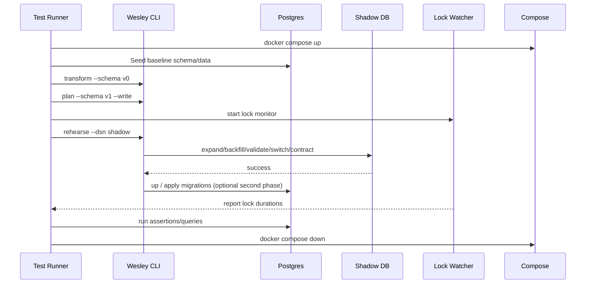

# Zero-Downtime Migration E2E Test Suite — Specification

## Purpose
Guarantee that Wesley’s generated migration plans truly uphold the “zero downtime” pledge by executing them end-to-end against live PostgreSQL instances under realistic load and “freaky” edge conditions.

## Objectives
1. Stand up a reusable integration harness (Docker Compose) for Postgres + tooling.
2. Seed baseline schemas/data, evolve them with GraphQL inputs, and drive Wesley CLI commands (`transform`, `plan`, `rehearse`, `up`).
3. Assert the absence of blocking locks, correctness of data, and pure success of every phase.
4. Cover stress scenarios (large backfills, concurrent traffic, failing defaults, etc.).
5. Integrate suite into CI (nightly and on planner-related PRs) without slowing down fast loops.

## High-Level Architecture
```mermaid
flowchart LR
    subgraph Fixture Layer
      GQL0[GraphQL Schema v0]
      GQL1[GraphQL Schema v1]
      Seeds[SQL Seed Scripts]
    end

    subgraph Harness
      Compose[Docker Compose]
      Postgres[(Postgres 15)]
      Shadow[(Shadow/Postgres)]
      Watcher[/Lock & Metrics Watcher/]
    end

    subgraph Orchestrator (Tests)
      Bats[Bats/Node Runner]
      WesleyCLI[Wesley CLI]
      Metrics[Assertions: locks, timings, data]
    end

    GQL0 --> WesleyCLI
    GQL1 --> WesleyCLI
    Seeds --> Compose
    Compose --> Postgres
    Compose --> Shadow
    WesleyCLI --> Postgres
    WesleyCLI --> Shadow
    Watcher --> Metrics
    Bats --> WesleyCLI
    Bats --> Watcher
```

## Test Flow


## Components
### 1. Docker Compose Harness
- `postgres` service (v15/v16 matrix-ready).
- Optional `pgwatch` or simple container for monitoring (alternative: run watcher directly as part of test).
- Network accessible to test runner (bats/Node).
- Scripts to reset state (`docker compose down -v`, `docker compose up -d`).

### 2. Seed & Fixture Files
- Base schema SQL derived from `transform --schema v0` (ensures consistent definitions).
- Seed script for data volume tests (e.g., 100k rows to measure backfill behavior).
- GraphQL schemas: v0 baseline, v1/v2 evolutions, each targeting a specific scenario.
- Optional fixture for RLS/policies to ensure policy migrations are covered.

### 3. Test Runner
- Primary: Bats scripts living under `packages/wesley-e2e-migrations/test`.
- Helpers in Node/TypeScript to collect metrics (e.g., connect to DB and query `pg_stat_activity`, `pg_locks`, `pg_stat_progress_analyze`).
- Environment variables for DSN overrides to allow local dev vs CI.

### 4. Monitoring & Assertions
- Lock watcher: repeatedly queries `pg_locks` filtering for `ACCESS EXCLUSIVE`, records hold time > configured threshold.
- Timing metrics per phase (expand/backfill/validate/...). Log to JSON for inspection.
- Data integrity checks: count rows before/after, verify defaults applied, ensure new constraints enforced.
- Concurrency test: spawn background workload (e.g., `psql` script running `SELECT/UPDATE` loops) while migrations run.

## Test Matrix
| Test ID | Scenario | Expected Behavior | Notes |
|---------|----------|------------------|-------|
| T1 | Add nullable column + index | Expand only; zero blocking; index created concurrently | Baseline smoke |
| T2 | Add NOT NULL column w/ default | Expand (nullable), Backfill, Switch (SET NOT NULL) | Check backfill script builds correct UPDATE and avoids ACCESS EXCLUSIVE except brief switch |
| T3 | Add FK (NOT VALID → VALIDATE) | Expand + Validate phases; ensure validation locks short-lived | Monitor `pg_locks` |
| T4 | Large table backfill | Measure runtime & confirm row-by-row update doesn’t block readers; consider throttled approach | Seed with 100k rows |
| T5 | Concurrent writes | While migrations run, continuously insert/update rows; ensure plan completes and workload sees minimal blocking | Simulate real traffic |
| T6 | Failing default/backfill | Provide schema change without default, expect TODO comment and test ensures manual intervention flagged | Governance check |
| T7 | Rehearse failure + retry | Force failure mid-phase (e.g., missing permissions) to confirm rerun idempotence | Use scripted error |
| T8 | RLS policy addition | Validate RLS files emitted, plan respects policies, tests run under policy context | Optional stretch |

Each test captures:
- Lock timelines (max hold durations, lock types).
- Phase durations.
- Success/failure with detailed logs.
- Data validation statements.

## Implementation Plan
1. **Scaffold project structure**
   - `packages/wesley-e2e-migrations/`
   - `docker-compose.yml`, `Dockerfile` for watcher (if needed).
   - `schemas/`, `seeds/`, `workloads/` directories.
2. **Build test harness scripts**
   - Bash/Bats entrypoints for each scenario.
   - Shared helper library (shell or JS) for running CLI commands, capturing output, and connecting to PG.
3. **Monitoring**
   - Node script polling `pg_locks` (with threshold configuration).
   - Optionally capture `pg_stat_io`, analyze sequential/backfill tells (future work).
4. **Automated workload**
   - Example: Node or psql script performing random CRUD operations.
   - Controlled via background processes started/stopped by tests.
5. **CI Integration**
   - New workflow: `.github/workflows/migrations-e2e.yml` with job matrix (e.g., Postgres 14/15).
   - Trigger: nightly + PRs labeled `ci:migration-e2e` to avoid slowing default runs.
6. **Reporting**
   - Store JSON summary per scenario (phase durations, locks, result).
   - Upload as artifact for PR inspection.
   - Optionally, update HOLMES/scorecards with migration risk metrics once pipelines exist.

## Future Enhancements
- Support for destructive operations (explain-only gating until safe).
- Performance regression thresholds (fail if runtime exceeds baseline + tolerance).
- Visual dashboards (Mermaid sequence snapshots, Grafana integration).
- Multi-tenant / RLS-specific flows.
- Integration with `moriarty` predictions for real-time readiness scoring.

## Conclusion
This suite will deliver confidence that Wesley-generated migrations remain safe under load, capture regressions early, and enforce the “zero downtime” contract through executable evidence. Next actions: implement harness, add tiered scenarios, and wire into CI.
