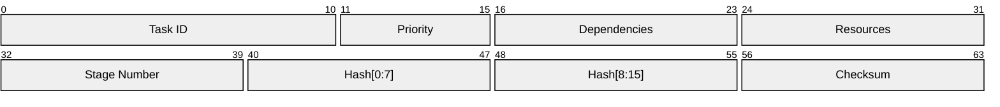
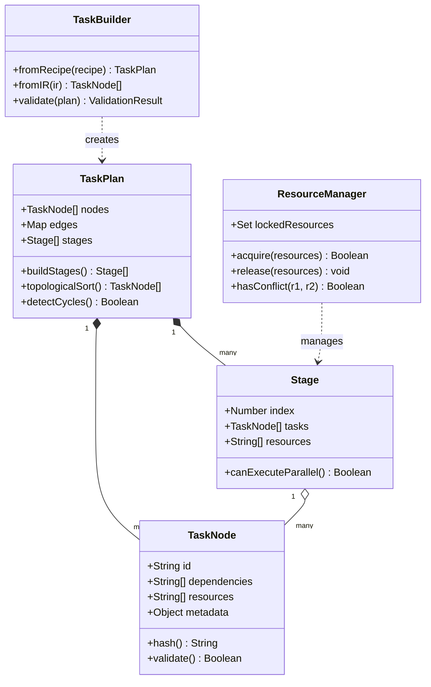
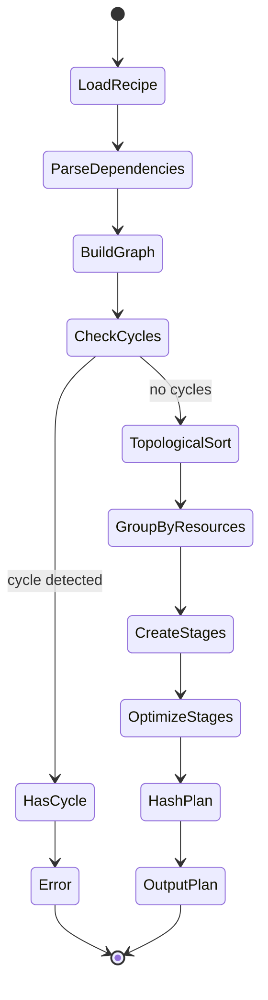
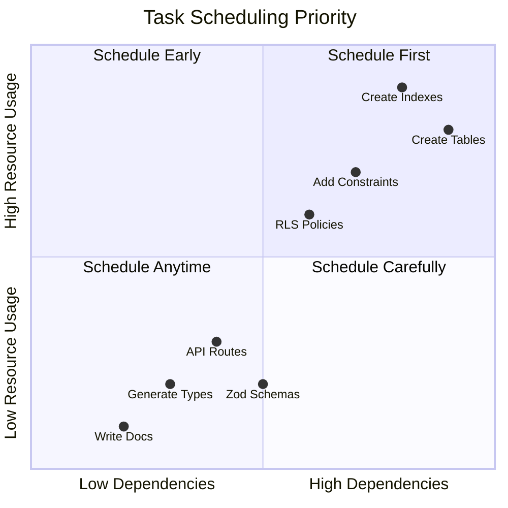
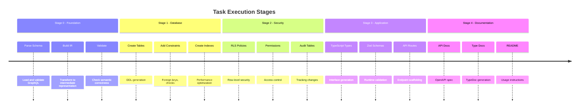
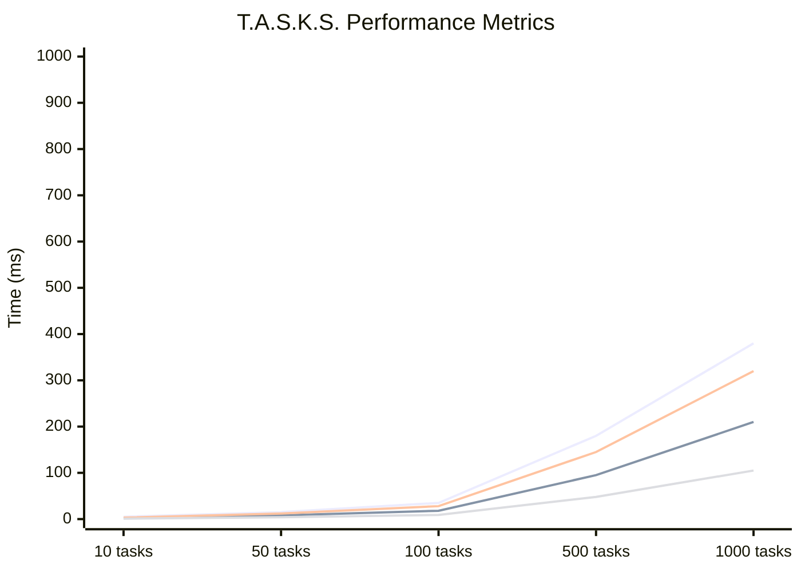
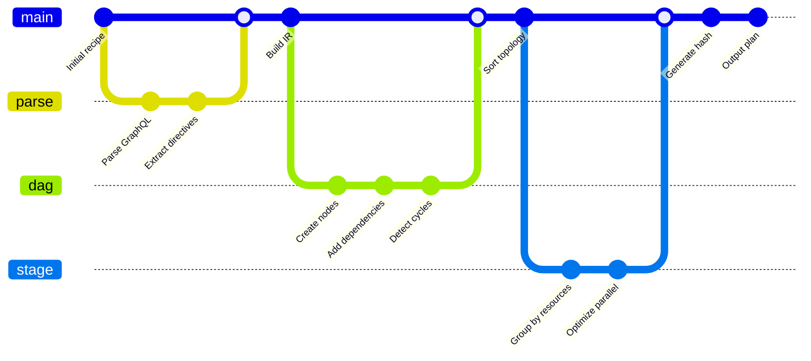
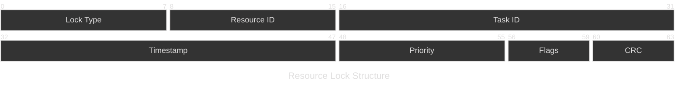

# T.A.S.K.S. - Topologically Arranged Sequential Knowledge System

## Overview

T.A.S.K.S. is Wesley's DAG (Directed Acyclic Graph) planning system that transforms high-level generation recipes into executable plans with proper dependency ordering and resource management.



---

## Core Components



---

## Dependency Resolution Algorithm



---

## Resource Management


---

## Task Priority Matrix



---

## Stage Execution Timeline



---

## Performance Characteristics



---

## Task Distribution Analysis


---

## Implementation Details



---

## Resource Locking Protocol



---

## API Usage

```typescript
// Building a plan with T.A.S.K.S.
import { TaskBuilder, TaskPlan } from '@wesley/tasks';

const builder = new TaskBuilder();

// From a recipe
const plan = await builder.fromRecipe({
  name: 'supabase-nextjs',
  tasks: [
    { 
      id: 'create-tables',
      generator: 'supabase',
      dependencies: [],
      resources: ['db:write']
    },
    {
      id: 'create-types',
      generator: 'typescript',
      dependencies: ['create-tables'],
      resources: ['fs:write']
    }
  ]
});

// Validate and optimize
const stages = plan.buildStages();
const hash = plan.hash();

console.log(`Plan ${hash} has ${stages.length} stages`);
```

---

## Next: [S.L.A.P.S. Execution Engine →](./02-slaps-overview.md)