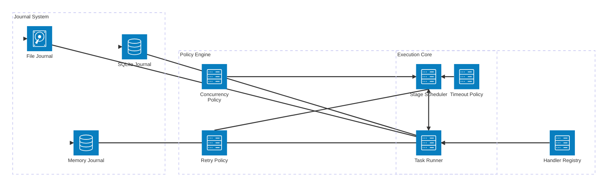
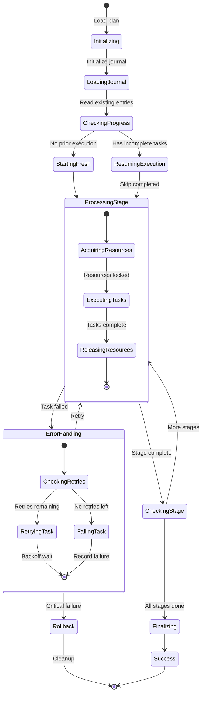
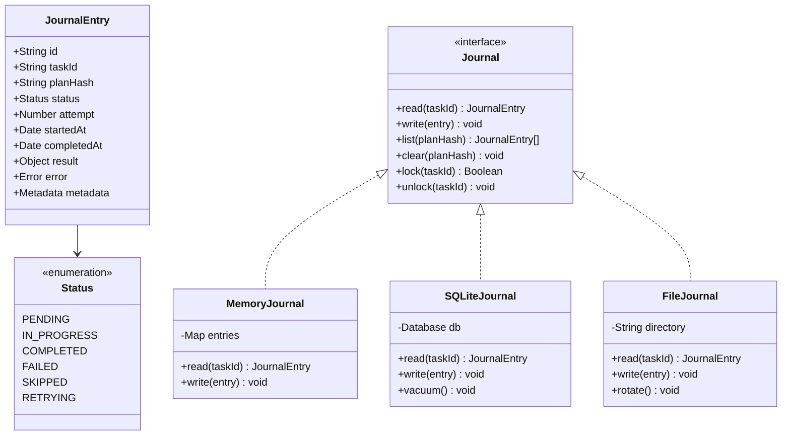
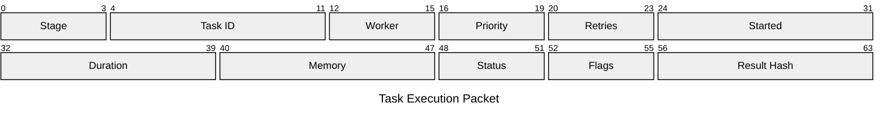
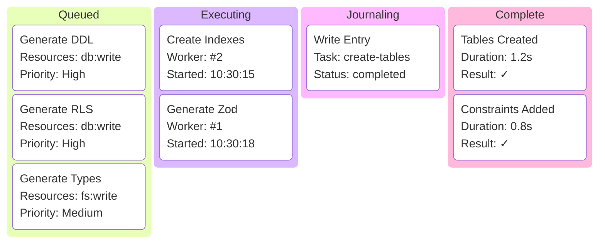
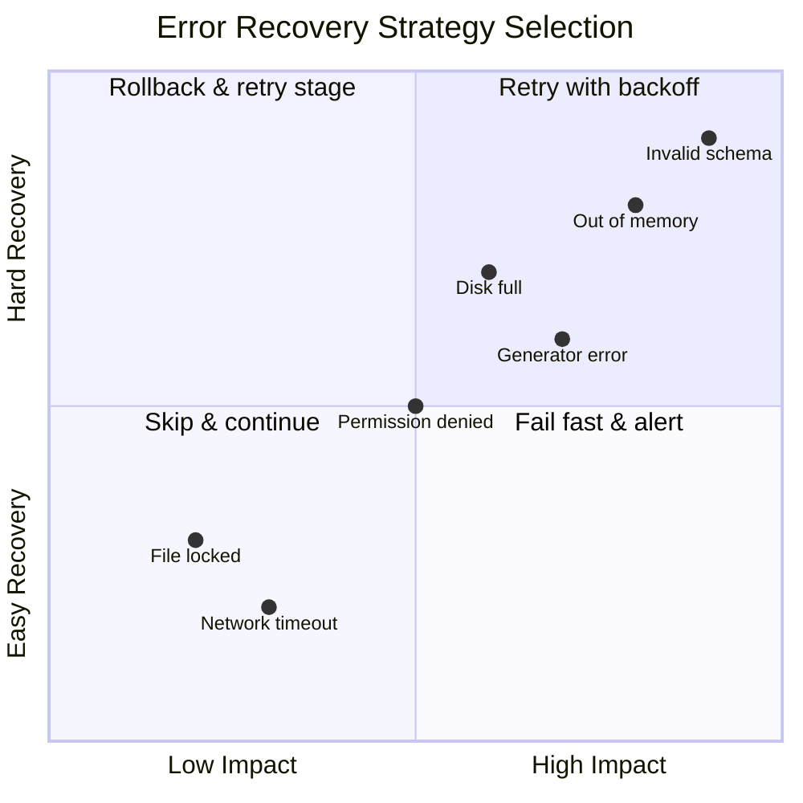
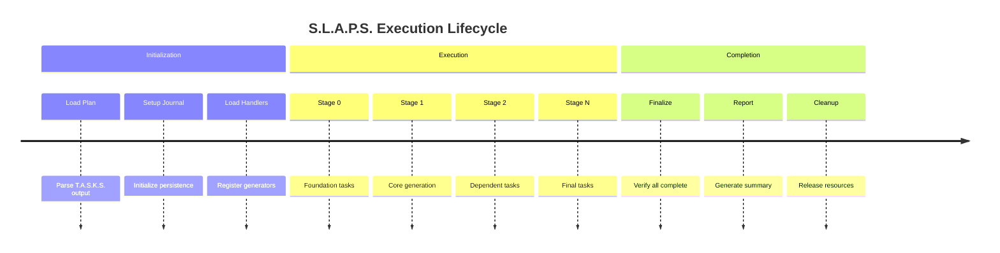

# S.L.A.P.S. - Stateful Linearized Asynchronous Processing System

## Overview

S.L.A.P.S. is Wesley's execution engine that takes T.A.S.K.S. plans and executes them with journaling, retry logic, and resource management to ensure reliable, resumable generation pipelines.



---

## Execution State Machine



---

## Journal Entry Structure



---

## Performance Metrics

```mermaid
xychart-beta
    title "S.L.A.P.S. Execution Performance"
    x-axis ["1 stage", "5 stages", "10 stages", "20 stages", "50 stages"]
    y-axis "Time (seconds)" 0 --> 60
    bar "Sequential" [2, 10, 20, 40, 100]
    bar "Parallel (4 workers)" [2, 4, 7, 12, 28]
    bar "Parallel (8 workers)" [2, 3, 5, 8, 18]
    line "Journal Overhead" [0.1, 0.3, 0.5, 0.9, 2.1]
```



---

## Resource Utilization


---

## Retry Policy Configuration

```mermaid
radar
    title Retry Policy Characteristics
    x-axis "Conservative" --> "Aggressive"
    y-axis "Low" --> "High"
    
    "Max Attempts": [3, 8]
    "Initial Delay (ms)": [100, 2]
    "Max Delay (ms)": [30000, 7]
    "Backoff Factor": [2, 6]
    "Jitter": [0.3, 4]
    "Timeout (s)": [60, 9]
```

---

## Execution Flow Analysis


---

## Concurrency Control



---

## Stage Execution Kanban



---

## Error Recovery Strategies



---

## Journal Storage Comparison

```mermaid
%%{init: {"theme": "dark"}}%%
C4Component
    title Journal Implementation Components
    
    Component_Boundary(journal, "Journal Implementations") {
        Component(memory, "Memory Journal", "JavaScript Map", "Fast, volatile")
        Component(sqlite, "SQLite Journal", "SQLite DB", "Persistent, queryable")
        Component(file, "File Journal", "JSON files", "Simple, portable")
        
        ComponentDb(memstore, "In-Memory Store", "Map<string, Entry>")
        ComponentDb(sqlitedb, "SQLite Database", "journal.db")
        ComponentDb(jsonfiles, "JSON Files", "./journal/*.json")
    }
    
    Rel(memory, memstore, "Stores in")
    Rel(sqlite, sqlitedb, "Persists to")
    Rel(file, jsonfiles, "Writes to")
```

---

## Execution Timeline



---

## API Usage Example

```typescript
// Using S.L.A.P.S. to execute a plan
import { Runner, SQLiteJournal, RetryPolicy } from '@wesley/slaps';

const journal = new SQLiteJournal('./journal.db');
const policy = new RetryPolicy({
  maxAttempts: 3,
  initialDelay: 100,
  maxDelay: 30000,
  backoffFactor: 2,
  jitter: 0.3
});

const runner = new Runner({
  journal,
  policy,
  concurrency: 4,
  timeout: 60000
});

// Execute plan from T.A.S.K.S.
const result = await runner.run(plan, handlers);

console.log(`Execution ${result.success ? 'succeeded' : 'failed'}`);
console.log(`Completed ${result.completed}/${result.total} tasks`);
```

---

## Next: [Integration Patterns →](./03-integration-patterns.md)