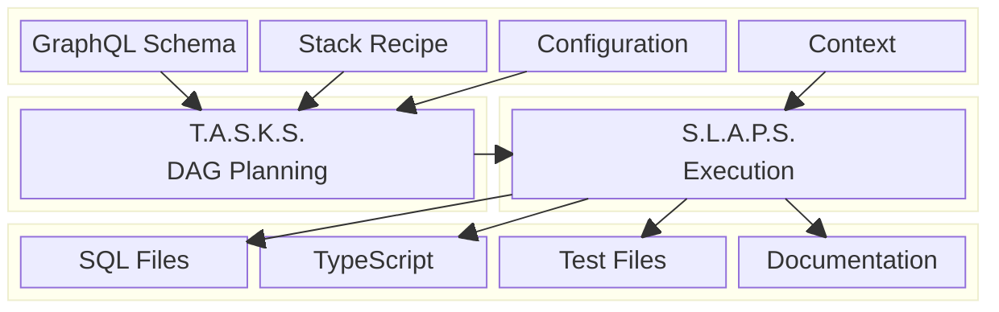
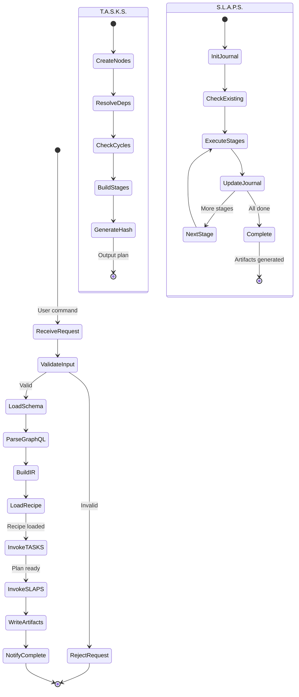
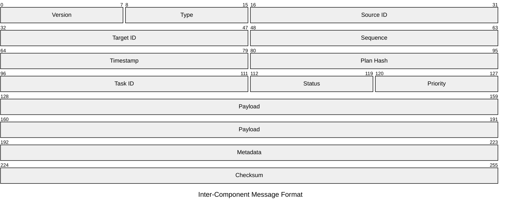
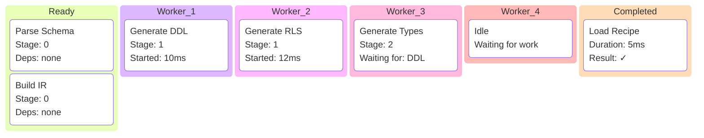
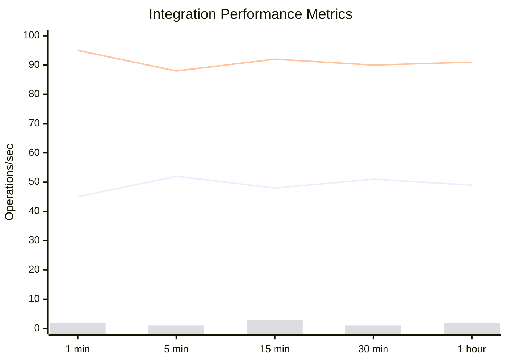
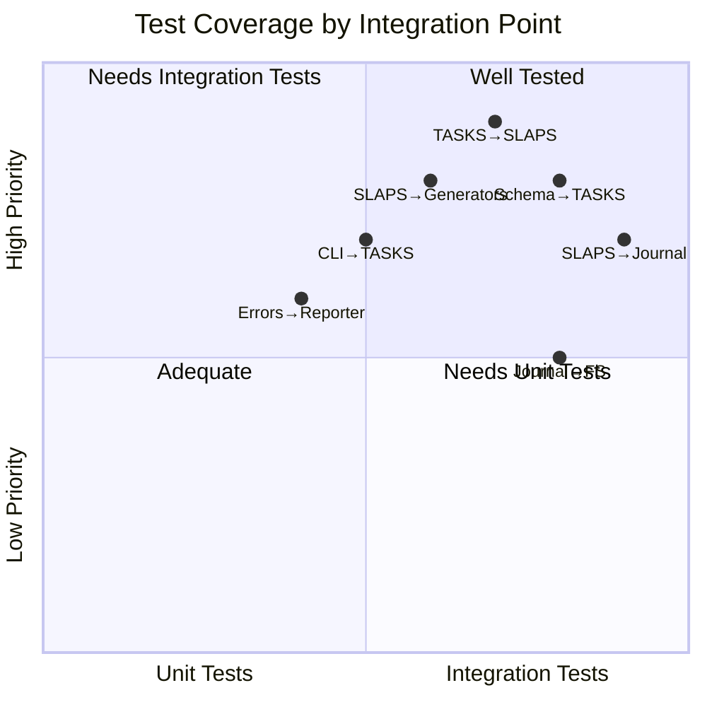
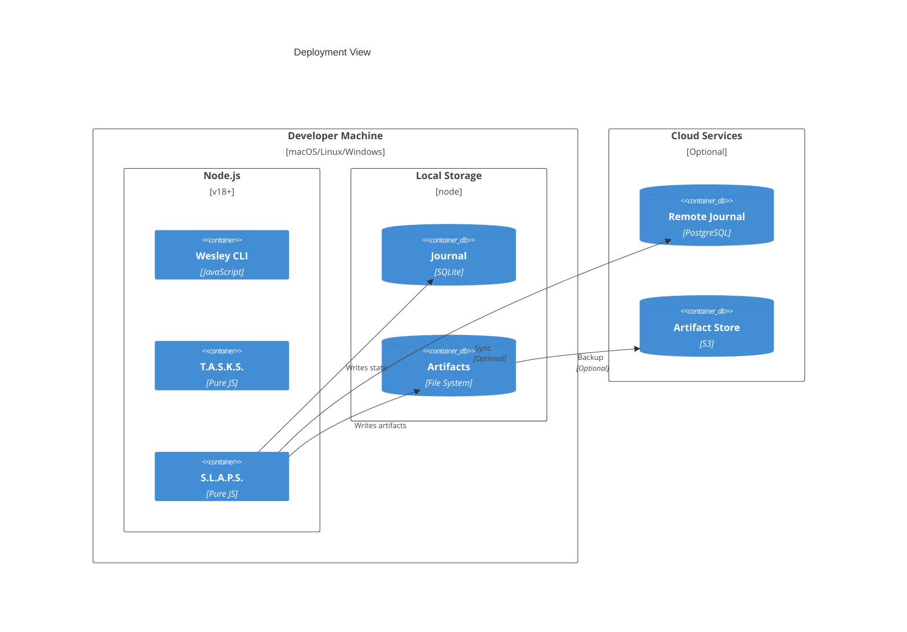

# T.A.S.K.S. and S.L.A.P.S. Integration Patterns

## Overview

This document describes how T.A.S.K.S. and S.L.A.P.S. work together to provide a complete orchestration solution for Wesley's code generation pipeline.



---

## Data Flow Architecture


---

## Integration State Machine



---

## Communication Protocol



---

## Performance Bottleneck Analysis


---

## Resource Allocation Strategy


---

## Optimization Opportunities

```mermaid
radar
    title Integration Optimization Potential
    x-axis "Low Impact" --> "High Impact"
    y-axis "Easy" --> "Hard"
    
    "Cache IR": [8, 3]
    "Parallel Stages": [9, 5]
    "Journal Batching": [6, 2]
    "Resource Pooling": [7, 4]
    "Lazy Loading": [5, 2]
    "Plan Reuse": [8, 3]
    "Worker Pools": [9, 6]
    "Incremental Generation": [10, 8]
```

---

## Error Propagation

```mermaid
C4Component
    title Error Handling Components
    
    Component_Boundary(tasks, "T.A.S.K.S.") {
        Component(validator, "Validator", "Pure JS", "Schema validation")
        Component(planner, "Planner", "Pure JS", "DAG construction")
    }
    
    Component_Boundary(slaps, "S.L.A.P.S.") {
        Component(executor, "Executor", "Pure JS", "Task runner")
        Component(retry, "Retry Manager", "Pure JS", "Error recovery")
    }
    
    Component_Boundary(errors, "Error Handling") {
        Component(collector, "Error Collector", "Pure JS", "Aggregates errors")
        Component(reporter, "Error Reporter", "Pure JS", "Formats output")
    }
    
    Rel(validator, collector, "Validation errors")
    Rel(planner, collector, "Planning errors")
    Rel(executor, retry, "Execution errors")
    Rel(retry, collector, "Unrecoverable")
    Rel(collector, reporter, "All errors")
    
    UpdateLayoutConfig($c4ShapeInRow="3", $c4BoundaryInRow="1")
```

---

## Concurrency Model



---

## Metrics Collection



---

## Integration Test Coverage



---

## Deployment Architecture



---

## Configuration Example

```yaml
# wesley.config.yaml
orchestration:
  tasks:
    maxDepth: 10
    cycleDetection: strict
    hashAlgorithm: sha256
    
  slaps:
    journal:
      type: sqlite
      path: ./journal.db
      retention: 7d
    
    execution:
      concurrency: 4
      timeout: 60000
      retryPolicy:
        maxAttempts: 3
        backoff: exponential
        
    resources:
      maxMemory: 512MB
      tempDirectory: /tmp/wesley
      
integration:
  errorReporting: verbose
  metrics: enabled
  tracing: enabled
```

---

## Next: [Performance Characteristics →](./04-performance.md)