# Performance Characteristics

## Overview

This document provides detailed performance analysis and optimization strategies for T.A.S.K.S. and S.L.A.P.S. systems.

```mermaid
xychart-beta
    title "End-to-End Performance Breakdown"
    x-axis ["Parse", "Plan", "Stage", "Execute", "Journal", "Write"]
    y-axis "Time (ms)" 0 --> 500
    bar "Small Project" [20, 15, 10, 300, 25, 80]
    bar "Medium Project" [45, 35, 25, 800, 60, 200]
    bar "Large Project" [120, 95, 65, 2000, 150, 500]
```

---

## Memory Usage Profile


---

## Scalability Analysis

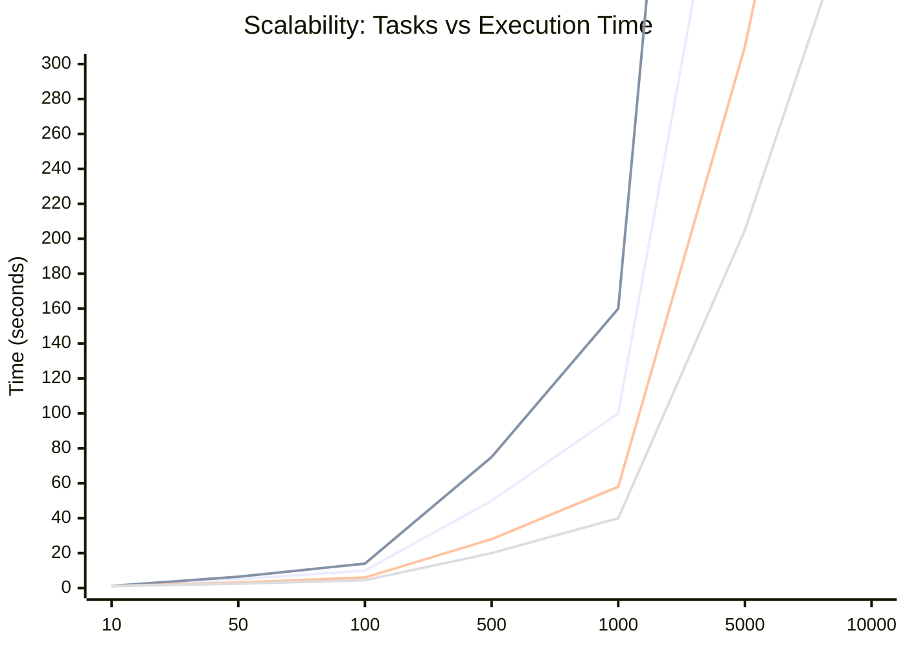

---

## CPU Utilization Patterns


---

## I/O Performance Characteristics

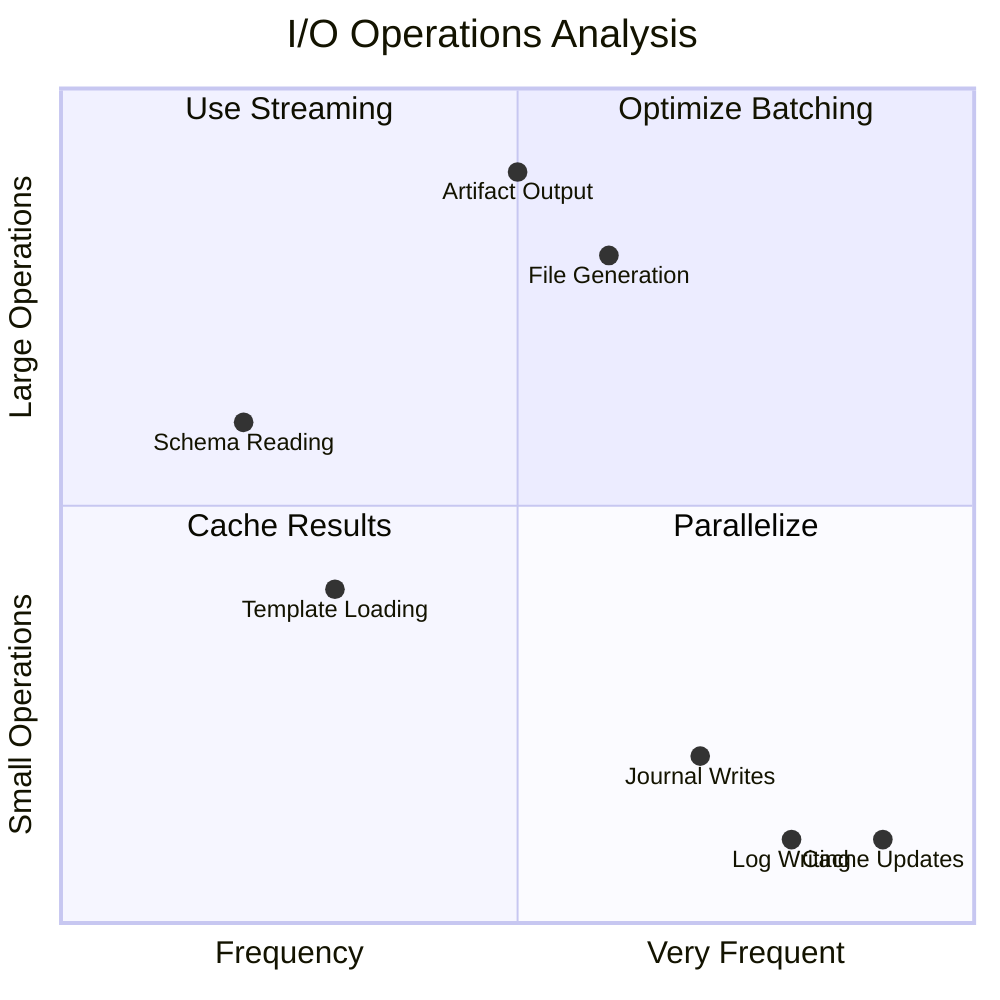

---

## Optimization Impact Matrix

```mermaid
radar
    title Performance Optimization Impact
    x-axis "Low Effort" --> "High Effort"
    y-axis "Low Impact" --> "High Impact"
    
    "Worker Pool Size": [3, 8]
    "Journal Batching": [2, 6]
    "Template Caching": [2, 7]
    "Parallel I/O": [6, 9]
    "Memory Pool": [4, 5]
    "IR Caching": [3, 8]
    "Lazy Loading": [3, 4]
    "Result Streaming": [5, 7]
    "Graph Optimization": [7, 6]
    "JIT Compilation": [9, 5]
```

---

## Performance by Component Timeline

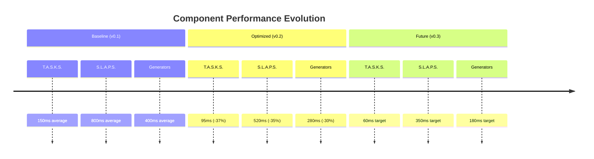

---

## Concurrency Scaling

```mermaid
xychart-beta
    title "Parallel Execution Efficiency"
    x-axis ["1 worker", "2 workers", "4 workers", "8 workers", "16 workers"]
    y-axis "Efficiency %" 0 --> 100
    bar "CPU-bound tasks" [100, 95, 88, 75, 60]
    bar "I/O-bound tasks" [100, 98, 96, 94, 92]
    bar "Mixed workload" [100, 96, 91, 83, 72]
    line "Ideal scaling" [100, 100, 100, 100, 100]
```

---

## Cache Hit Rates

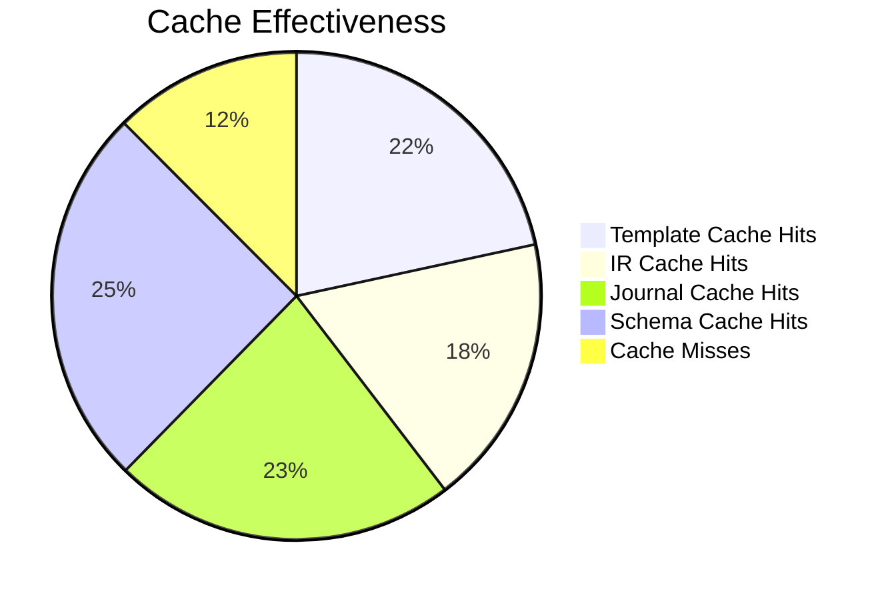

---

## Resource Contention Analysis

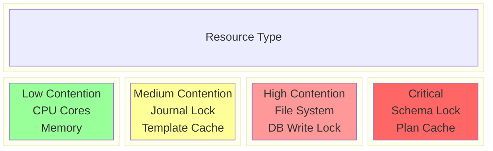

---

## Performance Bottleneck Detection

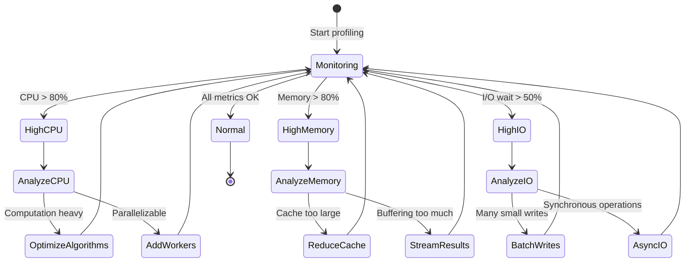

---

## Benchmark Comparison

```mermaid
xychart-beta
    title "Wesley vs Alternatives (1000 tasks)"
    x-axis ["Parse", "Plan", "Execute", "Total"]
    y-axis "Time (seconds)" 0 --> 10
    bar "Wesley (current)" [0.5, 0.3, 4.2, 5.0]
    bar "Wesley (optimized)" [0.3, 0.2, 2.8, 3.3]
    bar "Alternative A" [0.8, 0.5, 5.5, 6.8]
    bar "Alternative B" [0.4, 0.6, 6.2, 7.2]
```

---

## Memory Leak Detection Pattern

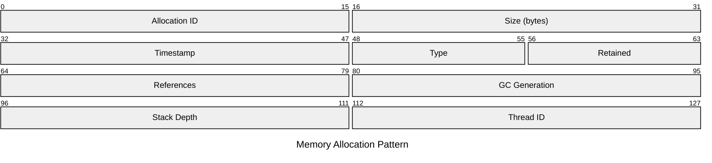

---

## Load Testing Results

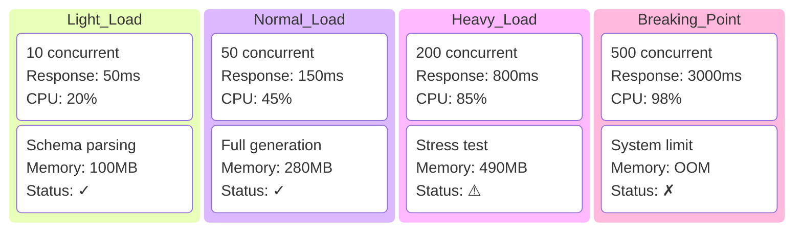

---

## Performance Tuning Recommendations

```typescript
// Optimal configuration for performance
const performanceConfig = {
  tasks: {
    // Graph optimization
    lazyDependencyResolution: true,
    cacheCompiledPlans: true,
    maxGraphDepth: 10,
    
    // Memory management
    nodePoolSize: 1000,
    reuseNodes: true
  },
  
  slaps: {
    // Execution optimization
    workerCount: os.cpus().length,
    workerPoolStrategy: 'dynamic',
    maxConcurrentTasks: 100,
    
    // I/O optimization
    batchSize: 50,
    writeBufferSize: 8192,
    useStreaming: true,
    
    // Journal optimization
    journalBatchWrites: true,
    journalCacheSize: 1000,
    journalCompression: true
  },
  
  generators: {
    // Template caching
    templateCacheSize: '100MB',
    precompileTemplates: true,
    
    // Output optimization
    streamingThreshold: 1024 * 10, // 10KB
    compressionLevel: 6
  }
};
```

---

## Next: [Error Handling & Recovery →](./05-error-recovery.md)