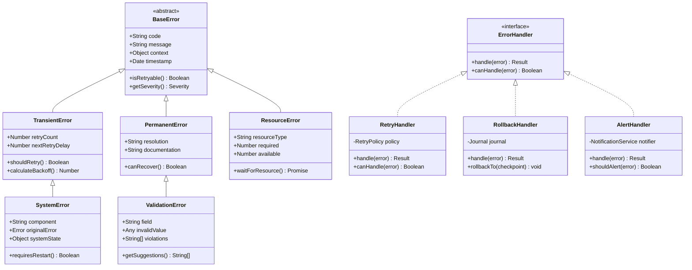

# Error Handling & Recovery

## Overview

Comprehensive error handling and recovery strategies for T.A.S.K.S. and S.L.A.P.S. systems, ensuring resilience and graceful degradation.


---

## Error Classification Matrix


---

## Error Types and Handlers



---

## Retry Strategy Patterns


---

## Recovery Checkpoint System


---

## Error Aggregation Pipeline


---

## Circuit Breaker Pattern


---

## Error Context Capture


---

## Recovery Time Objectives


---

## Error Monitoring Dashboard


---

## Failure Rate Analysis


---

## Graceful Degradation Strategy

```mermaid
radar
    title Degradation Options by Impact
    x-axis "Minor Impact" --> "Major Impact"
    y-axis "Quick" --> "Slow"
    
    "Disable caching": [2, 3]
    "Reduce parallelism": [4, 4]
    "Skip validation": [3, 2]
    "Use fallback generators": [6, 5]
    "Partial generation": [7, 6]
    "Read-only mode": [8, 3]
    "Queue requests": [5, 7]
    "Emergency shutdown": [9, 1]
```

---

## Recovery Procedures

```typescript
// Error recovery configuration
const recoveryConfig = {
  // Retry policies by error type
  retryPolicies: {
    transient: {
      maxAttempts: 5,
      initialDelay: 1000,
      maxDelay: 30000,
      backoff: 'exponential',
      jitter: 0.3
    },
    resource: {
      maxAttempts: 3,
      initialDelay: 5000,
      maxDelay: 60000,
      backoff: 'linear'
    },
    network: {
      maxAttempts: 10,
      initialDelay: 500,
      maxDelay: 10000,
      backoff: 'fibonacci'
    }
  },
  
  // Circuit breaker configuration
  circuitBreaker: {
    failureThreshold: 5,
    successThreshold: 2,
    timeout: 60000,
    halfOpenRequests: 3
  },
  
  // Checkpoint configuration
  checkpoints: {
    enabled: true,
    interval: 'stage', // 'task' | 'stage' | 'time'
    retention: '24h',
    compression: true
  },
  
  // Alert configuration
  alerts: {
    criticalErrors: {
      channels: ['email', 'slack'],
      throttle: '5m',
      aggregation: true
    },
    degradedPerformance: {
      channels: ['metrics'],
      threshold: 0.1 // 10% error rate
    }
  }
};
```

---

## Next: [Real-World Examples →](./06-examples.md)