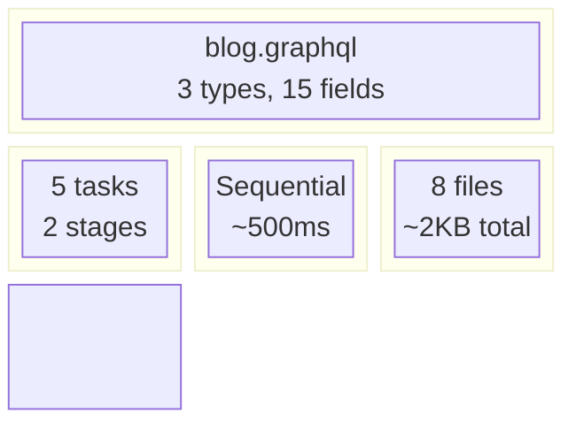
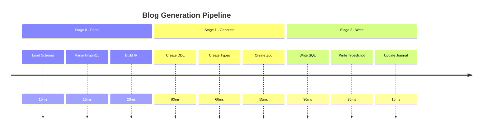
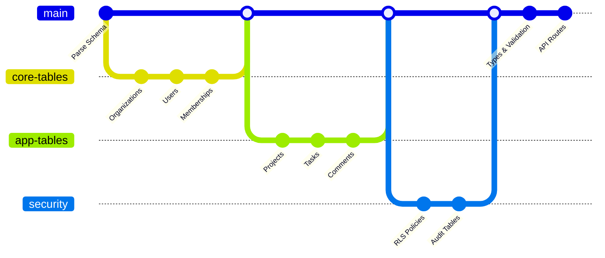
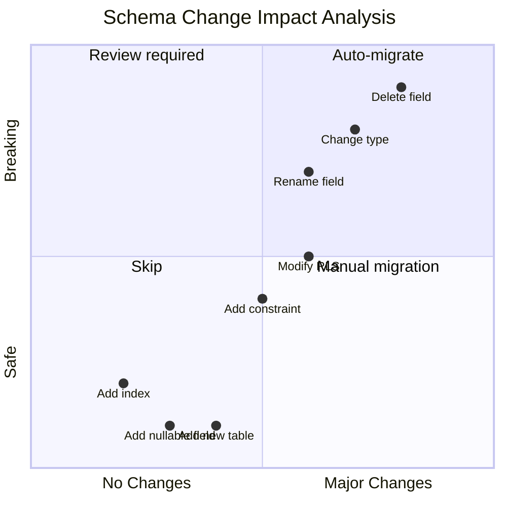
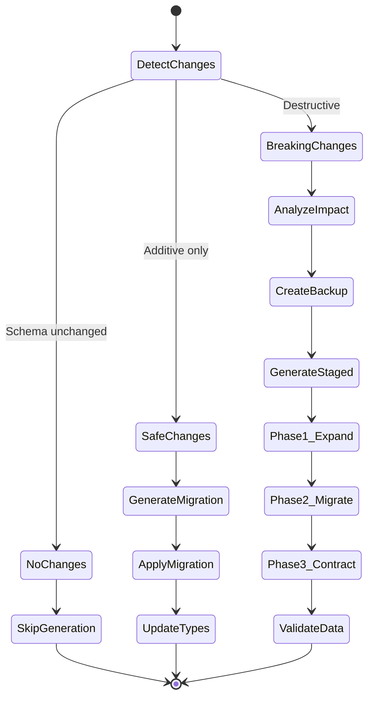
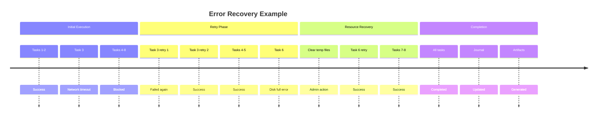
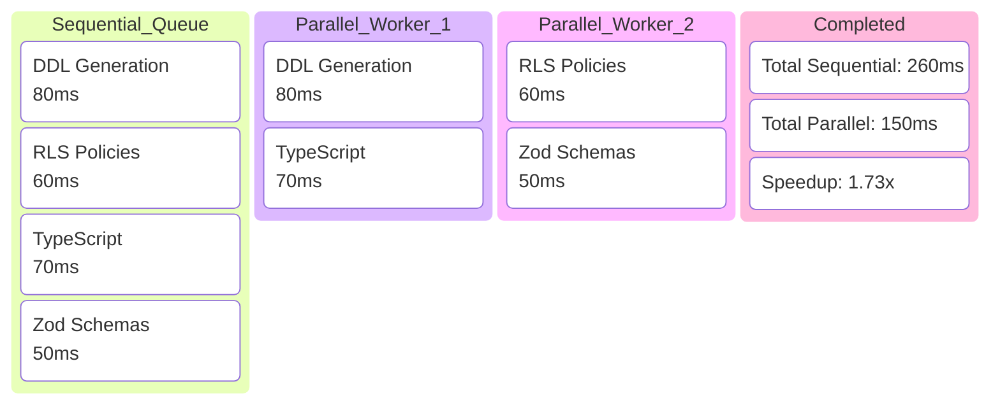
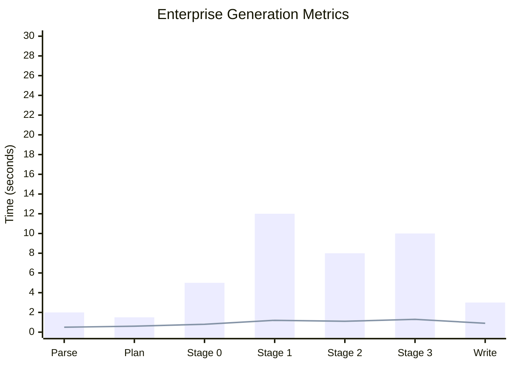
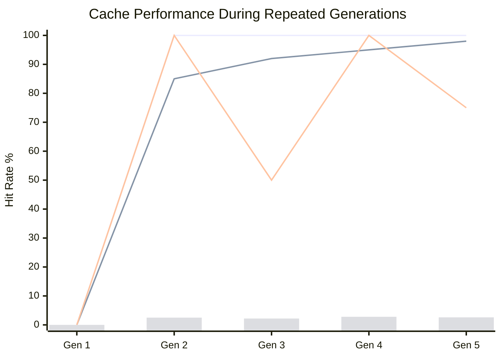

# Real-World Examples

## Overview

This document provides concrete examples of T.A.S.K.S. and S.L.A.P.S. in action, demonstrating various scenarios from simple to complex.

---

## Example 1: Simple Blog Schema Generation



### Execution Timeline



---

## Example 2: Multi-Tenant SaaS Platform

### Task Dependency Graph



### Resource Allocation


---

## Example 3: Incremental Schema Update

### Change Detection



### Migration Plan



---

## Example 4: Error Recovery Scenario

### Failure and Recovery Flow

```mermaid
xychart-beta
    title "Task Execution with Failures"
    x-axis ["T1", "T2", "T3", "T4", "T5", "T6", "T7", "T8"]
    y-axis "Status" 0 --> 3
    bar "First Attempt" [2, 2, 1, 2, 1, 2, 2, 2]
    bar "Retry Attempt" [0, 0, 2, 0, 2, 0, 0, 0]
    line "Success Line" [2, 2, 2, 2, 2, 2, 2, 2]
```



*Legend: 0=Not Run, 1=Failed, 2=Success*

### Recovery Timeline



---

## Example 5: Parallel Execution Optimization

### Parallel vs Sequential Performance



### Resource Utilization Comparison


---

## Example 6: Complex Enterprise Schema

### Execution Stages

```mermaid
C4Component
    title Enterprise Schema Generation Components
    
    Component_Boundary(stage0, "Stage 0: Foundation") {
        Component(parse, "Parser", "GraphQL", "100+ types")
        Component(validate, "Validator", "Rules", "500+ rules")
        Component(ir, "IR Builder", "Transform", "Complex graph")
    }
    
    Component_Boundary(stage1, "Stage 1: Database") {
        Component(tables, "Table Gen", "DDL", "150 tables")
        Component(relations, "Relations", "FK", "200+ FKs")
        Component(indexes, "Indexes", "Perf", "300+ indexes")
    }
    
    Component_Boundary(stage2, "Stage 2: Security") {
        Component(rls, "RLS Gen", "Policies", "500+ policies")
        Component(rbac, "RBAC", "Roles", "50 roles")
        Component(audit, "Audit", "Triggers", "100 triggers")
    }
    
    Component_Boundary(stage3, "Stage 3: Application") {
        Component(types, "TypeScript", "Types", "1000+ types")
        Component(api, "API Gen", "Routes", "200 endpoints")
        Component(docs, "Docs Gen", "OpenAPI", "Full spec")
    }
    
    Rel(parse, validate, "Validates")
    Rel(validate, ir, "Builds")
    Rel(ir, tables, "Generates")
    Rel(tables, relations, "Then")
    Rel(relations, indexes, "Then")
    Rel(indexes, rls, "Then")
    Rel(rls, rbac, "Then")
    Rel(rbac, audit, "Then")
    Rel(audit, types, "Then")
    Rel(types, api, "Then")
    Rel(api, docs, "Finally")
```

### Performance Metrics



---

## Example 7: Caching Strategy

### Cache Hit Rates Over Time



---

## Configuration Examples

### Minimal Configuration
```yaml
# wesley-minimal.yaml
schema: ./schema.graphql
output: ./generated
```

### Production Configuration
```yaml
# wesley-production.yaml
schema: ./schema/**/*.graphql
output: ./generated

orchestration:
  tasks:
    caching: true
    validation: strict
  
  slaps:
    concurrency: 8
    journal:
      type: sqlite
      checkpoint: stage
    retry:
      maxAttempts: 5
      backoff: exponential

generators:
  supabase:
    migrations: true
    rls: true
    audit: true
  
  typescript:
    strict: true
    zod: true
    docs: true
```

### Development Configuration
```yaml
# wesley-dev.yaml
schema: ./schema.graphql
output: ./generated
watch: true

orchestration:
  tasks:
    validation: relaxed
    verbose: true
  
  slaps:
    concurrency: 2
    journal:
      type: memory
    
generators:
  supabase:
    dryRun: true
    explain: true
```

---

## Performance Comparison

```mermaid
radar
    title Configuration Impact on Performance
    x-axis "Slower" --> "Faster"
    y-axis "Less Safe" --> "More Safe"
    
    "Minimal Config": [8, 3]
    "Development": [6, 5]
    "Production": [4, 9]
    "Optimized": [9, 7]
    "Paranoid": [2, 10]
```

---

## Summary

These examples demonstrate T.A.S.K.S. and S.L.A.P.S. handling various real-world scenarios:

1. **Simple schemas** execute quickly with minimal overhead
2. **Complex multi-tenant** systems benefit from parallel execution
3. **Incremental updates** use smart change detection
4. **Error recovery** maintains progress through failures
5. **Parallel optimization** provides significant speedups
6. **Enterprise scale** handles hundreds of tables efficiently
7. **Caching strategies** improve repeated generation performance

The system scales from simple blog schemas (< 1 second) to complex enterprise systems (< 1 minute) while maintaining reliability and resumability.