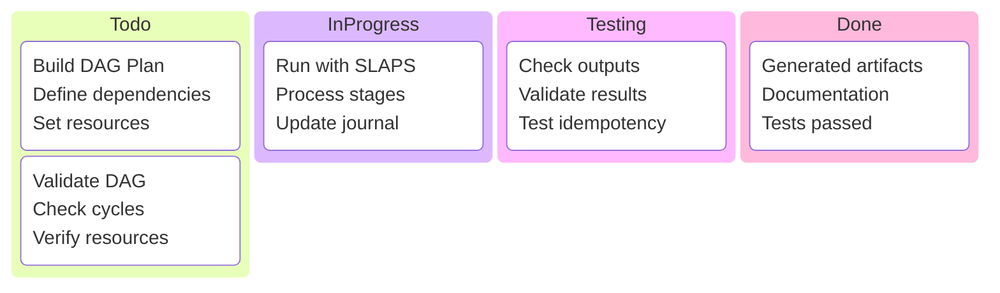
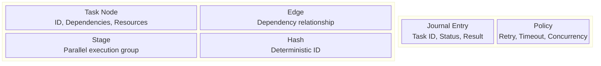
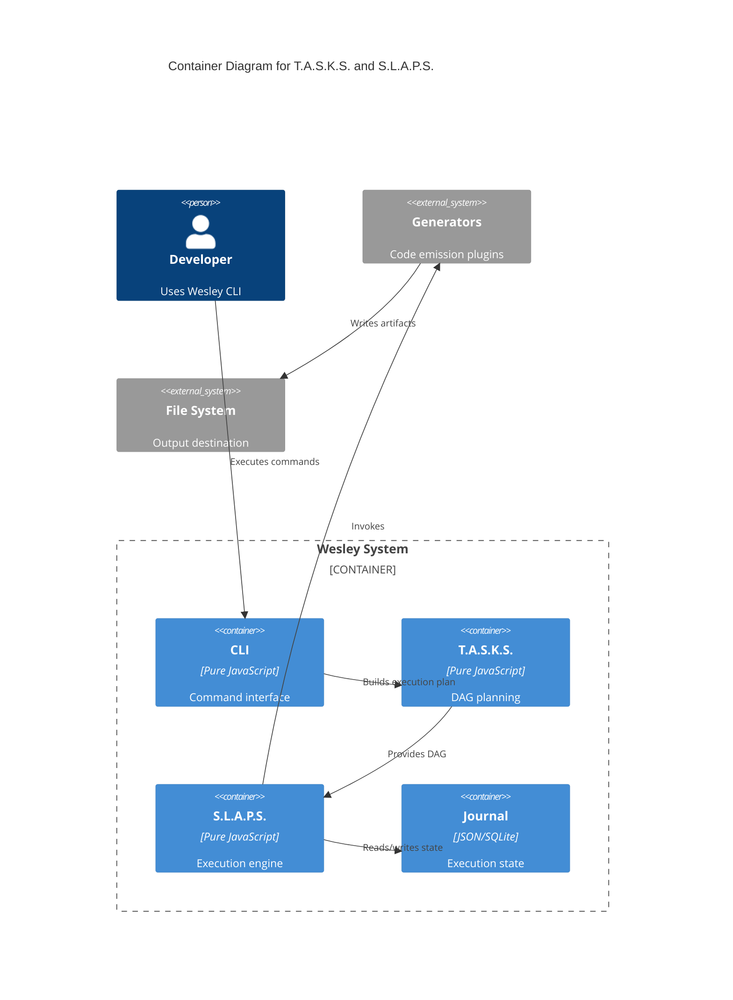

# T.A.S.K.S. and S.L.A.P.S. Documentation

## Overview

Wesley's orchestration engine consists of two complementary systems that work together to provide deterministic, resumable, and safe execution of complex generation pipelines.

- **T.A.S.K.S.** (Topologically Arranged Sequential Knowledge System) - DAG planning and dependency resolution
- **S.L.A.P.S.** (Stateful Linearized Asynchronous Processing System) - Execution engine with journaling

---

## Table of Contents

1. [T.A.S.K.S. - DAG Planning System](./01-tasks-overview.md)
2. [S.L.A.P.S. - Execution Engine](./02-slaps-overview.md)
3. [Integration Patterns](./03-integration-patterns.md)
4. [Performance Characteristics](./04-performance.md)
5. [Error Handling & Recovery](./05-error-recovery.md)
6. [Real-World Examples](./06-examples.md)

---

## Quick Start

---

## Core Concepts

---

## System Architecture Levels

---

## Detailed Documentation

- [T.A.S.K.S. Deep Dive →](./01-tasks-overview.md)
- [S.L.A.P.S. Deep Dive →](./02-slaps-overview.md)
- [Integration Guide →](./03-integration-patterns.md)