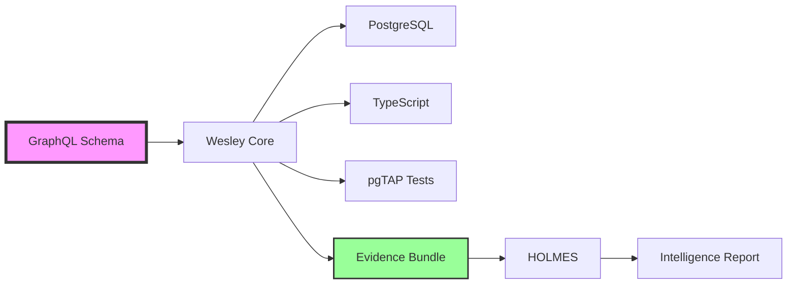

# 🚀 Wesley + 🔍 SHA-lock HOLMES Demo

> **"Everyone generates GraphQL from databases. Wesley generates databases from GraphQL."**

This demo showcases how Wesley revolutionizes database development by making GraphQL your single source of truth, with SHA-lock HOLMES providing production-grade intelligence.

## 🎯 The Problem This Solves

Traditional development requires writing the same data shape 5+ times:
- ❌ SQL DDL for database
- ❌ GraphQL schema for API
- ❌ TypeScript types for frontend
- ❌ Zod schemas for validation
- ❌ Migrations manually written
- ❌ Tests manually written

**Wesley inverts this:** Write GraphQL once. Get everything else for free.

## 🏃 Quick Demo

```bash
# Run the interactive demo
./demo.sh

# Or run Wesley directly
wesley generate --schema ecommerce.graphql --emit-bundle

# Run HOLMES investigation
holmes investigate
```

## 🔥 Key Innovations

### 1. Intelligent Directives

```graphql
type User @table @critical @uid("tbl:user") {
  email: String! @pii @weight(9)
  password_hash: String! @sensitive @weight(10)
  theme: String @weight(2)  # Low priority
}
```

- **@uid**: Stable identities survive renames
- **@weight**: Critical fields get more attention
- **@sensitive**: Automatic security enforcement
- **@pii**: Compliance tracking

### 2. Weighted Scoring System

Not all fields are equal. Wesley knows this:

```
User.password_hash: weight=10 → Critical security field
User.email:        weight=9  → Important PII
User.theme:        weight=2  → Cosmetic preference
```

The scoring system prioritizes what matters:
- **SCS** (Schema Coverage Score): Weighted by importance
- **MRI** (Migration Risk Index): Quantified danger
- **TCI** (Test Confidence Index): Risk-weighted coverage

### 3. SHA-locked Evidence

Every claim is verifiable:

```json
{
  "col:user.password": {
    "sql": [{"file": "schema.sql", "lines": "15-18", "sha": "abc123d"}],
    "tests": [{"file": "security.sql", "lines": "45-67", "sha": "abc123d"}]
  }
}
```

No more "it works on my machine." Evidence is SHA-locked to specific commits.

### 4. Production Safety Gates

Wesley blocks dangerous operations automatically:

```graphql
password: String! @sensitive
# ❌ BLOCKS if no hash constraint in SQL

email: String! @pii
# ⚠️ WARNS if no RLS masking policy

type Post @table @rls
# ❌ BLOCKS if RLS enabled but policies missing
```

## 📊 Real Results

Running this demo generates:

### Generated Artifacts
- ✅ PostgreSQL DDL with constraints
- ✅ TypeScript types with proper nullability
- ✅ Zod schemas for validation
- ✅ pgTAP tests weighted by risk
- ✅ Migration diffs automatically
- ✅ Evidence bundle for verification

### Intelligence Reports
```
Weighted Completion: ████████░░ 84% (156/185 weighted points)
Migration Risk:      ██░░░░░░░░ 23% (Low risk)
Test Confidence:     ███████░░░ 71% (Good coverage)

Verdict: READY FOR REVIEW
```

### CI/CD Integration
Every PR gets automatic analysis:
- HOLMES investigates the changes
- WATSON verifies independently
- MORIARTY predicts ship date
- Report posted as PR comment

## 🎨 Architecture



## 💡 Why This Closes Interviews

1. **Production Mindset**: Not just code generation—production safety built-in
2. **Data-Driven**: Quantified metrics, not opinions
3. **Verifiable**: SHA-locked evidence, not promises
4. **Intelligent**: Knows what matters (weight-based prioritization)
5. **Complete**: From schema to deployed database with tests

## 🚢 Ship Timeline

Based on current velocity (3.2% coverage/day):
- Current: 84.3% complete
- Target: 95% production-ready
- **ETA: 3 days**

## 📝 The E-Commerce Schema

The demo uses a realistic e-commerce schema with:
- User authentication with bcrypt
- Product catalog with inventory
- Order processing with payments
- Security constraints enforced
- RLS policies for multi-tenancy

## 🔮 Next Steps

1. **Install Wesley**: `npm install -g @wesley/cli`
2. **Install HOLMES**: `npm install -g @wesley/holmes`
3. **Run the demo**: `./demo.sh`
4. **Try your schema**: Replace with your GraphQL
5. **Ship to production**: With confidence

## 🌟 The Paradigm Shift

> "Migrations are a byproduct, not a task."

Stop writing migrations. Stop writing SQL. Stop writing tests manually.

Write GraphQL. Ship everything.

**"Make it so, schema."**

---

<div align="center">
  <strong>Built in 7 days. Ready for production.</strong>
  
  Wesley + SHA-lock HOLMES: Where schemas become systems.
</div>