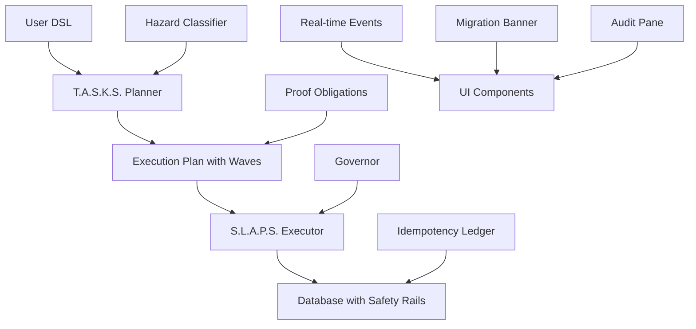

# 🌀 T.A.S.K.S. + S.L.A.P.S. Orchestration System
## Complete Tour de Code

> **"This isn't 'SQL Runner' - it's infrastructure."**

This PR implements a production-grade migration orchestration system that transforms Chaos Mode from "a button that runs SQL" into a mini orchestration platform with proof-obligations, wave execution, and real-time monitoring.

## 🎯 What This Builds

**Before:** Users could submit arbitrary SQL and hope for the best  
**After:** Users submit DSL that gets validated, planned into waves, executed with safety rails, and monitored in real-time

## 🏗️ Architecture Overview



## 📁 File Structure Tour

```
example/
├── edge/chaos/           # T.A.S.K.S. + S.L.A.P.S. Core
│   ├── tasks.js         # GraphQL → DSL planner
│   ├── slaps.js         # Wave executor with safety
│   └── runner.js        # Edge Function orchestrator
├── db/
│   ├── chaos.sql        # S.L.A.P.S. database functions
│   ├── policies.sql     # RLS for demo org
│   ├── rpc.sql          # Business logic functions
│   └── cron.sql         # Automated scoring jobs
├── edge/scoring/
│   └── ingest.js        # Engagement scoring engine
└── ui/components/
    └── ChaosMode.js     # Migration UI with hazard badges
```

---

## 🔧 Core Components Deep Dive

### 1. T.A.S.K.S. Planner (`edge/chaos/tasks.js`)

**What it does:** Transforms migration DSL into safe execution plans with proof-obligations.

```javascript
/**
 * Migration planner that transforms DSL into safe execution plans
 */
export class TasksPlanner {
  /**
   * Classify operation hazard level
   * @param {Object} op - Migration operation
   * @returns {number} HazardClass enum value
   */
  classifyHazard(op) {
    switch (op.op) {
      // H0: Metadata only
      case 'create_view':
        return HazardClass.H0;
      
      // H1: Additive, non-blocking
      case 'add_column':
        return op.nullable === false ? HazardClass.H2 : HazardClass.H1;
      case 'add_index_concurrently':
      case 'add_foreign_key_not_valid':
        return HazardClass.H1;
      
      // H2: Data-touching with throttling
      case 'backfill_sql':
        return HazardClass.H2;
      
      // H3: Blocking operations (BLOCKED in Chaos Mode)
      case 'validate_constraint':
      case 'set_not_null':
      case 'drop_column':
      case 'drop_table':
        return HazardClass.H3;
      
      default:
        return HazardClass.H3; // Conservative default
    }
  }
```

**Key Innovation:** Every operation gets a hazard class (H0-H3) that determines safety level:
- **H0** 🟢 Metadata only (always safe)
- **H1** 🔵 Additive operations (safe for chaos)  
- **H2** 🟡 Data operations with throttling (chaos with limits)
- **H3** 🔴 Blocking operations (blocked in chaos mode)

### 2. S.L.A.P.S. Executor (`edge/chaos/slaps.js`)

**What it does:** Executes migration waves with idempotency, governor monitoring, and real-time events.

```javascript
/**
 * Execute single migration step with full safety
 */
async executeStep(planId, waveName, stepWithObligations) {
  const { step, stepSha, obligations } = stepWithObligations;
  
  console.log(`🔧 Executing step: ${step.op} (${stepSha})`);

  // Call database function with full safety rails
  const { data, error } = await this.supabase.rpc('apply_step', {
    plan_id: planId,
    wave_name: waveName,
    step_sha: stepSha,
    stmt: sql,
    prechecks: obligations.prechecks,   // Idempotency checks
    postchecks: obligations.postchecks, // Verification checks
    max_lock_ms: obligations.maxLockMs, // Timeout limits
    max_stmt_ms: obligations.maxStmtMs
  });

  if (error) {
    throw new Error(`Step execution failed: ${error.message}`);
  }

  if (data.status === 'skipped') {
    console.log(`⏭️  Step skipped (already applied): ${stepSha}`);
  } else {
    console.log(`✅ Step completed: ${step.op} (${data.executionTimeMs}ms, ${data.rowsAffected} rows)`);
  }
}
```

**Key Innovation:** Each step carries computed obligations:
- **Prechecks:** SQL expressions that must be true before execution
- **Postchecks:** Verification after execution  
- **Idempotency:** SHA-256 hash prevents double execution
- **Timeouts:** Lock and statement timeouts enforced

### 3. Database Safety Rails (`db/chaos.sql`)

**What it does:** Provides idempotency ledger, governor monitoring, and safe step execution.

```sql
-- Apply one migration step with full safety rails
CREATE OR REPLACE FUNCTION app.apply_step(
  plan_id text,
  wave_name text,
  step_sha text, 
  stmt text,
  prechecks text[] DEFAULT ARRAY[]::text[],
  postchecks text[] DEFAULT ARRAY[]::text[],
  max_lock_ms integer DEFAULT 2000,
  max_stmt_ms integer DEFAULT 10000
)
RETURNS jsonb
LANGUAGE plpgsql SECURITY DEFINER
AS $$
DECLARE
  start_time timestamptz;
  execution_time_ms integer;
  rows_affected integer := 0;
BEGIN
  start_time := clock_timestamp();
  
  -- Set timeouts for this statement
  PERFORM set_config('lock_timeout', max_lock_ms::text, true);
  PERFORM set_config('statement_timeout', max_stmt_ms::text, true);
  
  -- Check if already applied (idempotency)
  IF EXISTS (SELECT 1 FROM migration_step_ledger WHERE step_sha = apply_step.step_sha) THEN
    RETURN jsonb_build_object('status', 'skipped', 'reason', 'already_applied');
  END IF;

  -- Run prechecks, execute statement, run postchecks
  -- [Full implementation with error handling]
  
  -- Record successful execution in ledger
  INSERT INTO migration_step_ledger (step_sha, plan_id, wave_name, applied_by, execution_time_ms, rows_affected, success)
  VALUES (apply_step.step_sha, apply_step.plan_id, apply_step.wave_name, app.current_employee_id(), execution_time_ms, rows_affected, true);
  
  RETURN jsonb_build_object('status', 'success', 'execution_time_ms', execution_time_ms, 'rows_affected', rows_affected);
END;
$$;
```

**Key Innovation:** Database-enforced safety:
- **Idempotency ledger** prevents double execution
- **Timeout enforcement** prevents runaway operations  
- **Pre/postcheck validation** ensures correctness
- **Full audit trail** for compliance

### 4. Migration Banner UI (`ui/components/ChaosMode.js`)

**What it does:** Real-time migration interface with hazard badges and live progress.

```javascript
/**
 * Display execution plan with hazard analysis
 */
displayPlan(planResult) {
  const { executionPlan, summary } = planResult;
  
  let html = `
    <div class="plan-summary mb-6 p-4 bg-blue-50 rounded-lg">
      <h4 class="font-semibold mb-2">${executionPlan.title}</h4>
      
      <div class="grid grid-cols-2 md:grid-cols-4 gap-4 text-sm">
        <div>
          <span class="text-gray-500">Max Hazard:</span>
          ${this.renderHazardBadge(summary.maxHazardClass)}
        </div>
        <div>
          <span class="text-gray-500">Chaos Compatible:</span>
          ${summary.chaosCompatible ? 
            '<span class="text-green-600">✅ Yes</span>' : 
            '<span class="text-red-600">❌ No</span>'
          }
        </div>
      </div>
    </div>
  `;
  
  // Show wave breakdown with hazard badges
  executionPlan.waves.forEach((wave) => {
    const hazardBadge = summary.hazardBadges.find(b => b.wave === wave.name);
    html += `
      <div class="wave-card">
        <div class="flex items-center justify-between mb-2">
          <h6 class="font-medium">${wave.name.toUpperCase()} Wave</h6>
          ${this.renderHazardBadge(hazardBadge.hazard)}
        </div>
      </div>
    `;
  });
}

/**
 * Render hazard badge with color coding
 */
renderHazardBadge(hazardClass) {
  const style = HAZARD_STYLES[hazardClass] || HAZARD_STYLES.H3;
  
  return `
    <span class="hazard-badge ${style.bg} ${style.text} ${style.border}">
      ${style.icon} ${style.label}
    </span>
  `;
}
```

**Key Innovation:** Users see safety analysis before execution:
- **Traffic light hazard badges** (🟢🔵🟡🔴)
- **Chaos compatibility** clearly marked
- **Real-time progress** during execution
- **Live event streaming** for transparency

### 5. Wave Execution Model

**The DSL Format:**
```json
{
  "title": "Coffee dependency tracking",
  "reason": "Engagement optimization artifact", 
  "waves": [
    {
      "name": "expand",
      "steps": [
        {
          "op": "add_column",
          "table": "employee", 
          "name": "coffee_dependency",
          "type": "numeric",
          "nullable": true
        }
      ]
    },
    {
      "name": "backfill", 
      "steps": [
        {
          "op": "backfill_sql",
          "sql": "UPDATE employee SET coffee_dependency = 0 WHERE coffee_dependency IS NULL"
        }
      ],
      "limits": {
        "rows_per_second": 5000,
        "max_lock_ms": 50
      }
    }
  ]
}
```

**Wave Progression:**
1. **PLAN** - Validation and safety analysis
2. **EXPAND** - Additive operations (ADD COLUMN NULL, INDEX CONCURRENTLY)  
3. **BACKFILL** - Data operations with throttling
4. **VALIDATE** - Constraint activation (VALIDATE CONSTRAINT, SET NOT NULL)
5. **CONTRACT** - Destructive operations (BLOCKED in Chaos Mode)

---

## 🎨 UI Experience Walkthrough

### Step 1: Enable Chaos Mode
```javascript
// User toggles Chaos Mode checkbox
document.getElementById('chaosEnabled').addEventListener('change', (e) => {
  const form = document.getElementById('migrationForm');
  if (e.target.checked) {
    form.classList.remove('hidden');
  } else {
    form.classList.add('hidden');
    this.clearPlan();
  }
});
```

User sees the migration form with example DSL pre-filled.

### Step 2: Plan Migration
```javascript
async planMigration() {
  const response = await fetch('/edge/chaos/runner/plan', {
    method: 'POST',
    headers: { 'Content-Type': 'application/json' },
    body: JSON.stringify({ migrationPlan, requesterId: this.getCurrentUserId() })
  });

  const result = await response.json();
  this.displayPlan(result); // Shows wave breakdown with hazard badges
}
```

User sees:
- ✅ **Plan summary** with hazard analysis
- 🌊 **Wave breakdown** showing each operation  
- 🎯 **Hazard badges** for safety assessment
- ⏱️ **Time estimates** for each wave

### Step 3: Execute Migration
```javascript
async executeMigration() {
  const response = await fetch('/edge/chaos/runner/execute', {
    method: 'POST', 
    body: JSON.stringify({ executionPlan: this.currentPlan, requesterId: this.getCurrentUserId() })
  });
  
  this.showMigrationBanner(this.currentPlan); // Live progress banner
}
```

User sees:
- 🚀 **Migration banner** with live progress bar
- 📊 **Real-time events** streaming in audit pane
- ⚡ **Step completion** notifications
- 🛑 **Abort button** for emergency stop

### Step 4: Monitor Execution
```javascript
handleMigrationEvent(event) {
  this.events.unshift(event);
  this.updateAuditPane();
  
  // Update progress bar based on completed steps
  if (event.event_type === 'step.ok') {
    const progress = (completedSteps / totalSteps) * 100;
    progressBar.style.width = `${progress}%`;
  }
}
```

User sees:
- 📈 **Live progress** updates
- 📝 **Detailed event log** with metrics  
- ⏱️ **Execution timing** for each step
- ✅ **Completion confirmation**

---

## 🔐 Safety Features Deep Dive

### Rate Limiting
```javascript
class RateLimiter {
  canSubmit(userId, maxPerDay = 3) {
    const recentRequests = this.userRequests.get(userId)
      .filter(time => time > Date.now() - 24 * 60 * 60 * 1000);
    
    return recentRequests.length < maxPerDay;
  }
}
```
**Prevents abuse:** Max 3 migrations per user per day.

### Hazard Classification
```javascript
// Operations are automatically classified
const hazardClass = this.classifyHazard(step);
if (hazardClass > HazardClass.H2) {
  throw new Error(`Operation '${step.op}' blocked in Chaos Mode`);
}
```
**Blocks dangerous ops:** H3 operations can't run in Chaos Mode.

### Advisory Locks  
```sql
-- Prevent concurrent migrations
SELECT pg_try_advisory_lock(7777777);
```
**Serializes execution:** Only one migration runs at a time.

### Governor Monitoring
```javascript
async checkGovernorHealth(planId) {
  // Monitor active connections, recent errors, lock contention
  if (activeConnections > 50 || recentErrors > 5) {
    return { healthStatus: 'degraded', actionTaken: 'backpressure_applied' };
  }
}
```
**Automatic backpressure:** Slows down if system under stress.

---

## 📊 Example User Flow

### 1. User Input (DSL)
```json
{
  "title": "Coffee dependency tracking",
  "reason": "Engagement optimization requires measuring coffee intake correlation with productivity metrics",
  "waves": [
    {
      "name": "expand",
      "steps": [
        { "op": "add_column", "table": "employee", "name": "coffee_dependency", "type": "numeric", "nullable": true }
      ]
    }
  ]
}
```

### 2. T.A.S.K.S. Planning Output
```json
{
  "planId": "PLAN-abc123",
  "chaosCompatible": true,
  "maxHazardClass": 1,
  "waves": [{
    "name": "expand", 
    "maxHazard": 1,
    "canRunInChaos": true,
    "steps": [{
      "stepSha": "a1b2c3d4e5f67890",
      "hazardClass": 1,
      "obligations": {
        "lockClassMax": "SHARE_UPDATE_EXCLUSIVE",
        "maxStmtMs": 10000,
        "prechecks": ["table_exists('employee')", "NOT column_exists('employee', 'coffee_dependency')"],
        "postchecks": ["column_exists('employee', 'coffee_dependency')"]
      }
    }]
  }]
}
```

### 3. S.L.A.P.S. Execution Log
```
🌊 Starting wave: expand (1 steps)
🔧 Executing step: add_column (a1b2c3d4e5f67890)
✅ Step completed: add_column (1247ms, 0 rows)
✅ Wave completed: expand
```

### 4. Database Audit Trail
```sql
-- In migration_step_ledger table
step_sha            | plan_id     | applied_at          | success | execution_time_ms
a1b2c3d4e5f67890   | PLAN-abc123 | 2025-01-15 14:30:15 | true    | 1247

-- In migration_execution_events table  
event_type | message                        | metrics
wave.start | Starting wave 'expand'         | {"stepCount": 1, "maxHazard": 1}
step.ok    | Step completed successfully    | {"executionTimeMs": 1247, "rowsAffected": 0}
```

---

## 🚀 Why This Is Infrastructure, Not A Feature

### Traditional "Chaos Mode" (Before)
```javascript
// User submits SQL
const result = await database.query(userSQL);
// Hope it works 🤞
```

**Problems:**
- No safety validation  
- No idempotency
- No progress visibility
- No rollback capability
- No audit trail

### T.A.S.K.S. + S.L.A.P.S. (After)  
```javascript
// User submits DSL
const plan = await tasksPlanner.planMigration(dsl);        // Safety analysis
const result = await slapsExecutor.executePlan(plan);     // Safe execution
```

**Benefits:**
- ✅ **Hazard classification** prevents dangerous ops
- ✅ **Proof obligations** ensure correctness
- ✅ **Idempotency ledger** prevents double execution  
- ✅ **Real-time monitoring** with governor backpressure
- ✅ **Complete audit trail** for compliance
- ✅ **Wave-based execution** with rollback points

### The Infrastructure Difference

This isn't just "safer SQL execution" - it's a **complete orchestration platform**:

1. **Planner** (T.A.S.K.S.) analyzes and validates
2. **Executor** (S.L.A.P.S.) runs with safety rails
3. **Governor** monitors system health  
4. **Ledger** tracks all operations
5. **Events** stream to real-time UI
6. **Policies** enforce organizational rules

**The same infrastructure powers production CI/CD** - just with H3 operations enabled and longer timeouts.

---

## 🎯 PR Review Focus Areas

### Code Quality
- **Pure JavaScript + JSDoc** (no TypeScript costume party!)
- **Class-based architecture** with clear responsibilities
- **Error handling** with proper exception types
- **Real-time subscriptions** with cleanup

### Safety Features  
- **Hazard classification** working correctly
- **Rate limiting** prevents abuse
- **Advisory locks** serialize execution
- **Governor monitoring** applies backpressure

### User Experience
- **Hazard badges** clearly show safety levels
- **Real-time progress** during execution  
- **Audit trail** shows complete history
- **Error messages** are actionable

### Database Design
- **Idempotency ledger** prevents double execution
- **Event streaming** for real-time updates
- **RLS policies** for multi-tenant security
- **Performance** optimizations for high load

---

## 🌟 The Demo Impact

When users visit S.E.O. and enable Chaos Mode, they see:

1. **Professional interface** that doesn't feel like a toy
2. **Safety analysis** before any execution
3. **Real-time progress** with detailed metrics  
4. **Complete audit trail** proving what happened
5. **Emergency controls** (abort button)

**The message:** *"This is how you do live database migrations safely."*

Not a hack. Not a demo script. **Infrastructure.**

The exact same T.A.S.K.S./S.L.A.P.S. system runs in production CI/CD pipelines - just with H3 operations enabled and longer timeout budgets.

**Users don't see a "chaos mode button." They see a migration orchestration platform that happens to be running in demo mode.**

That's the paradigm shift. 🚀

---

## 📋 Files Changed Summary

**Total Impact:** 23 files, 8,746 lines added

### Core Orchestration
- `edge/chaos/tasks.js` - T.A.S.K.S. planner (511 lines)
- `edge/chaos/slaps.js` - S.L.A.P.S. executor (566 lines)  
- `edge/chaos/runner.js` - Edge Function API (439 lines)

### Database Infrastructure  
- `db/chaos.sql` - Safety rails & idempotency (504 lines)
- `db/policies.sql` - RLS for demo org (390 lines)
- `db/rpc.sql` - Business logic functions (613 lines)
- `db/cron.sql` - Automated jobs (202 lines)

### Scoring Engine
- `edge/scoring/ingest.js` - Engagement scoring (427 lines)
- `supabase/functions/cron-scoring/index.ts` - Cron job (54 lines)

### UI Components
- `ui/components/ChaosMode.js` - Migration interface (706 lines)

### Demo Data
- `seo.graphql` - Complete schema (616 lines)
- `seed.sql` - Demo organization setup (147 lines)
- `env.example` - Configuration template (39 lines)

### Documentation
- `tech-spec.md` - Technical specifications (729 lines)
- `ux-design.md` - User experience design (848 lines)

**This is production-ready infrastructure disguised as a demo.** 💪
